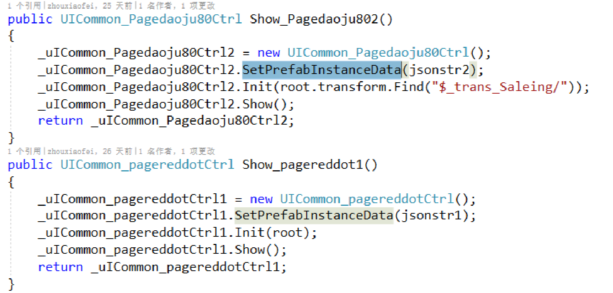

## Unity原理解析

UGUI：
--------------
锚点（anchors）：
是相对父节点的属性，决定了当屏幕分辨率发生改变的时候，UI的位置和大小如何变化。

中心点（pivot）：
是相对于节点本身的属性，Pivot点的坐标是一个归一化的2D模型坐标系下的坐标，决定了物体如何向两边延伸以及如何旋转。

尺寸变化量（sizeDelta）：
RectTransform的四个角相对于四个锚点的屏幕空间下的距离差。

anchoredPosition：
屏幕空间坐标系下，当前物体的pivot点相对于锚点的pivot点的距离。

Graphic：Graphic作为图像组件的基类,主要实现了网格与图像的生成/刷新方法。

EventSystem: UGUI事件管理系统,通过此系统完成我们所知的UI交互。
管理所有的输入检测模块(InputModule)并帧调用Module的执行(Process)
调动射线捕捉模块(Raycasters),为InputModule提供结果(具体本的触点所穿透的
对象信息)

### 1. 怎么设计一个UI框架？
思考下面这些问题
1. 需要提供哪些方法
2. UI层级怎么处理
3. 如果多个界面同时打开需要怎么处理
4. 导步怎么处理
5. 如果界面有动画怎么处理
6. 同一个界面多次打开怎么处理
7. 不同的UI怎么用同样的方式打开

### 2. UI相关资源的存放规则
1. 大的背景图片,单独管理,不打图集,或者一个图片一个个图集。
2. 公共图集使用,控制公共图集的个数,公共图集的添加要慎重。
3. 不是所有的小图都要使用图集,比如:物品图标
3. 公共Prefab放和公共Prefab文件夹,不与功能Prefab放一起记。
4. 同一功能的Prefab放入一个文件夹,即使功能Prefab只有一个也放入单独文件夹。

### 3. UI中贴图的处理
1. 划分私有图集、公共图集
2. 小图采用九宫格、纯色图片、减少半透明图片
3. 大的的背景图片尽量采用高复用性
4. 一定在项目初就要和美术沟通好图片的规则和规范,避免美术为了设计好看而大量使用半透明和渐变图素,重而导致图集过大以及图集的空间浪费。
5. 图集和背景单图要彻彻底底的分割,别撑大图集

### 4. 有一些公共的Prefab会在多个UI界面里显示,这些公共Prefab怎么处理? 要多个界面里重复实例化吗?
实例化一次，存储prefab的配置文件json，使用时加载用于设置预制体在不同UI界面的状态。

### 5. 垃圾回收机制
标记清除法：
 标记 -> 清除 -> 压缩

分代策略：
1. 堆(Heap)内存管理区域分为3个:#Gen 0 collections,#Gen 1
collections, #Gen 2 collections.
2. 如果Gen 0 heap内存达到阀值,则触发0代GC,0代GC后Gen 0中幸
存的对象进入Gen1。如果Gen1的内存达到阀值,则进行1代GC, 1
代GC将Gen 0 heap和Gen 1 heap一起进行回收,幸存的对象进入
Gen2。2代GC将Gen 0 heap、Gen 1 heap和Gen 2 heap一起回收。
如果GC跑过了,内存空间依然不够用,那么就抛出了OutOfMemoryException异常。
3. Gen 0和Gen 1比较小,这两个代龄加起来总是保持在16M左右미;
Gen2的大小由应用程序确定,可能达到几G,因此0代和1代GC的成
本非常低,2代GC称为full GC,通常成本很高。
