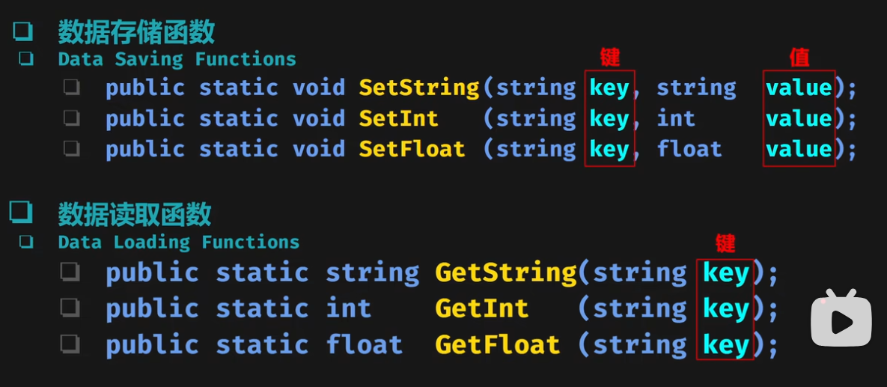
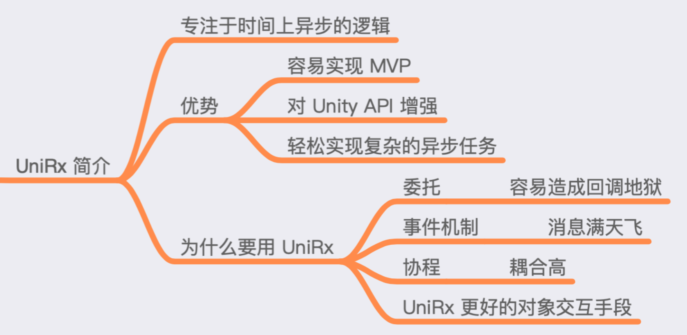
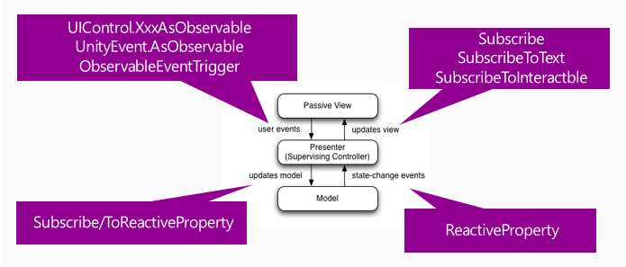

# Unity 工具
-------
## Protobuf

### 1. 什么是 Protobuf?

Protobuf（Protocol Buffers） 是一种轻量级的数据序列化协议，由 Google 开发。它可以用于结构化数据的序列化和反序列化，使得数据在不同系统之间进行传输和存储更加高效。

与 XML 和 JSON 等常见的数据交换格式相比，Protobuf 具有更小的体积、更快的速度和更简洁的定义语法。它使用二进制编码来表示数据，并且提供了自动生成代码的功能，以便在不同的编程语言中使用。

### 2. 使用Json进行序列化/反序列化的问题
（1）字符串占用空间大

（2）序列化/反序列化慢

（3）有向前和向后兼容性问题（客户端和服务器版本匹配）

### 3. 使用字符串进行序列化/反序列化的问题
（1）带来额外的信息，占用空间大，冗余信息多

### 4. 为什么要使用Protobuf
（1）低数据量：比Json小5倍

（2）高效解析：CPU的占用较少

（3）多语言：支持客户端和服务器采用不同的语言

（4）契约式设计：Protobuf要求适用显式标识符和类型来规范消息，并验证以确保数据完整性

（5）向后兼容性

### 5. Protobuf 的实现原理

Protobuf 的实现原理主要包括以下几个方面：

（1）定义消息结构：使用 Protobuf 的语言描述文件（.proto）来定义数据的结构和字段类型。这些描述文件可以指定消息的字段、嵌套消息、枚举等。

（2）编译生成代码：通过使用 Protobuf 提供的编译器，将描述文件编译成目标语言的代码。生成的代码包含了序列化和反序列化的方法，以及对应的数据结构。

（3）序列化与反序列化：在发送端，将数据按照定义的消息结构进行序列化，转换为二进制格式；在接收端，将二进制数据反序列化为具体的数据对象。

（4）版本兼容性：当数据结构发生变化时，可以通过向后兼容或者升级版本的方式来处理旧版本的数据。


### 6. Protobuf 的缺点

（1）可读性差：由于 Protobuf 使用二进制编码，无法直接阅读和理解数据内容，对调试和排查问题带来一定困难。

（2）不适合人类可读的配置文件：由于 Protobuf 的主要目标是高效的数据传输和存储，因此不适合用作人类可读的配置文件格式。

### 7. Protobuf 的使用注意事项

（1）版本一致性：在使用 Protobuf 进行数据传输时，发送方和接收方的代码生成文件（.proto）必须保持一致，否则会导致解析错误。

（2）字段编号规范：在定义消息结构时，需要为每个字段指定唯一的编号。这些编号用于标识字段在二进制格式中的位置，因此在修改字段时需要谨慎处理。


-----------------


## PlayerPrefs 数据持久化

### 1. 什么是PlayerPrefs
PlayerPrefs类是一种轻量级的，用于数据存储和检索的工具，它允许我们在玩家的设备上存储少量的数据。存储的数据可以在应用程序的生命周期内，甚至在多次启动应用程序之间持久存在。这种功能使得PlayerPrefs类成为保存如音量级别，亮度设置，字符选择等游戏设置的理想选择。

### 2. PlayerPrefs优缺点
优点：简单易用。

缺点：能直接存储的数据类型有限（int，float，string）；数据安全性低。

适用范围：玩家偏好设置；简单的数据；游戏原型制作时暂时的存储方案。

### 3. 如何使用PlayerPrefs存取数据



### 4. 使用PlayerPrefs需要注意的点和可能的知识扩展 

（1）数据安全性：由于PlayerPrefs存储的数据没有进行加密，所以这些数据很容易被用户或其他人修改。在一些对数据安全性要求比较高的游戏中，我们可以考虑自定义存储方式，对关键数据进行加密。

（2）数据管理：PlayerPrefs虽然简单，但是它并不适合存储大量复杂的数据。当我们的游戏需要保存大量的玩家状态或游戏进度时，我们可能需要考虑更复杂的数据管理方式，比如使用数据库。

（3）使用场景：在网络游戏中，可能大部分数据需要存储在服务器上，但是PlayerPrefs仍然有其用武之地，比如存储一些用户偏好的设置，比如音量、分辨率等。

（4）性能问题：频繁地读写PlayerPrefs可能会造成性能问题。一般情况下，我们应该尽可能地减少对PlayerPrefs的操作，比如在游戏关卡结束或者游戏退出的时候才保存数据。

（5）跨平台的数据持久化：虽然PlayerPrefs在不同的平台上有一致的接口，但是实际的数据存储方式却因平台而异。在一些需要跨平台数据共享的场景中，我们可能需要考虑其他的数据存储方案，比如云存储。

（6）数据备份和恢复：由于PlayerPrefs的数据存储在用户的设备上，因此当用户更换设备或者删除游戏后，PlayerPrefs的数据也会随之丢失。因此在一些对数据持久化有要求的游戏中，我们可能需要实现一套数据备份和恢复的机制。


-------------------------------

## Protobuf

### 1. 使用Json进行序列化/反序列化的问题
（1）字符串占用空间大

（2）序列化/反序列化慢

（3）有向前和向后兼容性问题（客户端和服务器版本匹配）

### 2. 使用字符串进行序列化/反序列化的问题
（1）带来额外的信息，占用空间大，冗余信息多

### 3. 什么是 Protobuf?
Protobuf（Protocol Buffers） 是一种轻量级的数据序列化协议，由 Google 开发。它可以用于结构化数据的序列化和反序列化，使得数据在不同系统之间进行传输和存储更加高效。

与 XML 和 JSON 等常见的数据交换格式相比，Protobuf 具有更小的体积、更快的速度和更简洁的定义语法。它使用二进制编码来表示数据，并且提供了自动生成代码的功能，以便在不同的编程语言中使用。

### 4. 为什么要使用Protobuf
（1）低数据量：比Json小5倍

（2）高效解析：CPU的占用较少

（3）多语言：支持客户端和服务器采用不同的语言

（4）契约式设计：Protobuf要求适用显式标识符和类型来规范消息，并验证以确保数据完整性

（5）向后兼容性：系统可以处理旧版本的数据，并且支持增量更新字段。     

### 5. Protobuf的实现原理
Protobuf 的实现原理主要包括以下几个方面：

（1）定义消息结构：使用 Protobuf 的语言描述文件（.proto）来定义数据的结构和字段类型。这些描述文件可以指定消息的字段、嵌套消息、枚举等。     
  
（2）编译生成代码：通过使用 Protobuf 提供的编译器，将描述文件编译成目标语言的代码。生成的代码包含了序列化和反序列化的方法，以及对应的数据结构。     

（3）序列化与反序列化：在发送端，将数据按照定义的消息结构进行序列化，转换为二进制格式；在接收端，将二进制数据反序列化为具体的数据对象。     
  
（4）版本兼容性：当数据结构发生变化时，可以通过向后兼容或者升级版本的方式来处理旧版本的数据。     

### 6. Protobuf的缺点
（1）可读性差：由于 Protobuf 使用二进制编码，无法直接阅读和理解数据内容，对调试和排查问题带来一定困难。     

（2）不适合人类可读的配置文件：由于 Protobuf 的主要目标是高效的数据传输和存储，因此不适合用作人类可读的配置文件格式。     

### 7. Protobuf 的使用注意事项
（1）版本一致性：在使用 Protobuf 进行数据传输时，发送方和接收方的代码生成文件（.proto）必须保持一致，否则会导致解析错误。     
  
（2）字段编号规范：在定义消息结构时，需要为每个字段指定唯一的编号。这些编号用于标识字段在二进制格式中的位置，因此在修改字段时需要谨慎处理。     

-------------------------------

## UniRx

### 1. 什么是UniRX？

UniRx 是一个 Unity3D 的编程框架。它专注于解决时间上异步的逻辑，使得异步逻辑的实现更加简洁和优雅。UniRx 将时间上异步的事件转化为响应式的事件序列，通过 LINQ操作可以很简单地组合起来。


### 2. 为什么需要UniRX？

（1）虽然协程的返回类型必须是IEnumerator,但是协程不能返回任何值。

（2）因为yield return 语句不能被try-catch结构体包裹，协程中不能处理异常。

（3）实现MVP架构模式



（4）对 UGUI/Unity API 提供了增强，很多需要写大量代码的 UI 逻辑，使用 UniRx 优雅实现。

###


-------------------------------

## UniTask

### 1. 什么是UniTask？
Unity 的 UniTask 是一种用于异步编程的 C# 库，它扩展了 .NET 中的 Task 和 await/async 模式。

### 2. 为什么需要UniTask？
（1）与传统的 Task 和 async/await 模式相比，UniTask 更加轻量级，因为它不需要像 Task 一样创建和管理线程池。

（2）UniTask 具有更高的性能，因为它使用了更少的内存和 CPU 资源，几乎0GC消耗。

（3）UniTask 还提供了更多的功能，如取消和超时等功能，这些功能在传统的 Task 中并不容易实现。

### 3. UniTask的常见用法？

（1）异步等待：使用 await 关键字，可以等待一个异步操作完成，这样就不需要手动处理回调或使用协程。

（2）延迟执行：使用 UniTask.Delay 方法可以在指定的时间后执行一个操作，而不需要使用协程或计时器。
``` 
  await UniTask.Delay(TimeSpan.FromSeconds(1.0f));
```

（3）同步化操作：使用 UniTask.SwitchToMainThread 方法可以在主线程上执行一个操作，这对于访问 Unity 的组件或 API 非常有用。
```
  // 异步更新UI
  await UniTask.SwitchToMainThread(); // 切换到主线程更新UI
  SomeUIComponent.text = "Updated via UniTask";
```

（4）迭代器：使用 UniTask.ToCoroutine 方法可以将一个 UniTask 对象转换为 IEnumerator，从而可以在协程中使用。

（5）任务链：使用 UniTask.WhenAll 或 UniTask.WhenAny 方法可以创建一个任务链，等待多个异步操作完成后执行下一步操作。

```
using System.Collections.Generic;
using Cysharp.Threading.Tasks;

public class UniTaskExampleAdvanced : MonoBehaviour
{
    async void Start()
    {
        var tasks = new List<UniTask<string>>(); // 创建一个任务列表来存储异步操作
        
        // 并发启动多个下载任务
        for (int i = 0; i < 5; i++)
        {
            string url = $"https://example.com/resource{i}.txt";
            tasks.Add(DownloadTextAsync(url));
        }

        // 使用UniTask.WhenAll等待所有任务完成
        var results = await UniTask.WhenAll(tasks);

        foreach (var result in results)
        {
            Debug.Log($"Downloaded text: {result}");
        }
    }

    private async UniTask<string> DownloadTextAsync(string url)
    {
        var www = UnityWebRequest.Get(url);
        using (var op = UnityWebRequestAsyncOperation.FromAsync(www.SendWebRequest))
        {
            await op.ToUniTask();
            if (www.result == UnityWebRequest.Result.Success)
            {
                return www.downloadHandler.text;
            }
            else
            {
                Debug.LogError($"Failed to download: {www.error}");
                return null;
            }
        }
    }
}

```

（6）取消任务：使用 UniTaskCancellationToken 类可以取消异步操作，这对于长时间运行的操作非常有用

```
using Cysharp.Threading.Tasks;
using UnityEngine;
using UnityEngine.UI;

public class UniTaskCancellationExample : MonoBehaviour
{
    public Button startButton;
    public Button cancelButton;
    private CancellationTokenSource cancellationTokenSource;

    private async void Start()
    {
        startButton.onClick.AddListener(async () => await LongRunningTaskAsync());
        cancelButton.onClick.AddListener(() => CancelLongRunningTask());

        cancellationTokenSource = new CancellationTokenSource();
    }

    private async UniTaskVoid LongRunningTaskAsync()
    {
        try
        {
            Debug.Log("Starting long running task...");
            await UniTask.Delay(TimeSpan.FromSeconds(10), cancellationTokenSource.Token);
            Debug.Log("Long running task completed.");
        }
        catch (OperationCanceledException)
        {
            Debug.LogWarning("Long running task was cancelled.");
        }
    }

    private void CancelLongRunningTask()
    {
        cancellationTokenSource.Cancel();
    }
}
```
