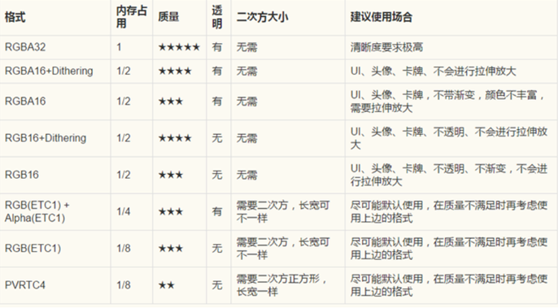
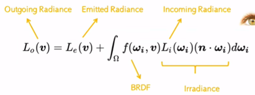
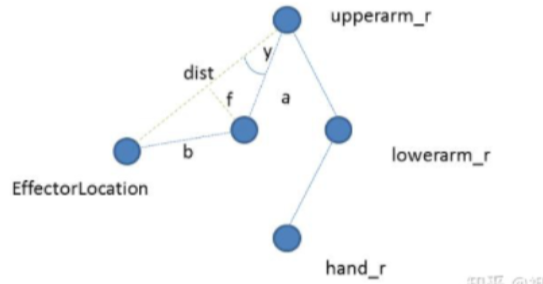
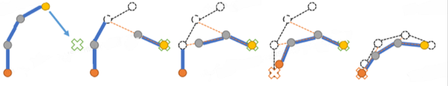

计算机基础知识面试题
============
# Unity
-------
## 组件
### 1. Unity脚本的生命周期

（1）Reset：当Scripts第一次绑定到物体上或者点击Reset按钮的时候会触发，且只在Editor的模式下触发，游戏打包的时候并不会触发。

（2）Awake：当脚本实例在游戏运行被载入的时候运行，一般为了初始化游戏变量和游戏状态，注意，无论函数是否被激活，Awake都会执行。

（3）OnEable：在游戏对象是可激活状态的时候会调用。

（4）Start：也是为了初始化变量的方法，但是和Awake有些许不同。首先，Awake是在项目初始化的时候调用的，但是Start可能在初始化之后调用，所以如果把一些状态变量放在Start中进行初始化，会很不安全，因为可能会有别的函数在Start之前就执行，造成一些空引用的问题。其次，如果不是处在激活的状态，Start是不会被调用的，但是Awake无论是不是激活都会被调用。

（5）FixedUpdate：所有的物理行为的每帧更新的逻辑都应该放在这里，因为这个是固定间隔的帧执行的，而普通的Update每一帧之间的间隔是不一样的，我们希望施加在物体上的力是均匀的，否则会出现卡顿的情况。实现原理：判断两帧之间的间隔deltaTime，加到Time内；如果Time-FixedTime >FixedDeltaTime，则执行FixedUpdate，并将FixedDeltaTime加到FixedTime；否则不执行FixedUpdate。

（6）OnTrigger：触发器行为  OnCollision：碰撞行为  OnMouse：点击输入行为

（7）Update：每一帧进行调用，是实现游戏逻辑的主要方法。

（8）LateUpdate：在所有Update方法执行之后执行，一般用于摄像机的跟随移动。

（9）OnGUI：处理GUI数据，也是每一帧执行一次

（10）OnDisable：在对象被取消活跃状态的时候响应，和OnEnable相对应，但与此同时对象再次被激活的时候，OnEnable也会再次响应。

（11）OnDestroy：在对象被销毁的时候调用，但是如果一开始对象就处于不激活状态然后被销毁了，就不会调用这个函数。

### 2. NavMesh导航系统

导航烘焙：通过导航面板（Window -> AI -> Navigation）规划场景中哪里可以去哪里不能去。（1）选择场景中，将地形、场景相关的游戏物体设置为Static模式，这是烘培的前提（2）直接选择子栏目Bake，点击Bake按钮。（3）场景中部分区域呈现成蓝色，意味着烘培成功，蓝色就是角色可以前往的地方。一定要把场景Static打开，静态才能导航烘焙。

NavMeshAgent 导航网格代理：添加这个导航代理组件的游戏物体，身上会增加一个圆柱体形状的碰撞体，可以设置移动物体的属性。

NavMeshObctacle 导航网格障碍物：是NavMeshAgent需要避开的障碍物。NavMeshObstacle 为圆柱形，能够以特定的速度沿着导航网格的表面移动。默认情况下，障碍物只会影响agent 的“规避”行为，并不会影响其寻路行为。这意味着 agent 将在寻路时忽略障碍物，但需要在沿路径移动时绕过障碍物。如果已启用“Carve雕刻”，障碍物会在导航网格中创建一个临时的“孔”。寻路时可识别该孔，因此所确定的路径将避开障碍物。这意味着如果障碍物阻挡了狭窄的间隙，寻路功能会寻找前往目的地的替代路线。如果没有雕刻功能，agent会前往空隙处，但只能在清除障碍物后才能通过。Carve: 是否重新渲染，不勾上的话只有离agent近的时候才会参与计算，如果障碍物是实时运动的，那就不要选，不然消耗资源 。

OffMeshLink 网格外连接：在平面导航网格外部移动的链接，将两个分开网格建立链接。

底层实现基于A*寻路算法和网格图。

### 3. UGUI

UGUI是Unity引擎自带的UI系统，只能用于游戏UI功能，不能用于开发编辑器内置的用户界面。

#### 3.1 六大基本组件：

Canvas对象上依附的：（1）Canvas，画布组件，主要用于渲染UI控件。（2）Canvas Scaler，画布分辨率自适应组件，主要用于分辨率自适应。（3）Graphic Raycaster，射线事件交互组件，主要用于控制射线响应相关。（4）RectTransform，UI对象位置锚点控制组件，主要用于控制位置和对齐方式。EventSystem对象上依附的：（5）EventSystem，玩家输入事件响应系统。（6）Standalone Input Modul，独立输入模块组件，主要用于监听玩家操作。

#### 3.2 Canvas的三种渲染方式：

（1）Screen Space – Overlay：屏幕空间，覆盖模式，UI始终在前。

（2）Screen Space – Camera：屏幕空间，摄像机模式，3D物体可以显示在UI之前。

（3）World Space：世界空间，3D模式。

三大基础控件：（1）Image，UGUI的图像组件，是UGUI用于显示精灵图片的关键组件，除了背景图等大图，一般都使用Image来显示UI中的图片元素，只有Sprite可以拖拽到Image组件中。（2）Text，用于显示文本，可以设置字体、字号、颜色、对齐方式等属性，并支持富文本格式。（3）RawImage控件：用于显示未经处理的原始图像，例如将图片作为背景或显示视频纹理等，用于显示大图（背景图，不需要打入图集的图，网络下载的图等）。

#### 3.3  Image和Rawlmage的区别：

（1）渲染方式：Image组件使用Unity的UI系统进行渲染，支持图像的2D变换、填充类型、九宫格切片等功能，可以显示Sprite或Texture，支持更复杂的渲染效果，如颜色混合、填充、裁剪等，这些额外的渲染操作可能会增加性能开销。RawImage组件使用Unity的底层渲染系统，只能显示Texture，渲染方式相对较简单，通常只涉及纹理的绘制。

（2）纹理处理：Image组件会对纹理进行处理，使其适应UI元素的大小和变换。RawImage：RawImage组件直接使用原始的纹理数据，不对纹理进行处理或拉伸。

（3）功能和用途：Image通常用于显示UI界面中的静态图像，如图标、背景、按钮等。RawImage通常用于需要直接显示纹理、视频帧或动态渲染结果的情况。

#### 3.4 UIGroup UIPanel：

UIGroup的概念通常用于复杂的UI系统中，以提高UI的模块化、可重用性和可维护性。

（1）UI层级管理：UIGroup可以用于管理UI的层级关系，确保不同UI元素的正确显示顺序和重叠关系。（2）UI元素布局：UIGroup可以用于管理UI元素的布局和位置。（3）UIGroup可以用于管理一组相关的UI元素的交互行为。（4）UI元素状态切换：UIGroup可以用于管理UI元素的状态切换。

#### 3.5 unity中UI怎么屏幕自适应，原理是什么？

UGUI的屏幕自适应，是通过Canvas Scaler来做的，根据屏幕的分辨率，计算出canvas的大小，同时计算ScaleXY,通过Size + Scale来控制Canvas的变换，UI作为canvas的子物体，也会跟随着一起变化；为了保证UI的位置，需要在设计UI的时候，对角落，边缘的UI做特殊的处理，利用锚点来保证UI与边缘或角落的距离，锚点的概念就不多说了，一句话：锚点的向量值就是锚点与自己轴心的距离。

#### 3.6 锚点和中心点的区别：

锚点用于控制游戏对象在屏幕上的位置和大小，中心点用于控制游戏对象的旋转和缩放。

#### 3.5 源码解析：
根据Unity2017的UGUI 内核源码的文件夹结构图，可分成了三块，输入事件，动画，核心渲染。

动画：
动画部分相对比较简单，用了tween补间动画的形式，对颜色，位置，大小做了渐进的操作。tween的原理是在启动一个协程，在协程里对元素的属性渐进式的修改，除了修改属性数值，tween还有多种曲线可以选择，比如内番曲线，外翻曲线等，一个数值从起点到终点的过程可以由曲线来控制。

输入事件：
UGUI 把输入事件模块有四部分，事件数据模块，输入事件捕获模块，射线碰撞检测模块，事件逻辑处理及回调模块。
（1）事件数据模块，主要作用为在各种事件发生时，为事件逻辑做好数据工作。
（2）输入事件捕获模块，进行输入监测。
（3）射线碰撞检测模块，主要工作是从摄像机的屏幕位置上，做射线碰撞检测并获取碰撞结果，把结果返回给事件处理逻辑类。射线碰撞检测模块主要为3个类，分别为2D射线碰撞检测，3D射线碰撞检测，GraphicRaycaster图形射线碰撞测试。
（4）事件主逻辑处理模块，主要的逻辑都集中在 EventSystem 类中，EventSystem 是事件处理模块中唯一继承 MonoBehavior 并且有在 Update 帧循环中做轮询的。也就是说，所有UI事件的发生都是通过 EventSystem 轮询监测到的并且实施的。

### 4. 动画系统

Timeline：是Unity推出的一个资源整合工具。该工具可以给不同的游戏对象建立不同类型的轨道。每个轨道可以单独进行编辑，轨道内的不同资源可以有序的进行排列以及融合。

（1）Activation Track：对象激活与隐藏轨道，选择控制在Timeline上何时激活轨道。

（2）AnimationTrack：动画轨道，控制游戏物体的动画，允许直接导入动画片段clip。

（3）AudioTrack：声音轨道，允许导入现有音频资源片段，做出编辑。

（4）Signal Track：信号轨道，包括信号资源，信号发射器和信号接收器，它其实就是一个Event，作用就是在单独轨道上面添加事件点，在某一帧执行某个方法。

Animation：

每一个动画都是一个AnimationClip，存放在Assets文件夹里，它是一段预定义的动画序列，包含了对象在一段时间内的位置、旋转、缩放等变化。

动画组件（Animation Component）：实际播放动画的是物体上的Animator组件，应用于游戏对象中控制对象的动画播放。注意动画的优先级比代码要高。

动画过渡（Transitions）：用于动画与动画间的转化。状态控制参数是用于控制Transition的发生的。比如只有当我们按下空格时才要过渡到跳跃动画。

其他：骨骼动画系统、动画事件、动画曲线编辑、Blend Trees。

### 5. meta文件的作用

每个meta文件中一定会有两个属性：（1）uuid：该资源的唯一标识符，meta文件创建时随机生成。（2）ver：meta文件的版本号，由资源对应的meta类定义，用于判断资源在不同版本的编辑器中是否需要重新导入。

不能随意删除meta文件：uuid是资源的唯一标识符，资源文件直接的引用都是依赖于uuid的，一旦删除了meta文件，那么这个资源的uuid就发生了变化，之后使用这个资源的地方就会遇到无法找到资源的问题。

## 机制
### 1. 什么是Unity的垃圾回收

堆栈是内存的线性分配，用于储存值类型，当局部变量超出作用域的时候会自动将这些内存释放，性能开销极小。堆中存储引用类型的具体数据，它们的指针存在堆栈中，堆不是线性储存的。当堆填满后，untiy垃圾回收器会对其进行检查，若其中存在没有引用的内存，则会对其进行释放，如果只是空间不足，则会自动扩展堆的空间。当然，当unity进行垃圾回收时需要检查整个堆，游戏被暂停造成卡顿，除了自动回收外，也可以通过代码手动进行垃圾回收，如在加载界面执行System.GC.Collect。

每次运行GC的时候，主要进行下面的操作：（1）GC会检查堆内存上的每个存储变量；（2）对每个变量会检测其引用是否处于激活状态；（3）如果变量的引用不再处于激活状态，则会被标记为可回收；（4）被标记的变量会被移除，其所占有的内存会被回收到堆内存上。

Unity il2cpp下的GC算法是贝母垃圾收集器，执行垃圾收集时，它将停止正在运行的程序，导致执行延迟；从2019.1开始Unity开启了BoehmGC 的渐进式GC模式，将工作负载分配到多个帧来显着减少 GC 尖峰破坏动画流畅性的问题。Java和 C# GC 都是精准式GC,而Boehm GC 是保守式的。垃圾回收算法有引用计数和标记清除的方式，其中贝母垃圾回收器采用的是标记清除法。

目前主流的回收器有如下三种：（1）保守式回收（Conservative GC），以Boehm为代表。
（2）分代式回收（Generational GC），以SGen（Simple Generational GC）为代表。（3）引用（计数）式内存回收（Reference Counting GC），例如Java就是使用的这种，但是它是结合了保守式的引用式内存回收。

### 2. AddForce的函数参数 ForceMode

AddForce用于对rigidbody组件对象添加力的作用。

Force（力）：通过 AddForce 函数添加力，单位为 N。如果我们在FixUpdate内持续调用AddForce(Vector3.up *100,ForceMode.Force)，那一秒内的50次调用（默认情况下FixUpdate 0.02秒调用一次）即为对该物体产生一个向上的100N的力持续一秒。

Impulse（冲量）：通过 AddForce 函数添加冲量，单位为 N /s（牛顿每秒）。冲量是一个在一瞬间产生的力，AddForce(Vector3.up *100,ForceMode.Impulse) 调用1次与AddForce(Vector3.up *100, ForceMode.Force) 调用50次（一秒）的总力一样。

Acceleration（加速度）：通过 AddForce 函数添加加速度。忽略对象的质量，AddForce(Vector3.left*100, ForceMode.Acceleration)在fixupdate内执行一秒（默认50次），即视作一秒内物体保持了一个向左的100的加速度，静止的物体会在一秒后速度变为100.

VelocityChange（变速）：通过AddForce函数添加的速度变化，单位为m/s。忽略对象的质量，速度变化是一个直接改变物体速度的量，它可以在一次调用后立即影响物体的运动状态。

其中Force和Impulse受物体质量影响，Acceleration和VelocityChange与质量无关。

### 3. Unity 延迟执行的5种方式

Update：适合需要同步显示时间的场合，写法复杂，可读性差。

Invoke：适合简单的延迟场合，无法传参，没有返回值。

协程WaitForSeconds：适合较为复杂的延迟场合，可控性高，可直接传参。

DoTween：适合UI动画场合（配合其他功能一起使用）

UnityTimer：写法简单，支持lambda表达式传参。

### 4. Cocos的内存管理，引用计数。

引用计数基本思想是通过计数方式实现多个不同对象同时引用一个共享对象，具体的讲，当创建一个对象实例并在堆上分配内存时，对象的引用计数为1，在其他对象中需要持有这个共享对象时，需要把共享对象的引用计数+1，当其他对象不在持有该共享对象时，共享对象引用计数-1，当共享对象的引用计数变为0时，对象的内存会被立即释放。

Cocos2d-x中使用引用计数进行内存管理；Ref类是Node的父类，Node类是Sprite、Layer、Scene父类，Director类直接继承自Ref类；对象的引用计数是Ref类中的成员变量，是个int值；Ref类中提供了retain()、release()、autorelease()、getReferenceCount()方法对引用计数进行操作；Ref::autorelease()方法是将本ref对象添加到自动释放池对象AutoreleasePool中；Ref类提供了检测内存泄露的相关方法；PoolManager实例对象和自动释放池类对象进行管理。

### 5. 纹理压缩

在构建时把纹理源文件压缩为对应指定纹理压缩格式的过程。源文件如JPG、PNG、TGA、PSD等，在游戏运行时是不会使用这些格式的，而是使用设备显卡所支持的纹理压缩格式。

纹理压缩格式：ETC、DXT、PVRTC、ASTC。

平台默认纹理压缩格式 ：
Android：RGB Compressed ETC[RGB 24bit] ；RGBA Compressed ETC [RGBA 32bit]
IOS：RGB Compressed PVRTC 4bit；RGBA Compressed PVRTC 4bit

当平台不支持指定的纹理压缩格式时，会造成两个问题：（1）对纹理资源进行重新解压为RGB32，更加耗时。（2）之前解压不支持的部分也会保留，浪费内存空间。

### 7. 渲染管线

内置渲染管线（Build-In Render）：这是Unity最早的渲染管线，也是默认的渲染管线，提供了一套简单的渲染流程，但功能较为基础，对于一些高级的图形效果可能无法实现。

可编程渲染管线技术SRP（Scriptable Render Pipline）：可以在Unity通过C#脚本调用API配置或执行渲染命令的方式来实现渲染流程，SRP将这些命令传递给Unity底层图形体系结构（low-level graphics architecture），然后再将指令发送给图形API（Graphics API），最终由GPU进行处理，SRP 技术可以强化通用渲染管线 (URP) 和高清渲染管线 (HDRP)。URP和HDRP建立在SRP之上，还可以在 SRP 之上创建自己的自定义渲染管线。

通用渲染管线URP（Universal Render Pipeline）：从Unity 2019.3版本开始，Unity引入了通用渲染管线URP，它是一种快速的单通道前向渲染器，主要设计用于不支持计算着色器技术的低端设备，还可为中端设备（如游戏主机和PC）提供更高质量的图形性能。优势：（1）URP是单Pass前向渲染管线，所有的光源处理都可以在一个DrawCall中完成，而内置管线是多Pass,可选前向渲染管线和延迟渲染管线。（2）传统内置渲染管线中的批处理有着诸多限制，特别是动态批处理，这在底层渲染优化机制SRP Batcher 中得到了彻底优化，只要是用一个着色器变体的物体都可以批处理到一起。（3）可扩展性得到了提升

HDRP 高清渲染管线（High Definition Render Pipeline）：这是Unity的高质量渲染管线，主要针对高端设备，例如最新的智能手机、游戏主机和PC等。它提供了更高的视觉效果和更真实的图像表现，同时也需要更高的计算能力。

## AssetBundle

### 1. Resources和AssetBundle使用区别？

Resources是动态内部调用，在编辑环境下是project窗口的一个文件夹，调用里面的资源，可以用Resources类，比如Resources.Load，打包后这个文件夹不存在，统一生成assets资源。文件夹目录下统一打包，只读无法修改。

AssetBundle是外部调用，要用AssetBundle首先要先把资源打包为.assetbundle文件，再动态的去加载这个文件，本地或者网络服务器都可以。存储位置可自定义，压缩方式可自定义，后期可动态更新。

### 2. 什么是AB包？

特定于平台的资产压缩包，有点类似压缩文件。资产包括模型、贴图、预设体、音效、材质球等等。C#是编译型语言，C# 脚本文件包含在AssetBundle中无法在运行时动态编译，如果在游戏需要使用AssetBundle中包含的C#脚本文件，你需要在打包AssetBundle时对这些脚本进行预编译，将它们编译成 DLL文件并打包到AssetBundle中。

### 3. AB包有什么作用？

相较于Resources下的资源，AB包更好管理资源。

减小包体大小。压缩资源，减少初始包的大小。

热更新。资源热更新，脚本热更新。客户端自带很少的默认资源，通过与资源对比文件，从服务器更新最新的各种AB包。打包后的 AssetBundle 文件可以通过网络或本地文件系统进行传输和加载。

### 4. 如何生成AB资源文件？

Unity编辑器开发，自定义打包工具。BuildpipeLine.BuildAssetBundle()

官方提供好的打包工具：Asset Bundle Browser。先通过BuildTarget确定目标平台，如IOS、Windows；确定输出路径；可输出在Application.streamingAssetsPath；压缩方式包括NoCompression（不压缩，加压快，包较大），LZMA（压缩最小，解压慢，用一个资源要解压所有），LZ4（压缩，相对与LZMA大一点，用什么解压什么）。

包括主包、资源包、主包的manifest（资源的描述信息，包括依赖关系）、资源包的manifest。

### 5. 使用AB包文件

加载AB包：AssetBundle ab = AssetBundle.LoadFromFile( path )  //异步LoadFromFileAsync()

加载AB包中的资源： GameObject obj = ab.LoadAsset<GameObject>(“Cube”);

### 6. AssetBundle 的加载方式有哪些？各自的优缺点是什么？

AssetBundle 的加载方式有同步加载和异步加载两种。同步加载可以在加载完成前阻塞程序的执行，直到资源加载完成后才继续执行程序。异步加载可使用协程，不会阻塞程序的执行，而是在后台线程中进行资源加载，并在加载完成后通过回调函数通知程序。同步加载可以保证资源的即时可用性，但会阻塞程序的执行，影响用户体验；异步加载可以提高程序的响应速度，但需要通过回调函数来处理资源加载完成后的逻辑，代码复杂度较高。

### 7.  如何在 AssetBundle 中包含 C# 脚本文件？如何在加载 AssetBundle 时运行这些脚本？

可以将 C# 脚本文件编译成 DLL 文件，并将 DLL 文件打包到 AssetBundle 中。在加载 AssetBundle 时，可以使用 Assembly.LoadFrom 或 Assembly.LoadFile 方法加载 DLL 文件，并使用反射机制实例化和调用其中的类和方法。需要注意的是，在加载 DLL 文件之前，需要先加载其依赖项，并保证 DLL 文件和依赖项的版本和平台兼容性。

### 8. 如何在 AssetBundle 中包含依赖项？如何在加载 AssetBundle 时一并加载这些依赖项？

可以通过 Unity 的编辑器界面或代码 API 来设置 AssetBundle 的依赖项。在加载 AssetBundle 时，可以先加载其依赖项，再加载 AssetBundle 本身。可以使用 AssetBundle.GetAllDependencies 方法获取 AssetBundle 的所有依赖项，然后递归加载这些依赖项。加载依赖项时，需要保证依赖项的加载顺序和依赖关系，以避免资源加载出错。

### 9. 如何优化 AssetBundle 的大小和加载速度？

（1）选择适当的压缩方式和压缩比例，以平衡加载速度和文件大小；

（2）将重复使用的资源打包成公共的 AssetBundle，以避免重复加载和占用内存；

（3）对于动态生成的资源，可以使用AssetBundle.CreateFromMemory 或 AssetBundle. CreateFromFile 方法在运行时动态创建 AssetBundle；

（4）对于较大的资源，可使用分包技术将其拆分成多个AssetBundle，并按需加载和释放；

（5）加载 AssetBundle 时需异步，使用回调函数处理加载后的逻辑，提高响应速度；

（6）在使用 AssetBundle 时需要及时释放资源，并避免内存泄漏和程序崩溃。

### 10. 什么是热更新

热更新（Hotfix）是指在软件运行时，动态地更新程序代码或资源文件，而无需重新启动或重新安装软件。在游戏开发中，热更新通常用于修复游戏中的漏洞、优化游戏性能、添加新的游戏内容或功能等。热更新通常分为代码热更新和资源热更新两种类型。

lua热更原理：逻辑代码转化为脚本，脚本转化为文本资源，以更新资源的形式更新程序。

### 11. 热更新时怎么进行资源对比？

在manifest文件中，"assets"字段下，记录每个资源的key和md5信息，只需要远端的_remoteManifest下记录的资源进行对比，新的key则是新增资源，没有的key则是需要删除的资源，md5不同的就是需要更新的文件。

### 12. 介绍一下Addressables

Addressables是基于AssetBundle架构做的高阶流程。优点：（1）自动化管理AB包打包、发布、加载。（2）可以更方便的进行本地、远程资源的加载。（3）系统会自动处理资源关联性。（4）内存管理更方便。（5）迭代更方便。注意：（1）C#代码无法作为可寻址资源（2）Resources文件夹下资源如果变为寻址资源，会移入Resources moved，这是因为Resources文件夹下资源会最终打包出去，如果变为可寻址资源意味着想通过Addressables进行管理那么它就没有必要通过Resources方式去加载和打包，避免重复打包，浪费空间。

## 常考八股 

### 1. Cocos Creater和Unity有什么区别？

（1）Cocos Creator主要使用js和ts，而Unity使用C#。

（2）Cocos Creator最初是为2D游戏开发而设计的，具有丰富的2D功能和工具。它还支持一些3D功能，但相比Unity而言，它的3D功能较为有限。

（3）Unity拥有庞大的生态系统，有大量的社区支持、插件和资源可以使用。您可以从Unity Asset Store中获取各种游戏资源和工具。

（4）Unity不开源，Cocos Creator不开源。

（5）Cocos2d-x中使用引用计数进行内存管理；Ref类是Node的父类，Node类是Sprite、Layer、Scene父类，Director类直接继承自Ref类；对象的引用计数是Ref类中的成员变量，是个int值；Ref类中提供了retain()、release()、autorelease()、getReferenceCount()等函数。

在Cocos Creator中，垃圾回收是由JavaScript或TypeScript语言的运行时环境负责的。Cocos Creator使用的是基于标记清除（Mark and Sweep）算法的垃圾回收机制。该算法通过标记不再使用的对象，然后清除这些被标记的对象及其相关的资源，以回收内存空间。在Unity中，垃圾回收是由Mono运行时环境负责的。

Unity使用的是基于引用计数（Reference Counting）和标记-清除（Mark and Sweep）相结合的垃圾回收机制。引用计数用于跟踪对象的引用数，当引用数降为零时，对象就可以被回收。而标记-清除算法则用于处理循环引用的情况，通过标记不再使用的对象，然后清除这些被标记的对象及其相关的资源。

### 2. MeshCollider和其他Collider的一个主要不同点？

MeshCollide是网格碰撞器，对于复杂网状模型上的碰撞检测，比其他碰撞检测精确的多，但是相对其他的碰撞检测计算也增多了，所以一般使用网格碰撞也不会在面数比较高的模型上添加，而会做出两个模型，一个表示物体的形状用于做碰撞检测，一个用于显示。

### 3. 当细小的高速物体撞向另一个较大的物体时，会出现什么情况？如何避免？

穿透（碰撞检测失败）。

避免方法：把刚体的实时碰撞检测打开Collision Detection修改为Continuous Dynamic。

### 4. MeshRender中material和shader的区别？

MeshRender是模型渲染的组件，有此组件物体才能显示出来。Material是材质球，实际就是shader的实例，并进行赋值，贴图、纹理、颜色等。Shader是着色器，实际上是一段程序，还可以用来实现一些仅靠贴图不容易实现的效果，如玻璃。

### 5. 请描述游戏动画有哪几种，以及其原理？

序列帧：原理就是在很短的间隔内，按照一定的间隔拍摄连续的静态照片；内存占用高。

关键帧动画：每个关键帧定义了一个特定状态，关键帧间通过插值生成平滑过渡动画效果。

刚性层阶式动画：角色由一堆刚性部分建模而成，在关节位置容易产生裂缝。

蒙皮/骨骼动画：骨骼（skeleton）由刚性的骨头(bone）构建而成，这与刚性层阶式动画是一样的。称为皮肤的三角形mesh网格会绑定在这些骨骼上，其顶点随着关节（joint）的移动而移动，每个顶点可以按照权重绑定到多个关节，因此关节移动时，蒙皮可以自然的拉伸。

优缺点对比：（1） 帧动画。优点：性能好，直接换图即可，不用计算。缺点：内存高，动作分解了好多图片。（2）骨骼动画。优点：内存资源占用少，只有一个一个的骨骼，动画代码控制。缺点：动画需要代码计算，所以性能比帧动画要差。

### 6. 游戏客户端的性能指标有哪些？

FPS、网络流量、CPU、内存（PSS、mono）、Drawcalls、三角形数、耗电量、包体大小等。

测试工具：Unity自带的Profiler和Stats。PrefDog腾讯开源的性能测试工具。

### 7. 什么是Unity GPU instancing

Unity GPU Instancing指将多个相同的网格渲染为一个网格，以此来减少网格绘制调用次数，并不通过对网格的合并操作来减少Drawcall。它将网格的渲染交由GPU处理，从而提升渲染效率。在Unity中，GPU Instancing主要用于渲染大批量的相似物体，比如植被、雨滴等。实现步骤：（1）创建一个网格，并将需要渲染的物体绑定到该网格上。（2）使用材质球对该网格进行渲染。（3）在材质球Shader中，使用多个submesh定义待渲染物体的顶点属性、纹理等信息，以及用实例化属性定义每个物体属性。（4）在C#代码中，用Graphics.DrawMeshInstanced方法来渲染该网格。

与动态合批和静态合批的区别：使用静态或动态批处理物体的材质的所有参数是相同的，因为使用Renderer.sharedMaterial修改参数，所有物体都会受影响；而使用Renderer.material会生成新实例，没法进行批处理。使用GPU Instancing的同一类物体的材质对象相同，但可以在代码中通过接口设置不同的参数，但仍会被批渲染。

静态合批是物体勾选Static后，Unity在Build的时候，会自动生成合并的网格，并将它以文件形式存储合并后的数据，这样在当场景被加载时，一次性提交整个合并模型的顶点数据，根据引擎的场景管理系统判断各个子模型的可见性。然后设置一次渲染状态，调用多次使用方法：场景中选中需要静态合批的物体，在该物体的Inspector窗口中将右上角的Static勾选。条件：①使用相同的材质球  ②标明为Static的静态物体。适用范围：像生活中的静态物体一样，建筑，树木等，因为计算合并后的数据在场景内就是固定的不会再变动。优势：网格通常在预处理阶段（打包）时合并，运行时顶点、索引信息也不会发生变化，所以无需CPU消耗算力维护；若采用相同的材质，则以一次渲染命令，便可以同时渲染出多个本来相对独立的物体，减少了DrawCall的次数。弊端：①增大内存开销：Draw call分别绘制每一个子模型。需要相同材质而且不能发生变换。②包体增大。

动态合批：动态合批的过程：既然不能预先计算，那么可以在运行时，在cpu里直接把可以合批物体的顶点等数据变换到世界空间下。渲染时，提交合并后的顶点数据，设置一次渲染状态，调用一次DrawCall绘制多个模型(不同于静态合批的多次调用DrawCall,因为可以进行动态合批的物体已经判断过可见性)。缺点：消耗CPU的计算性能，当计算消耗大于设置渲染状态等消耗时得不偿失。使用条件：①使用相同的材质球②在视野范围内的物体。适用范围： 移动的，同一个材质球并且模型面数较少的情况。

动态合批为了平衡CPU消耗和GPU性能优化，将实时合批条件限制在比较狭窄的范围内。静态合批则牺牲了大量的内存和带宽，以使得合批工作能够快速有效的进行。

### 8. 什么是法线贴图？

法线贴图通过在每个像素上存储法线向量信息来模拟光照在物体表面产生的微小凹凸效果，贴图中每个像素的RGB通道值被用来表示法线向量XYZ的方向。

### 9. 什么是切线空间？

切线空间就是纹理空间,由TBN轴组成的坐标系；（1）N：该顶点本身的法线方向，z轴；（2）T：该顶点的一条切线，其一般由模型给定，对应着UV图中的U，也就是使用和纹理坐标方向相同的那条；（3）B：由前两者叉乘得到，对应着UV图中的V。

### 10. timescale会影响update、fixedupdate或lateupdate吗

timeScale不影响Update和LateUpdate，会影响FixedUpdate；timeScale不影响Time.fixedDeltaTime和Time.unscaleDeltaTime，会影响Time.deltaTime。当timeScale等于0时，Update和LateUpdate可以执行，FixedUpdate不可以执行。Time.fixedDeltaTime不变，Time.deltaTime变为0，Time.unscaleDeltaTime就像游戏正常速度运行下的Time.deltaTime。

### 11. Mask和RectMask的区别？

（1）Mask遮罩的大小与形状依赖于Graphic，而RectMask2D只需要依赖RectTransform

（2）Mask支持圆形或其他形状遮罩， 而RectMask2D只支持矩形

（3）Mask会增加drawcall，除了绘制元素本身所需的1个drawcall以外，Mask还会额外增加2个drawcall。一个用来在绘制元素前修改模板缓冲的值，另一个用来在所有UI绘制完后将模板缓冲的值恢复原样。

（4）Mask组件的性能较低，RectMask2D组件性能相对较高，裁剪计算相对简单和快速。

（5）不同RectMask2D的子对象不能合批。多个Mask之间可以进行合批，需要同渲染层级(depth), 同材质, 同图集；Mask内外（Mask之间分离）不能进行合批。

### 12. 不透明/半透明物体的渲染顺序

半透明物体之间渲染是从远到近，不透明物体之间是从近到远。半透明和不透明物体之间是先不透明后透明。

### 13. 图形渲染中的earlyZ做了什么工作，原理是什么？

通常情况下,深度测试是在像素着色器执行之后进行的。这意味着即使一个像素最终不会被渲染(因为它被遮挡了),它仍然需要经历整个着色过程。EarlyZ 将深度测试放在像素着色器之前执行,可以在更早的阶段就确定哪些像素需要被渲染,从而避免不必要的着色计算。

### 14. 为什么深度测试要放在像素着色器之后而不能放在之前呢？

如果在着色之前就进行深度测试,可能会错过一些重要的着色信息,导致渲染结果不正确。对于透明物体,我们需要在着色之后进行深度测试和颜色混合,才能得到正确的渲染结果。

## OpenGL

### 1. 渲染管线

应用阶段：CPU主导，输出要渲染的图元，DrawCall。

顶点着色器：该阶段对场景中的每个顶点进行处理，传入顶点坐标UV、颜色、法线等等，并将它们从3D空间中变换到2D屏幕空间中。顶点着色器内包括MVP变换，最后进行了通过P裁剪。本地空间（M模型矩阵）->世界空间（V视图矩阵）->视图空间（P投影矩阵）->裁剪空间（透视除法进行归一化处理）->NDS标准设备坐标空间（视口映射）->屏幕空间。每一个顶点都调用vertex Shader。

图元装配（Primitive Assembly）：该阶段将相邻的顶点组成图元，例如三角形、线段或点。

几何着色器（Geometry Shader）：该阶段可以对图元进行进一步的处理，例如生成新的顶点或修改图元的形状。

面的剔除：根据右手法则，如果一个面的顶点按照逆时针方向排列（在屏幕上看来是顺时针方向），那么这个面是正面，否则是背面。可将所有背向面剔除掉。

光栅化：该阶段将图元转换为像素，并确定每个像素在屏幕上的位置。可利用多重采样解决抗锯齿问题，将单一的采样点变为多个采样点，利用采样点的平均颜色作为像素元素。

片元着色器：该阶段对每个像素进行处理，并通过插值计算出它的最终颜色值。每一个片元调用一次fragment shader。纹理采样、光照计算、多纹理混合等。

逐片段操作：对着色的像素进行输出合并，片元数据->裁剪测试->（透明度测试）->模板测试（模板缓冲区）->深度测试（深度缓冲区）->（透明度&）混合（颜色缓冲区）。

帧缓存（Framebuffer）：该阶段将最终的像素颜色值存储到帧缓存中，完成渲染过程。

### 2.  OpenGL中GLSL的变量类型有哪些

基本类型（Basic Types）：float、int、uint、bool。

矢量类型（Vector Types）：vec2、vec3、vec4、ivec2、ivec3、ivec4、bvec2、bvec3、bvec4。

矩阵类型（Matrix Types）：mat2、mat3、mat4。

数组类型（Array Types）：可以是基本类型、矢量类型或矩阵类型的数组。

纹理类型（Texture Types）：sampler2D、samplerCube、sampler2DArray等。

结构体类型（Struct Types）：用于组织多个变量成为一个自定义的数据结构。

其他特殊类型：采样器类型（Sampler Types）：用于采样纹理数据。缓冲对象类型（Buffer Object Types）：用于访问缓冲对象中的数据。图像类型（Image Types）：用于读写图像数据。

uniform是一种特殊的变量类型，用于在着色器程序中声明全局变量，并从应用程序中传递数据给着色器。uniform变量在渲染过程中保持不变，对于每个绘制调用都具有相同的值。

### 3. 物体描边如何实现?

在 shader 中开 2 个 Pass 渲染通道，第一个 Pass 通道将待描边物体的屏幕区域像素对应的模板值标记为 1，第二个 Pass 通道将待描边物体的顶点向外膨胀，绘制模板值为非 1 的膨胀区域，即外环区域。

### 4. 镜面反射，给定入射向量和镜面的法向量，计算反射向量

 入射光线为AO，反射光线为OB，法向量为N。先利用等腰三角形可以得到OB = AO + 2 * OP’，然后计算OP’，OP’=-(AO·N) * N。所以 OB =AO – 2 * dot（AO,N） * N。

### 5. 写出环境光、漫反射光、镜面高光的计算公式?

光照计算公式为：I = 环境光(Iambient) + 漫反射光(Idiffuse) + 镜面高光(Ispecular)。

环境光 Iambient = Aintensity * Acolor;  (Aintensity是环境光强度，Acolor是环境光颜色)。

漫反射光Idiffuse = Dintensity * Dcolor * max(0, dot(L, N));  (Dintensity表示漫反射强度，Dcolor表示漫反射光颜色，N为该点的法向量，L为光源向量)。

镜面光照Ispecular = Sintensity * Scolor * (max(0, dot(R, V))) ^n;  (Sintensity表示镜面光照强度，Scolor表示镜面光颜色，R为光的反射向量，V为观察者向量，n是表面的光泽度)

引入半程向量后的镜面光照计算公式Ispecular = Sintensity * Scolor * (max(0, dot(N, H))) ^n，N是法线，H是半程向量，它是光线方向和观察方向的中间向量。

### 6. 光照模型有哪些？

Lambert Lighting：兰伯特反射(Lambert)是最常见的一种漫反射，它与视角无关，即从不同的方向观察并不会改变渲染结果。Ld = Kd * I * max(N*L, 0) 。

Half-Lambert Lighting: 是Valve公司提出来的算法，其为了解决Lambert公式在灰面太暗的问题，进行了亮度提升， Ld = Kd * I * [max (N*L, 0) * 0.5 + 0.5] 。

Phong：模拟高光效果，它认为从物体表面反射出的光线包括环境光+漫反射+高光反射。

Blin-Phong Lighting：在Phong的基础上对高光反射计算进行了改进，参考镜面反射公式，引入了半角向量，即视角与入射光线中间的方向替代，其高光结果比Phong更"光滑"。此外，不用计算耗时的反射光线reflect，更简单高效。

PBR(Physically Based Shading)：是基于与现实世界的物理原理所创建的一种渲染技术，它模拟了真实世界中光线和材质的相互作用，相比于传统的基于经验的模型（Phong Blin-Phong等）更具有物理准确性。PBR的主要核心有两个，基于物理的光照和基于物理的材质。PBR材质依赖于PBR贴图，PBR贴图可以描述材质的各种属性，PBR的工作流有两种：Metallic-Roughness Workflow（Cocos，Unity），Specular-Glossiness Workflow（Unity）；都是用来渲染pbr材质表现的。基于物理的光照必须满足三个条件:（1）基于微平面理论，微观下没有任何平面是完全光滑的（2）能量守恒，出射光线的能量不能超过入射光线的能量（3）菲涅尔反射，如看水，离视线越近的地方水面反射越弱，越能看清水底，离视线越远的地方水面反射越强；PBR采用数学建模的方法计算物体的最终颜色，利用到了BRDF（双向反射分布函数，计算入射光线有多少反射到了出射光线上）模型；PBR中环境光使用IBL（Image Based Lighting）进行计算，通过环境贴图的像素信息计算光照强度。

### 7. 介绍一下Unity的全局光照模型GI（global illumination）？

全局光照GI由直接光照和间接光照两部分组成。直接光照由光照射到物体上后直接弹射到人眼，所接收到的光照；间接光照为光照射到物体上又弹射到其它物体上面，经过多次弹射才被人眼接收的光照。Unity有两种全局光照：Realtime GI和Baked GI。

Realtime GI：对静态物体进行光线反弹部分数据的预计算，在运行时支持实时光线反弹。缺点：计算实时GI会有一定的延迟，这不适合快速变化的灯光，适合明暗缓慢变化的光源。

Baked GI:烘焙全局光照，经过计算后把光照信息存储在光照贴图（lightmap）上。优点：经过烘焙后的显示效果好、性能消耗低，可以在移动设备上流畅的运行。缺点：经过烘焙后的光源都是固定的，不能有变化。

### 8. 光线追踪的原理

通过模拟光线的现实传播的交互行为来追踪光线进行渲染，通过发射虚拟的光线，然后追踪并记录这些光线与场景中物体之间碰撞的信息来生成画面的技术。（发射光线，碰撞检测，相交点计算，光照计算，递归追踪，阴影计算，光线融合）光线追踪比光栅化技术更容易实现全局光照效果；光追的计算量大、内存和显存的需求也比较大，从原理上要求场景中所有的几何体需预先加载到内存或显存中参加相交测试，因显卡针对光追技术的特殊设计才使得其能在游戏中得到应用。

按照追踪方式的不同，可分为三类：（1）正向光线追踪，从光源发射光线，需计算不到达摄像头的光线，效率低；（2）反向光线追踪，从摄像机发射光线，计算效率高但不能处理复杂的光路；（3）混合光线追踪，结合前两者的方法。游戏中常使用混合光线追踪，使用光栅化绘制的画面作为基础，再使用光线追踪补充一些额外信息补充细节。

### 9. 光照探针

 原理：在某一光照探针的所在位置点上对光照信息进行采样，然后从该光照探针相邻的其他光照探针的位置上对光照信息进行采样，把这些采样得到的光照信息进行插值运算，便可算出这些光照探针之间某个位置的光照信息。

实时 Realtime 光照太浪费资源，一般不会大范围使用在实际游戏场景中；烘焙 Baked 光照又不能作用在动态物体上，这就有了光照探针，来弥补光照贴图的不足；对于 Mixed 光照，虽然可以将光影效果投射到移动物体上，但移动物体不会从静态环境中接收到反射光，所以也需要使用光照探针。

### 10. 前向渲染和延迟渲染

前向渲染：基本原理是通过对场景中的每个可见物体进行逐个渲染，将它们的颜色、光照和阴影等效果计算并叠加到最终的图像上。在前向渲染中，渲染管线的每个阶段都会对每个物体进行处理。首先，通过顶点着色器将物体的顶点位置和属性转换为屏慕空间。然后，通过片段着色器对每个像素进行处理，计算其颜色和光照效果。最后，将处理后的像素颜色输出到帧缓冲区。优点：简单直观，易于实现和调试。它适用于场景中物体数量较少的情况并且能够处理透明物体和复杂的光照效果。缺点：由于每个物体都需要进行完整的渲染过程，对于大规模场景和复杂的光照计算，前向渲染的性能可能会受到限制。

延迟渲染：延迟渲染则将几何处理和光栅化分离开来，将几何信息和光照信息分别存储在不同的缓冲区中。将场景内所有物体绘制到G-Buffer后在进行着色计算，此时着色计算的对象便不是场景中的每一个渲染目标，而是G-Buffer里面的每一个片元信息。几何处理阶段只负责计算顶点的位置和法线等信息，并将这些信息存储在几何缓冲区中。光栅化阶段只负责计算片元的位置和纹理坐标等信息.并将这些信息存储在片元缓冲区中。在这之后，延迟渲染会执行一个光照处理阶段，该阶段使用几何缓冲区和片元缓冲区中的信息来计算光照效果。由于光照处理只需要对可见的片元进行计算，因此可以大大减少计算量，提高渲染效率。优点：可以提高渲染效率和图形质量，而无需重新计算所有的片元，别适用于处理复杂的场景和实现高级的图形效果，如全局光照、阴影等。缺点：需要使用更多的缓冲区，显存占用高，无法直接支持透明物体和抗锯齿等效果。

对比：在传统的前向渲染中用于简单的场景，但在复杂的场景中会导致大量的光照计算，降低渲染性能。延迟渲染通过将光照计算延迟到后期进行，可以大大减少光照计算的数量，提高渲染性能。然而，延迟渲染也有一些限制，比如无法直接支持透明物体和抗锯齿等效果。因此，结合延迟渲染和前向渲染可以克服各自的限制。一种常见的方式是使用延迟渲染来处理大部分不透明物体的渲染，而使用前向渲染来处理透明物体和其他无法直接支持的效果。另一种方式是使用延迟渲染来处理主要的光照计算，而使用前向渲染来处理一些特殊的光照效果，比如全局光照或实时阴影。

### 11. 如何实现Shadow Mapping？

ShadowMapping是一种常用的实时阴影生成方法，ShadowMap是动态生成的阴影纹理图，在需要时对其进行采样来获取阴影的一种技术手段。原理：在光源处添加一个相机，同时打开深度测试与写入，从光源视角渲染并生成ShadowMap（深度图/阴影贴图），保留深度信息；正常绘制场景，在进行场景渲染前需要将阴影贴图传递给着色器，把当前的片段转换到光源空间下，在片元着色器中，计算当前片元深度值与ShadowMap对应位置处的深度值进行比较，如果大于则表示该片段处于阴影中，反之则不在阴影中。

---------
## 网络

### 1. 与服务器的同步方案有哪些

状态同步：​
（1）​计算逻辑在服务器端​​。服务器负责处理所有核心游戏逻辑（如技能释放、伤害计算、物理碰撞等），客户端仅接收服务器广播的最终状态（如角色位置）并进行渲染。客户端与服务器上同步的是服务器上的最后的一个状态。要避免动作不流畅的最低是30。
（2）​​同步内容​​：服务器广播关键状态（如位置、血量）的最终结果。
​​（3）数据量​​：流量较大（需频繁传输完整状态），例如《全民超神》30分钟消耗约20MB流量。
​​（4）安全性​​：高（逻辑在服务器端，外挂难以篡改核心数据）。
​​（5）适用游戏类型​​：复杂逻辑与物理交互（如《守望先锋》的弹道计算）、大规模多人在线游戏（如MMORPG、FPS）。
（6）​​断线恢复​​：客户端重新加载服务器最新状态（可能丢失中间过程）。​​回放​​需记录完整状态快照，文件体积较大。

帧同步：
（1）按逻辑帧（固定时间间隔）同步数据。帧同步原理就是把这个帧率在本机的转为由服务器每隔一段时间向客户端发送数据来作为帧来驱动游戏，​​计算逻辑在客户端​​。所有客户端基于相同的初始状态和操作指令独立运行逻辑计算，服务器仅负责转发操作指令（如按键输入、技能释放时间），不参与实际运算。断线重连要从第一帧开始计算。
（2）​​同步内容​​：仅传输操作指令（如按键序列、操作时间戳）。
​（3）​数据量​​：流量较小（仅传输指令），例如《王者荣耀》30分钟消耗约8MB流量。
​​（4）安全性​​：低（客户端可篡改本地逻辑，需额外反作弊校验）。
​（5）​适用游戏类型​​：高实时性需求（如MOBA、RTS类游戏）、同屏单位数量多（如《星际争霸》的兵海战斗）。
​​（6）断线恢复​​：服务器补发断线期间的指令序列，客户端加速追帧。回放​​仅需记录操作指令，文件体积极小。

---------
## 算法

### 1. A*算法原理是什么？

核心公式：f(n) = g(n) + h(n)

f(n)：总移动代价。目前这个迭代阶段的经过第n个点到达目标点的预计值。

g(n)：从初始点到达第n个点的移动代价。

h(n)：从第n个点到达目标点的预估计代价。通常采用曼哈顿距离或者欧式距离。

Open列表：保存了所有生成而未考察的点。

Close列表：记录了已经访问过的节点。

具体流程：

（1）有一个open表，有一个close表，open表存储起点，然后由此出发。

（2）把起点放入close表中，并检测这点周围点的f值（g+h）。

（3）把剩下的点放入open列表中，并根据f值进行堆排序。

（4）把f值最小的点放入close列表中。

（5）继续上面的循环，继续处理，直到找到终点为止。

补充：可以定义一个node类存储节点，包括一个属性parent记得生成该节点的上一个节点，用于从终点确定一条到起点的路径。其他的一些寻路算法：Dijkstra算法，优点是精确计算最短路径，缺点是时间复杂度较高。BFS广度优先搜索算法，优点是保证找到的路径是最短路径，缺点是可能会访问很多无用节点。Jump Point Search算法，预处理图中的一些“跳跃点”，优点是可以大大减少搜索的节点数量，缺点是需要进行复杂的预处理操作。

优化策略：
（1）openlist优化：通过优化openlist提升A*的速度，如优先级队列；通过优化openlist改变A*的路径，如考虑排序算法的稳定性。
（2）getNeighbour优化：增加路径的随机性，如获取邻居时增加概率；寻找更优路径，如4邻居改为8邻居；JSP跳点搜索，对邻居节点进行剪枝，只支持斜线，加快寻路速度。
（3）F=G+H+C启发式优化：减少拐点，增加经过拐点的额外代价C；可穿障碍物，增加通过障碍物的代价。
（4）Map矩阵优化：通过控制维度提升速度；分层优化提升速度—HPA。

其他问题：
（1）A*算法，如果障碍物很多，怎么调整减低它的遍历次数？
（2）寻路过程中经过拐点的过程不够平滑怎么处理？
路径平滑算法：插值，三次样条插值，贝塞尔曲线，圆弧化处理（计算拐点附近两个线段的斜率，得到拐点处的切线方向。然后，我们可以构造一个以拐点为圆心、以切线方向为切线的圆弧，将拐点替换为圆弧上的一段路径。）

### 2. 四叉树/八叉树？

四叉树索引的基本思想是将地理空间递归划分为不同层次的树结构。它将已知范围的空间等分成四个相等的子空间，如此递归下去，直至树的层次达到一定深度或者满足某种要求后停止分割。四叉树的结构在空间数据对象分布比较均匀时，具有比较高的空间数据插入和查询效率（复杂度O(logN)）。

问题：（1）四叉树/八叉树的一个问题是，物体有可能在边界处来回，从而导致物体总是在切换节点，从而不得不更新四叉树/八叉树。

而松散四叉树/八叉树正是解决这种边界问题的一种方式，是指出口边界比入口边界要稍微宽些，从而使节点不容易越过出口边界，减少了物体切换节点的次数，实验表明出口边界长度为入口边界2倍时可以表现得很好。

四叉树/八叉树的应用：（1）场景管理。（2）碰撞检测。（3）光线追踪（Ray Tracing）过滤。

### 3. 漏斗寻路算法

### 4. AOI（Area Of Interest）算法

（1）暴力法：不使用任何算法以及数据结构进行管理和组织，当玩家需要某个坐标点以及对应范围内的玩家列表时，暴力检索整个场景中的所有存在对象，然后进行坐标判断，随后返回给调用方的一种AOI实现算法，其检索的时间复杂度为O(n)。优点：实现简单，不需要多余的复杂数据结构，少量Entity的地图场景之中（如小队副本，团队副本等），效率很高。缺点：当场景中Entity数据量巨大，遍历整个数组会有很大的性能损耗。

（2）灯塔算法：把整个场景通过不同的粒度，利用网格划分成一个一个的大小相等的小区域， 在每个区域里树立灯塔。在Entity进入或退出格子时，维护每个灯塔上的Entity列表。优点：实现简单，灯塔法将大量Entity分散到了多个灯塔中，所以性能要好的多。缺点：存储空间不仅和Entity数量有关，还和场景大小有关，浪费内存，且当场景规模大过对象数量规模时，性能还会下降。

（3）十字链表算法：十字链表算法是根据二维地图，将其分成x轴和y轴两个链表。将对象的坐标值按照大小相应的排列在相应的坐标轴上面。将玩家的X坐标按照从小到大插入 X链表，将玩家的Y坐标按照从小到大插入Y链表，查询时根据玩家的坐标分别从2个链表中取出范围内的所有玩家，对两个玩家列表做交集，即为我们需要发送消息的玩家列表。优点：节省内存空间，没有Entity那么就不会占用内存空间；由于是有序链表，可以采用二分法进行快速搜索；由于链表特性插入和删除不会那么麻烦。缺点：大数据量的搜索性能还是有待提高、但是可以通过跳表等进行优化。

（4）四叉树算法：搜索性能来讲四叉树与灯塔算法的搜索性能差不多，但是相较其优势时针对内存的占用，因为灯塔算法时一次性开辟所有内存，无论其格子内是否包含数据，而四叉树则可以在没有数据的地方不开辟内存。

### 5. 蓄水池抽样算法和洗牌算法

------
## IK原理
IK（ Inverse Kinematic）逆向动力学，FK（Forward Kinematic）正向动力学。IK是子关节带动父关节，FK是父关节带动子子关节。IK对于提升动画质量，展现动画细节来说是很重要的工具。

https://blog.csdn.net/alazycat_/article/details/122163340

### IK解算器
#### 1. 双骨骼IK算法：
限制IK的骨链只能有2根骨骼和一个关节。Effector Location: 指定的Target位置
，DistDir：由起始位置指向Target位置的向量，并且可以直接拿到长度dist。

（1）余弦定理求第一个关节的旋转角度，即上述的cos（θ1-θr）。

    cos(y) = (a^2 + dist^2 - b^2) / (2 * a * dist);   

（2）求f的长度，用于后面求投影距离。

    f = a * sin(y); 

（3）勾股定理求a在DistDir上的投影距离

    ProjDist = FMath::Sqrt(a^2 - f^2); 

（4）最后通过向量加关节起始点位置，得到最后要求的中间关节的位置。

    OutJointPos = RootPos + (ProjDist *DistDir) + (f  * JointBlendDir); 

#### 2. FABRIK算法（前向和后向到达IK）：

支持多根骨骼IK，但主要是控制骨骼的位置，不负责控制骨骼的旋转。通过往前和往后遍历骨骼链的方式使骨骼的位置收敛于解决方案（可能不是最好的，由迭代次数和精度决定）。

（1）先计算整条骨骼链的长度，判断目标点是否可达，如果不可达，则要求根骨骼移动。

（2）从末端骨骼开始，直接把骨骼拆下来，把末端效应器放到Target目标位置，并且这根骨骼的两端，和剩余骨骼的末端与Target的连线要处于同一直线。依次拆下剩余的骨骼，并按照1的规则来放置拆下来的骨骼。

（3）当1~2步都执行完毕后（这就是前向遍历到达（Forward Reaching）），以原Target位置为骨链的起始位置，原Base设置为Target位置，再执行1~2步，这就是后向遍历到达（Backward Reaching）

（4）重复1~3步，直到末端效应器到达目标点的一定阈值内，或者达到迭代次数（UE4默认为10）停止。

#### 3. CCDIK（Cyclic Coordinate Descent 循环坐标下降法）
#### 4. Spline IK

---------
## 优化

### 1. UI优化 

（1）降低drawCall：动态合批和静态合批，合并为一个批次进行渲染。将同一画面图片放到同一图集中。图片和文字尽量不要交叉，会产生多余drawcall（相同材质和纹理的UI元素是可以合并的）。UI层级尽量不要重叠太多。相同材质和纹理UI放在同一层级下。UI的Z值保持为0。减少使用mask，用覆盖的方式代替。

（2）内存优化：Texture packer图集制作。图片按是否有颜色通道进行划分，再进行图片压缩。使用UI对象池。

（3）动静分离，将动态UI和静态UI元素放在不同Canvas中，减少canvas网格重构频率。

（4）禁用某些组件预选项，取消勾选不必要的射线检测RaycastTarget；text组件的richText属性。

### 2. 物理引擎优化

（1）降低drawCall：动态合批和静态合批，合并为一个批次进行渲染。将同一画面图片放到同一图集中。图片和文字尽量不要交叉，会产生多余drawcall（相同材质和纹理的UI元素是可以合并的）。UI层级尽量不要重叠太多。相同材质和纹理UI放在同一层级下。UI的Z值保持为0。减少使用mask，用覆盖的方式代替。

（2）内存优化：Texture packer图集制作。图片按是否有颜色通道进行划分，再进行图片压缩。使用UI对象池。

（3）动静分离，将动态UI和静态UI元素放在不同Canvas中，减少canvas网格重构频率。

（4）禁用某些组件预选项，取消勾选不必要的射线检测RaycastTarget；text组件的richText属性。

### 3. 内存管理优化

（1）使用对象复用和对象池。

（2）使用纹理压缩和合批处理，使用纹理压缩技术（如 ETC、ASTC）来减少纹理占用的内存。此外，使用合批处理来减少绘制调用，以优化渲染性能和内存使用。

（3）减少内存分配，避免在运行时频繁地创建临时对象，特别是在Update函数中。

（4）优化资源加载：合理管理资源加载可以减少内存占用。使用异步加载资源的方法，避免在主线程上进行耗时的资源加载操作，以保持游戏的流畅性。

（5）垃圾回收优化：避免在性能敏感的代码路径中触发频繁的垃圾回收。

---------
## 场景题

### 1.  Unity3D中角色头上显示图片和伤害值，但只想进行一次drawCall，怎么处理？

问题：（1）渲染上每块文字、图片都要用一次drawcall，图片文字可能是交替出现的没法dynamic batching。（2）UGUI元素都要放到canvas下，同步位置、朝向、缩放是很大的消耗。

解决方法：把文字做成位图。一个drawcall同时渲染图文的方式就是用混合，一个材质带文字和atlas两张贴图，用3套uv进行混合，uv1是文字的，uv2是图片的，uv3表示混合权重

### 2. Animator中如果有非常多个状态要如何优化？

优化Animator动画状态机排线，添加AnyState状态作为中间状态。

### 3.

### 4. 

### 5.