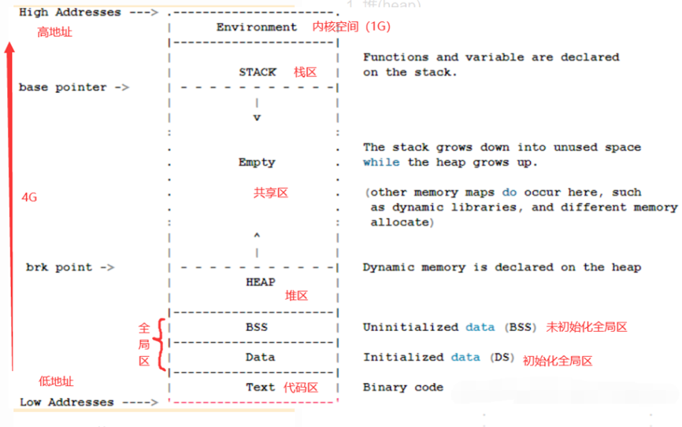
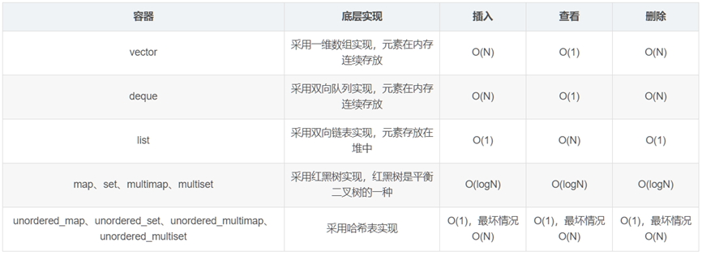

计算机基础知识面试题
============
C++
-------
### 1.为什么选择C++来开发游戏?

（1）C++够“低级”它允许你控制所有底层的东西，比如内存、指令、硬件。你几乎可以知道你的一段代码编程CPU指令后是什么样的?

（2）C++开发效率不是那么高，因为你有很多的细节要自己去控制把握。但它的运行效率非常的高 (只要你掌握的足够好、优化的足够好) 。甚至一些主机硬件会针对C++做优化。

（3）如果你的应用场景是需要你的程序、模块、系统高度优化 (可能是硬件限制、可能是成本考量) ，就可以考虑使用C++语言。

### 2.  游戏开发中可能有哪些场景会使用C++?
引擎开发：引擎的运行时库是需要最大化的运行效率的。

服务器开发：在用户量大的时候，尽力发挥每台服务器的效能，提高性价比。

工具开发：有些高性能需求工具，可以考虑用C++进行开发。

### 3. 数据类型的常见问题

（1）溢出：如整型运算的值超出32位，D =A * B / C 改为 D = A / C * B 更安全一点。
（2）精度：数字太小 ，小数点后N位就无法正确计算了。图形编程中的Z闪烁。
（3）有损截断：当用高精度数据类型给低精度数据类型赋值的时候，数据会被破坏性的转化。narrow cast是C++中的一个模板函数，可以用来进行类型转换，并检查是否有数据精度损失的风险。

### 4. 什么是指针，什么是野指针？

指针是一个存储地址的变量，指向内存的存储单元。指针可以让你只动结构，不动内容。

野指针：指针变量原来指向的变量/对象释放了，这块内存可能被释放了，也可能后来又被分配它来用，这时候这个指针还在，如果再用指针所指的地址做原来那些操作，事情会错乱。

### 5. 智能指针的作用和内部实现

作用：解决内存泄漏问题。

内部实现：重载了*和->运算符；引用计数，通过引用计数来判断对象是否在用，是否超出了范围，来决定是否释放内存。

### 6. 内存问题-写内存越界

说明：C/C++的特点是"自由"，它不管你怎么读写内存，想写到哪里都可以。

危害：很难知道什么东西被写坏了，很难知道被什么写坏了，错误表现通常无厘头。

容易出现越界的操作：字符串操作；内存操作；指针操作。

### 7. 内存问题-内存泄露

排查：借用工具来排查内存泄露。

避免：可通过使用智能指针来避免内存泄露

### 8. 内存问题-内存碎片

注意：运行时尽量避免持续的分配、释放内存，这样会产生内存碎片。

解决：内存池。

### 9. 内存问题-内存对齐

说明：CPU一次取一批数据；CPU取数据的位置是有对齐规则的。为了提高CPU的数据读取性能，需要内存对齐。应用场景：优化内存使用，对象序列化。

### 10. 什么是模板

作用：实现对不同数据类型的统一管理。

应用举例：容器、事件机制、3D数据处理。

### 11. 什么是位掩码bit masking？

在 C++ 中，位运算一种常见的技巧就是位掩码（bit masking）。位掩码是一种使用位运算来操作二进制位的技术，通常用于对二进制数据进行位操作、数据压缩和加密等方面。

作用：“多快好省”的存储和操作数据。应用：多开关状态存储。

### 12. 类型转换cast

C++ 中有四种类型转换方式：隐式转换、C 风格的类型转换、static_cast和dynamic_cast。不同于强制类型转换，使用cast转换会对转化类型进行检查。

### 13. 宏

注意：宏只是将其定义的那段字符串展开到使用代码的位置，所以它定义的内容不能被当成一个整体处理，本身也无语法定义。结果如何是看被展开以后，那个地方整体代码的效果。

使用：编译配置中可以针对不同的编译平台配置不同的宏。应用：版本平台差异的区分。

### 14. inline内联函数

作用：inline的函数会在调用的地方被展开，相当于把函数内的代码插入到调用的地方。

建议：如果函数较小且被多次调用，可以加inline。防止代码膨胀导致可执行文件的太大。

### 15. 库函数

作用：库文件可以理解为一个模块/系统的封装。

静态库：给程序编译用的，如果你的库是想给不同开发者拿去集成功能的，就做成静态库。

动态库：给程序运行用的。如果你的库是想给不同的程序去运行调用的，就做成动态库。

### 16. C和C++的区别

面向过程的思路：面向过程编程就是分析出解决问题的步骤，然后把这些步骤一步一步的实现，使用的时候一个一个的依次调用就可以了。C 语言主要用于嵌入式领域，驱动开发等与硬件直接打交道的领域，

面向对象的思路：面向对象编程就是把问题分解成各个对象，建立对象的目的不是为了完成一个步骤，而是为了描述某个事物在整个解决问题的步骤中的行为。C++ 可以用于应用层开发，用户界面开发等与操作系统打交道的领域。

C++ 对C 的“增强”，表现在以下几个方面：类型检查更为严格。增加了面向对象的机制、泛型编程的机制（Template）、异常处理、运算符重载、标准模板库（STL）、命名空间（避免全局命名冲突）。

C和C++一个典型的区别就在动态内存管理上了，C语言通过malloc和free来进行堆内存的分配和释放，而C++是通过new和delete来管理堆内存的；

强制类型转换上也不一样，C的强制类型转换使用()小括号里面加类型进行类型强转的，而C++有四种自己的类型强转方式，分别是const_cast，static_cast，reinterpret_cast和dynamic_cast；

C和C++的输入输出方式也不一样，printf/scanf，和C++的cout/cin的对别，前面一组是C的库函数，后面是ostream和istream类型的对象。

C++还支持namespace名字空间，可以让用户自己定义新的名字空间作用域出来，避免全局的名字冲突问题。

C++ 既继承了 C 强大的底层操作特性，又被赋予了面向对象机制。它特性繁多，面向对象语言的多继承，对值传递与引用传递的区分以及 const 关键字，等等。

### 17. 构造函数和析构函数可不可以为虚函数，为什么？

虚函数的调用需要虚函数表指针，而该指针存放在对象的内存空间中；若构造函数声明为虚函数，那么由于对象还未创建，还没有内存空间，更没有虚函数表地址用来调用虚函数——构造函数了。类编译后虚表放在rodata区（也就是全局只读区），表里面放的是函数地址。

### 18. 为什么析构函数可以为虚函数，如果不设为虚函数可能会存在什么问题？

防止内存泄露，delete p（基类）的时候，可以先执行了派生类的析构函数，然后执行了基类的析构函数。如果基类的析构函数不是虚函数，在delete p（基类）时，调用析构函数时，只会看指针的数据类型，而不会去看赋值的对象，这样就会造成内存泄露。

### 19.  C++ 程序编译过程

编译过程分为四个过程：预处理，编译，汇编，链接。

编译预处理：处理以 # 开头的指令，产生 .i 文件；由预编译器负责，内容包括：展开宏定义，处理所有条件预编译指令，删除所有注释，添加文件标号和行号，保留#pragma编译器指令。

编译、优化：将源码 .cpp 文件翻译成 .s 汇编代码；由编译器负责，包括词法分析，语法分析，语义分析，优化和生成汇编代码五个部分。

汇编：将汇编代码 .s 翻译成机器指令的 .o 或.obj 目标文件；

链接：产生.out 或.exe可运行文件。通过链接器将多个目标文件以及所依赖的其他库文件链接起来，最后生成可执行文件。链接器主要负责地址的重新分配、符号名称绑定和重定向。

### 20. 静态链接lib和动态链接dll的区别

静态链接：代码从其所在的静态链接库中拷贝到最终的可执行程序中，在该程序被执行时不需要其他额外的库文件，这些代码会被装入到该进程的虚拟地址空间中。

动态链接：代码被放到动态链接库或共享对象的某个目标文件中，链接程序只是在最终的可执行程序中记录了共享对象的名字等一些信息。在程序执行时，动态链接库的全部内容会被映射到运行时相应进行的虚拟地址的空间。具体来说，动态链接就是把调⽤的函数所在⽂件模块（DLL）和调⽤函数在⽂件中的位置等信息链接进目标程序，程序运⾏的时候再从 DLL 中寻找相应函数代码，因此需要相应 DLL ⽂件的⽀持 。

区别：

静态链接是将各个模块的obj和库链接成一个完整的可执行程序；而动态链接是程序在运行的时候寻找动态库的函数符号（重定位），即DLL不必被包含在最终的exe文件中。

（1）链接工具不同: 静态链接通过“链接器”，动态链接由操作系统在程序运行时完成；

（2）库包含限制：静态链接库中不能再包含其他的动态链接库或者静态库；动态链接库中还可以再包含其他的动态或静态链接库。

（3）运行速度：静态链接运行速度快，可独立运行；动态链接速度慢、不可独立运行。

优缺点：

静态链接：浪费空间，每个可执行程序都会有目标文件的一个副本，这样如果目标文件进行了更新操作，就需要重新进行编译链接生成可执行程序（更新困难）；优点就是执行的时候运行速度快，因为可执行程序具备了程序运行的所有内容。

动态链接：节省内存、更新方便，但是动态链接是在程序运行时，每次执行都需要链接，相比静态链接会有一定的性能损失。

### 21. C++ 内存管理

从高地址到低地址，一个程序由内核空间、栈区、堆区、BSS段、数据段（data）、代码区组成。常说的C++ 内存分区：栈、堆、全局/静态存储区、常量存储区、代码区。

栈：存放函数的局部变量、函数参数、返回地址等，由编译器自动分配和释放。栈从高地址向低地址增长。是一块连续的空间。Windows默认大小为2Mb，Linux默认为8Mb。

堆：动态申请的内存空间，就是由 malloc 分配的内存块，由程序员控制它的分配和释放，如果程序执行结束还没有释放，操作系统会自动回收。堆从低地址向高地址增长。一般可以分配几个G大小的内存。

在堆栈之间有一个共享区（文件映射区）。

全局区/静态存储区（.BSS 段和.data段）：存放全局变量和静态变量，程序运行结束操作系统自动释放，在 C语言中，程序中未初始化的全局变量和静态变量存放在.BSS段中，已初始化的全局变量和静态变量存放在.data 段中，C++ 中不再区分了。

常量存储区（.data段）：存放的是常量，不允许修改，程序运行结束自动释放。

代码区（.text段）：存放程序执行代码的一块内存区域。只读，不允许修改，但可以执行。编译后的二进制文件存放在这里。代码段的头部还会包含一些只读的常量，如字符串常量字面值。（注意：const变量虽然属于常量，但是本质还是变量，不存储于代码段）

### 22. 栈和堆的区别

申请方式的不同：栈由系统自动分配，而堆是人为申请开辟;

申请大小的不同：栈获得的空间较小，而堆获得的空间较大;

申请效率的不同：栈由系统自动分配，速度较快，而堆一般速度比较慢;

存储的内容不同：栈在函数调用时，第一个进栈的是主函数中后的下一条指令的地址，然后是函数的各个参数，在大多数的C编译器中，参数是由右往左入栈的，然后是函数中的局部变量。注意静态变量是不入栈的。当本次函数调用结束后，局部变量先出栈，然后是参数，最后栈顶指针指向最开始存的地址，也就是主函数中的下一条指令，程序由该点继续运行。

### 23. 全局变量、局部变量、静态全局变量、静态局部变量的区别

全局变量就是定义在函数外的变量。存储在常量区（静态存储区）。具有全局作用域。

局部变量就是函数内定义的变量。存储在栈区。具有局部作用域。

静态变量就是加了static的变量。存储在常量区（静态存储区）。全局作用域+文件作用域。

### 24. 静态变量在代码执行的什么阶段进行初始化？

C语言： 静态变量和全局变量均在编译期进行初始化，初始化发生在任何代码执行之前。

C++： 静态变量和全局变量仅当首次被使用的时候才进行初始化。

### 25. 局变量定义在头文件中有什么问题？

如果在头文件中定义全局变量，当该头文件被多个文件 include 时，该头文件中的全局变量就会被定义多次，导致重复定义，因此不能再头文件中定义全局变量。

### 26. 什么是内存对齐？内存对齐的原则？为什么要进行内存对齐，有什么优点？

内存对齐：编译器将程序中的每个“数据单元”安排在字的整数倍的地址指向的内存之中。

内存对齐的原则：
（1）数据类型自然边界对齐。
（2）结构体、类的自身对齐。缺省情况下，编译器为结构体的每个成员按其自然边界对齐方式分配空间，并按照每个成员被声明的顺序在内存中顺序存储，第一个成员的地址和整个结构体的地址相同。结构体整体的默认字节对齐值是结构体中所有成员中对齐参数最大值，结构体长度的计算必须取所用过的所有对齐参数的整数倍。

补充：结构体变量的起始地址能够被其最宽的成员大小整除。结构体每个成员相对于起始地址的偏移能够被其自身大小整除，如果不能则在前一个成员后面补充字节。结构体总体大小能够被最宽的成员的大小整除，如不能则在后面补充字节。

进行内存对齐的原因：
  （1）硬件设备的限制。只能存取对齐数据；非对齐数据不能保证是原子操作。
  （2）相比于存取对齐的数据，存取非对齐的数据需要花费更多的时间。
  （3）便于在不同的平台之间进行移植。
  （4）内存的访问效率，因为 CPU 在读取内存时，是一块一块的读取。

补充：编译器提供了一种手动指定对齐值的方式，只要在代码前添加关键字#pragma pack(n)，其中n是手动指定的内存对齐的字节数。如#pragma pack(4)表示以4个字节进行对齐。

### 27. 什么是内存泄露？内存溢出？
内存泄漏：由于疏忽或错误导致的程序未能释放已经不再使用的内存，失去了对该段内存的控制，造成了内存不能回收和不能及时回收，不能释放的内存越来越多就会内存溢出。

内存溢出：运行时堆内存的需求超过了计算机分配给程序的内存，造成”Out of Memory”。（1）堆内存泄漏。（2）系统资源泄漏。（3）没有把基类函数定义为虚函数。（4）在释放对象数组时没有使用delete[]，而是delete。（5）缺少拷贝构造函数。

### 28. 怎么防止内存泄漏？内存泄漏检测工具的原理？

内部封装：将内存的分配和释放封装到类中，在构造时申请内存，析构时释放内存。

智能指针：智能指针是 C++ 中已经对内存泄漏封装好了一个工具。

内存泄漏检测工具的原理一般分为两类：静态分析和动态分析。静态分析工具通常会对源代码进行分析。动态分析工具则是在程序运行时进行检测。通常会拦截程序中的内存分配和释放操作，并记录内存块的分配和释放情况，在程序结束时检查是否存在未释放的内存块。

### 29. 智能指针有哪几种？智能指针的实现原理？

智能指针是为了解决动态内存分配时忘记释放内存导致的内存泄漏以及多次释放同一块内存空间而提出的。C++11 中封装在了#include <memory>头文件中。

共享指针（shared_ptr）：资源可以被多个指针共享，使用计数机制表明资源被几个指针共享。通过use_count()查看资源的所有者的个数，可以通过unique_ptr、weak_ptr来构造，调用 release()释放资源的所有权，计数减1，当计数减为 0 时，会自动释放内存空间。

独占指针（unique_ptr）：独享所有权的智能指针，资源只能被一个指针占有，该指针不能拷贝构造和赋值。但可以进行移动构造和移动赋值构造（调用move() 函数），即一个 unique_ptr 对象赋值给另一个 unique_ptr 对象，可以通过该方法进行赋值。

弱指针（weak_ptr）：指向 shared_ptr 指向的对象，能够解决由shared_ptr带来的循环引用问题。weak_ptr是弱引用，不拥有所指向的对象，不会阻止对象的释放。shared_ptr可以直接赋值给weak_ptr，weak_ptr通过lock()成员函数来获取share_ptr，如果资源已释放则返回nullptr。如果你希望删除指向已释放变量的weak_ptr，可以使用weak_ptr的expired()函数来检查指向的变量是否已释放。如果expired()返回true，表示该weak_ptr指向的变量已经被释放，可以选择将该weak_ptr设置为空或者销毁该weak_ptr对象，调用reset();。

1）同一个shared_ptr被多个线程“读”是安全的；
2）同一个shared_ptr被多个线程“写”是不安全的；
3）共享引用计数的不同的shared_ptr被多个线程”写“ 是安全的。

### 30. 一个unique_ptr怎么赋值给另一个unique_ptr对象？

借助 std::move() 可以实现将一个 unique_ptr 对象赋值给另一个 unique_ptr 对象，其目的是实现所有权的转移

### 31. 使用智能指针会出现什么问题？怎么解决？

循环引用：比如定义了两个类 Parent、Child，在两个类中分别定义另一个类的对象的共享指针，由于在程序结束后，两个指针相互指向对方的内存空间，导致内存无法释放。

解决方法： weak_ptr。weak_ptr 对被 shared_ptr 管理的对象存在非拥有性（弱）引用，在访问所引用的对象前必须先转化为shared_ptr；weak_ptr 用来打断shared_ptr 所管理对象的循环引用问题，若这种环被孤立，shared_ptr 引用计数无法抵达 0，内存被泄露；令环中的指针之一为弱指针可以避免该情况。

### 32. VS检测内存泄漏，定位泄漏代码位置方法

#include <crtdbg.h>。在main函数最后面一行，加上一句_CrtDumpMemoryLeaks()。调试程序，自然关闭程序让其退出（不要定制调试），查看输出。

### 33. 深拷贝与浅拷贝

浅拷贝就是对象的数据成员之间的简单赋值，如你设计了一个类而没有提供它的复制构造函数，当用该类的一个对象去给另一个对象赋值时所执行的过程就是浅拷贝。当数据成员中没有指针时，浅拷贝是可行的；但当数据成员中有指针时，如果采用简单的浅拷贝，则两类中的两个指针将指向同一个地址，当对象快结束时，会调用两次析构函数，而导致指针悬挂现象，所以，此时，必须采用深拷贝。

深拷贝会在堆内存中另外申请空间来储存数据，而不是一个简单的赋值过程，从而也就解决了指针悬挂的问题。

### 34. 物理内存与虚拟内存

物理内存：物理内存实际上是CPU中能直接寻址的地址线条数。由于物理内存是有限的，例如32位平台下，寻址的大小是4G，并且是固定的。内存很快就会被分配完，于是没有得到分配资源的进程就只能等待。当一个进程执行完了以后，再将等待的进程装入内存。这种频繁的装入内存的操作是很没效率的。

虚拟内存：虚拟内存是一个内存管理技术，有两个优点，有连续的虚拟内存地址空间，不会产生内存碎片；把内存扩展到了磁盘空间。进程创建时分配可寻址大小的虚拟空间，数据保存在磁盘，进程要访问数据时通过页表发现数据的地址不在物理内存，会发生缺页异常，磁盘的这部分数据会通过页面置换算法复制到内存，更新页表地址，下次访问就能命中了。此外，操作系统屏蔽了物理内存空间的细节，进程无法访问到操作系统禁止访问的物理地址，程序更安全，简化了内存管理。

工作原理：当运行到对应的程序时，进程去寻找页表，发现页表中地址没有存放在物理内存上，而是在磁盘上，于是发生缺页异常，于是将磁盘上的数据拷贝到物理内存中。另外在进程运行过程中，要通过malloc来动态分配内存时，也只是分配了虚拟内存，即为这块虚拟内存对应的页表项做相应设置，当进程真正访问到此数据时，才引发缺页异常。可以认为虚拟空间都被映射到了磁盘空间中，mmap是用来建立虚拟空间和磁盘空间的映射关系的。

### 35. C++ 11 新特性

auto 类型推导：编译器会在编译期间通过初始值推导出变量的类型，通过 auto 定义的变量必须有初始值。auto不能在函数的参数中使用。auto不能定义数组。auto不能用于类的非静态成员中。

decltype 类型推导：作用是选择并返回操作数的数据类型。decltype不要求变量初始化。decltype(表达式)变量名[初始值]，用exp表示表达式，编译器分析表达式的结果来返回相应的数据类型。exp是一个左值，或者是一个被（）包裹的值，那么decltype(exp)的类型将是exp的引用。

lambda 表达式：可以在需要函数对象的场合内联定义一个函数，从而避免了显式地定义一个函数对象的开销。可以作为函数参数传递，也可以作为函数返回值返回。

范围 for 语句：遍历容器、数组或者其他支持迭代器的对象中的元素。左值和右值，左值引用和右值引用：

（1）左值：指表达式结束后依然存在的持久对象，可以取地址。左值符号&。

（2）右值：表达式结束后不再存在的临时对象，不可取地址，没有名字。右值符号&。纯右值：非引用返回的临时变量( int func(void))、运算表达式产生的临时变量(b+c)、原始字面量、lambda表达式等。将亡值：将要被移动的对象、T&&函数返回值、std::move返回值和转换为T&&的类型的转换函数的返回值。

（3）左值引用：对一个左值进行引用的类型。常规的引用一般都是左值引用，是一种对象类型的引用。move() 函数可以把左值引用转换为右值引用。

（4）右值引用：绑定到右值的引用，用 && 来获得右值引用，右值引用只能绑定到要销毁的对象。是一种对象值的引用。

移动语义：依赖于可以区分拷贝左值对象和拷贝右值对象，纠正问题“函数返回时临时对象或临时变量b赋值给变量a时，a需要创建对象，再把b对象中的数据赋值给a，然后再销毁b”。取而代之，通过右值引用，只需“盗取”临时对象的内容，直接移动至目标对象。

标准库move() 函数：通过该函数可获得绑定到左值上的右值引用。

智能指针。

delete 函数和 default 函数： = delete 表示该函数不能被调用。= default 表示编译器生成默认的函数，例如：生成默认的构造函数。

### 36. Python 和 C++ 的区别 

语言自身：Python为脚本语言，解释执行，不需要经过编译；C++是一种需要编译后才能运行的语言，在特定的机器上编译后运行。

运行效率：C++ 运行效率高，安全稳定。

开发效率：Python 开发效率高。

### 37. 什么是面向对象？面向对象的三大特性 

面向对象：对象是指具体的某一个事物，这些事物的抽象就是类，类中包含数据（成员变量）和动作（成员方法）。

面向对象的三大特性：

封装：将具体的实现过程和数据封装成一个函数，只能通过接口进行访问，降低耦合性。

继承：延伸现有的类去定义新的类，新类可以延伸现有类的数据、接口和行为。

多态：允许采用单一共同接口操作不同类型的对象。基类的指针指向或绑定到派生类的对象，使得基类指针呈现不同的表现方式。

### 38. 重载、重写、隐藏的区别

重载：是指同一可访问区内被声明几个具有不同参数列（参数的类型、个数、顺序）的同名函数，根据参数列表确定调用哪个函数，重载不关心函数返回类型。

隐藏：是指派生类的函数屏蔽了与其同名的基类函数，主要只要同名函数，不管参数列表是否相同，基类函数都会被隐藏。在父类与子类中，函数名相同，参数不同，无论父类中的同名函数是否含有virtual关键字，都是隐藏；在父类和子类中，函数名相同，参数相同，父类中的同名函数没有virtual关键字，为隐藏。

重写(覆盖)：是指派生类中存在重新定义的函数。函数名、参数列表、返回值类型都必须同基类中被重写的函数一致，只有函数体不同。基类中被重写的函数必须有virtual修饰。

隐藏和重写，重载的区别：隐藏函数和被隐藏函数参数列表可以相同，也可以不同，但函数名一定相同；当参数不同时，无论基类中的函数是否被 virtual修饰，基类函数都是被隐藏，而不是重写。

### 39. 什么是多态？多态如何实现？

多态：多态就是不同继承类的对象，对同一消息做出不同的响应，基类的指针指向或绑定到派生类的对象，使得基类指针呈现不同的表现方式。在基类的函数前加上virtual关键字，在派生类中重写该函数，运行时将会根据对象的实际类型来调用相应的函数。如果对象类型是派生类，就调用派生类的函数；如果对象类型是基类，就调用基类的函数。

实现方法：多态是通过虚函数实现的，虚函数的地址保存在虚函数表中，虚函数表的地址保存在含有虚函数的类的实例对象的内存空间中。

实现过程：
（1）在类中用 virtual 关键字声明的函数叫做虚函数；
（2）存在虚函数的类都有一个虚函数表，当创建一个该类的对象时，该对象有一个指向虚函数表的虚表指针（虚函数表和类对应的，虚表指针是和对象对应）；
（3）当基类指针指向派生类对象，基类指针调用虚函数时，基类指针指向派生类的虚表指针，由于该虚表指针指向派生类虚函数表，通过遍历虚表，寻找相应的虚函数。

### 40. 静态多态与动态多态：

静态多态：也称为编译期间的多态，编译器在编译期间完成的，编译器根据函数实参的类型(可能会进行隐式类型转换)，可推断出要调用那个函数，如果有对应的函数就调用该函数，否则出现编译错误。

动态多态（动态绑定）：即运行时的多态，在程序执行期间(非编译期)判断所引用对象的实际类型，根据其实际类型调用相应的方法。

### 41. 什么是虚函数？什么是纯虚函数

虚函数：被 virtual 关键字修饰的成员函数，就是虚函数。

纯虚函数：纯虚函数在类中声明时，加上=0。含有纯虚函数的类称为抽象类（只要含有纯虚函数这个类就是抽象类），类中只有接口，没有具体的实现方法。继承纯虚函数的派生类，如果没有完全实现基类纯虚函数，依然是抽象类，不能实例化对象

### 42. 虚函数和纯虚函数的区别？

（1）虚函数和纯虚函数可以出现在同一个类中，该类称为抽象基类。

（2）使用方式不同：虚函数可以直接使用，纯虚函数必须在派生类中实现后才能使用。

（3）定义形式不同：虚函数在定义时在普通函数的基础上加上virtual关键字，纯虚函数。

（4）虚函数必须实现，否则编译器会报错。

（5）在派生类实现的纯虚函数称为虚函数，虚函数和纯虚函数都可在派生类中重写。

（6）析构函数最好定义为虚函数，特别是对于含有继承关系的类；析构函数可以定义为纯虚函数，此时，其所在的类为抽象基类，不能创建实例化对象。

### 43. 虚函数的实现机制

实现机制：虚函数通过虚函数表来实现。虚函数的地址保存在虚函数表中，在类的对象所在的内存空间中，保存了指向虚函数表的指针（称为“虚表指针”），通过虚表指针可以找到类对应的虚函数表。虚函数表解决了基类和派生类的继承问题和类中成员函数的覆盖问题，当用基类的指针来操作一个派生类的时候，这张虚函数表就指明了实际应该调用的函数。

虚函数表相关知识点：
（1）虚函数表存放的内容：类的虚函数的地址。
（2）虚表建立时间：编译阶段，程序的编译过程中会将虚函数的地址放在虚函数表中。
（3）虚表的存放位置：只读数据段（read-only data segment）中存储。
（4）虚表指针存放在对象的内存空间中最前面的位置，这是为了保证正确取到虚函数的偏移量。

### 44. 单继承和多继承的虚函数表结构

（1）在单继承中,派生类对象包含一个虚函数表指针(vptr),指向基类的虚函数表。这个虚函数表存储了基类中所有的虚函数地址。派生类对象的内存布局是:成员变量 + vptr。在多继承中,派生类对象包含多个虚函数表指针(vptr),分别指向各个基类的虚函数表。每个基类在派生类中都有一个单独的虚函数表。派生类对象的内存布局是:基类1成员 + vptr1 + 基类2成员 + vptr2 + 自身成员。

（2）在单继承中,虚函数调用通过单一的vptr即可找到正确的虚函数。在多继承中,虚函数调用需要根据调用者的动态类型,选择相应的vptr来定位虚函数。

编译器将虚函数表的指针放在类的实例对象的内存空间中，该对象调用该类的虚函数时，通过指针找到虚函数表，根据虚函数表中存放的虚函数的地址找到对应的虚函数。

如果派生类没有重新定义基类的虚函数A，则派生类的虚函数表中保存的是基类的虚函数 A 的地址，也就是说基类和派生类的虚函数A的地址是一样的。

如果派生类重写了基类的某个虚函数B，则派生的虚函数表中保存的是重写后的虚函数B的地址，也就是说虚函数B有两个版本，分别存放在基类和派生类的虚函数表中。

如果派生类重新定义了新的虚函数 C，派生类的虚函数表保存新的虚函数 C 的地址。

### 45. 不能声明为虚函数的有哪些

（1）类的构造函数不能是虚函数。

（2）类的静态成员函数不能是虚函数。

（3）内联函数：内联函数的目的是为了减少函数调用时间。inline是在编译器将函数类容替换到函数调用处，是静态编译的。而虚函数是动态调用的，在编译器并不知道需要调用的是父类还是子类的虚函数，所以不能够inline声明展开，所以编译器会忽略。

（4）友元函数：友元函数与该类无关，没有this指针，所以不能为虚函数。

### 46. sizeof和strlen的区别

（1）strlen 是头文件中的函数，sizeof是C++ 中的运算符。

（2）strlen测量的是字符串的实际长度，必须以\0结束才能正确统计其字符长度，否则是一个随机数。而sizeof测量字符数组的分配大小。

（3）若字符数组arr（如char* arr），作为函数的形参，sizeof(arr)中arr被当作字符指针来处理，strlen(arr) 中arr依然是字符数组。值得注意的是，char arr [] = “123”则sizeof(arr)为3，char arr [100] = “123”则sizeof(arr)为100，此时虽然arr是指针，但sizeof计算整个数组大小。

（4）strlen是库函数，在程序运行过程中计算长度；而sizeof在编译时计算长度。

（5）sizeof的参数可以是类型，也可以是变量；strlen的参数必须是char*类型的变量。

### 47. lambda 表达式（匿名函数）的具体应用和使用场景

[capture list] (parameter list) -> reurn type{ function body}

capture list：捕获列表，指lambda表达式所在函数中定义的局部变量的列表，通常为空，但如果函数体中用到了lambda表达式所在函数的局部变量，必须捕获该变量，即将此变量写在捕获列表中。捕获方式分为：引用捕获方式 [&]、值捕获方式 [=]。

return type、parameter list、function body：分别表示返回值类型、参数列表、函数体，和普通函数一样。

当定义一个Lambda表达式时，编译器会生成一个与Lambda表达式对应的新的（未命名的）函数对象类型和该类型的一个对象。这个函数对象可以重载函数调用运算符()，从而具有类似函数的行为。圆括号(parameter list)传参数是通过函数调用运算符()来实现的。

常见使用场景：排序算法。

### 48. explicit的作用（如何避免编译器进行隐式类型转换）

explicit 修饰构造函数时，是显示调用，而非隐式调用，可以防止隐式转换和复制初始化。

explicit 修饰转换函数时，可以防止隐式转换，但按语境转换除外。

### 49. static 的作用

保持变量内容持久：static 作用于局部变量，改变了局部变量的生存周期，使得该变量存在于定义后直到程序运行结束的这段时间。

隐藏：static作用于全局变量和函数，改变了全局变量和函数的作用域，使得全局变量和函数只能在定义它的文件中使用，在源文件中不具有全局可见性。

static 作用于类的成员变量和类的成员函数，使得类变量或者类成员函数和类有关，也就是说可以不定义类的对象就可以通过类访问这些静态成员。

### 50. static 在类中使用的注意事项（定义、初始化和使用）

 static 静态成员变量：

（1）静态成员变量是在类内进行声明，在类外进行定义和初始化，在类外进行定义和初始化的时候不要出现 static关键字和private、public、protected 访问规则。

（2）静态成员变量相当于类域中的全局变量，被类所有对象所共享，包括派生类的对象。

（3）静态成员变量可以作为静态成员函数的参数，而普通成员变量不可以。

（4）静态数据成员的类型可以是所属类的类型，而普通数据成员的类型只能是该类类型的指针或引用。

  static 静态成员函数：

（1）静态成员函数不能调用非静态成员变量或者非静态成员函数，因为静态成员函数没有 this 指针。静态成员函数做为类作用域的全局函数。

（2）静态成员函数不能声明成虚函数（virtual）、const 函数和volatile函数。

### 51. const 作用及用法

作用：

（1）const 修饰成员变量，定义成const常量，相较于宏常量，可进行类型检查，节省内存空间，提高了效率。

（2）const 修饰函数参数，使得传递过来的函数参数的值不能改变。

（3）const 修饰成员函数，使得成员函数不能修改任何类型的成员变量（mutable 修饰的变量除外），也不能调用非const成员函数，因为非const成员函数可能会修改成员变量。

在类中的用法：

const 成员变量：（1）const 成员变量只能在类内声明、定义，在构造函数初始化列表中初始化。（2）const 成员变量只在某个对象的生存周期内是常量，对于整个类而言却是可变的，因为类可以创建多个对象，不同类的 const 成员变量的值是不同的。因此不能在类的声明中初始化 const 成员变量，类的对象还没有创建，编译器不知道他的值。

const 成员函数：（1）不能修改成员变量的值，除非有mutable修饰；只能访问成员变量。（2）不能调用非常量成员函数，以防修改成员变量的值。

### 52.  define 和 const 的区别

编译阶段：define 是在编译预处理阶段进行替换，const 是在编译阶段确定其值。

安全性：define 定义的宏常量没有数据类型，只是进行简单的替换，不会进行类型安全的检查；const 定义的常量是有类型的，是要进行判断的，可以避免一些低级的错误。

内存占用：define定义的宏常量，在程序中使用多少次就进行多少次替换，内存中有多个备份，占用代码段的空间；const定义的常量占用静态存储区的空间，运行过程中只有一份。

调试：define 定义的宏常量不能调试，因为在预编译阶段就已经进行替换了；const定义的常量可以进行调试。

const 的优点：有数据类型，在定义式可进行安全性检查。可调式。占用较少的空间。

### 53. define 和 typedef 的区别

#define 作为预处理指令，在编译预处理时进行替换操作，不作正确性检查，只有在编译已被展开的源程序时才会发现可能的错误并报错。

typedef 是关键字，在编译时处理，有类型检查功能，用来给一个已经存在的类型一个别名，但不能在一个函数定义里面使用typedef。

功能：typedef 用来定义类型的别名，方便使用。#define 不仅可以为类型取别名，还可以定义常量、变量、编译开关等。

作用域：#define 没有作用域的限制，只要是之前预定义过的宏，在以后的程序中都可以使用，而typedef 有自己的作用域。

指针的操作：typedef和#define在处理指针时不完全一样，当使用 typedef 定义指针类型时，定义的是新类型名称的指针类型，而不是简单地将指针替换为别名。

### 54. inline 作用及使用方法

inline 是一个关键字，可以用于定义内联函数。内联函数，像普通函数一样被调用，但是在调用时并不通过函数调用的机制而是直接在调用点处展开，这样可以大大减少由函数调用带来的开销，从而提高程序的运行效率。

使用方法：
（1）类内定义成员函数默认是内联函数。
（2）类外定义成员函数，若想定义为内联函数，需用关键字声明。

### 55. inline 函数工作原理

内联函数不是在调用时发生控制转移关系，而是在编译阶段将函数体嵌入到每一个调用该函数的语句块中，编译器会将程序中出现内联函数的调用表达式用内联函数的函数体来替换。普通函数是将程序执行转移到被调用函数所存放的内存地址，函数执行完后返回到执行前的地方。转移操作需要保护现场，被调函数执行完后再恢复现场，该过程需要较大的资源开销。

### 56. 宏定义（define）和内联函数（inline）的区别

（1）内联函数是在编译时展开，而宏在编译预处理时展开；在编译的时候，内联函数直接被嵌入到目标代码中去，而宏只是一个简单的文本替换。

（2）内联函数是真正的函数，和普通函数调用的方法一样，在调用点处展开避免了函数参数的压栈操作，减少了调用的开销。宏定义编写较为复杂，需要增加一些括号来避免歧义。

（3）宏定义只进行文本替换，不会对参数的类型、语句能否正常编译等进行检查。而内联函数是真正的函数，会对参数的类型、函数体内的语句编写是否正确等进行检查。

### 57. new 的作用？

new是C++ 中的关键字，用来动态分配内存空间。

### 58. new 和 malloc 如何判断是否申请到内存？

malloc ：成功申请到内存，返回指向该内存的指针；分配失败，返回 NULL 指针。

new ：内存分配成功，返回该对象类型的指针；分配失败，抛出 bac_alloc 异常。

### 59. delete 实现原理？delete 和 delete[] 的区别？基本数据类型的数组使用delete可以释放完全吗？

delete 的实现原理：首先执行该对象所属类的析构函数；进而通过调用operator delete的标准库函数来释放所占的内存空间。

delete和delete[]的区别：delete用来释放单个对象所占的空间，只会调用一次析构函数；delete[]用来释放数组空间，会对数组中的每个成员都调用一次析构函数。

基本类型的对象没有析构函数，所以回收基本类型组成的数组空间用delete和delete[]都是应该可以的；对于类对象数组，只能用delete[]，否则可能会造成内存泄漏或者其他错误。

### 60. new 和 malloc 的区别，delete 和 free 的区别

（1）在使用的时候 new、delete 搭配使用，malloc、free 搭配使用。

（2）malloc、free 是库函数，而new、delete 是关键字。

（3）new申请空间时，无需指定分配空间的大小，编译器会根据类型自行计算；malloc在申请空间时，需要确定所申请空间的大小。

（4）new申请空间时，返回的类型是对象的指针类型，无需强制类型转换，是类型安全的操作符；malloc申请空间时返回void*类型，需进行强制类型转换，转换为对象类型的指针。

（5）new分配失败时，会抛出bad_alloc异常，malloc分配失败时返回空指针。

（6）对于自定义的类型，new 首先调用operator new()函数申请空间（底层通过 malloc 实现），然后调用构造函数进行初始化，最后返回自定义类型的指针；delete 首先调用析构函数，然后调用 operator delete() 释放空间（底层通过 free 实现）。malloc、free 无法进行自定义类型的对象的构造和析构。

（7）new操作符从自由存储区上为对象动态分配内存，而malloc函数从堆上动态分配内存。（自由存储区不等于堆，自由存储区需要程序员手动管理内存，而堆则由操作系统管理。）

（8）placement new在已分配的原始内存中初始化一个对象，它不分配内存。相反，它接受指向已分配但未构造内存的指针，并在该内存中初始化一个对象。

### 61. malloc的原理？malloc的底层实现？

原理：当开辟的空间小于 128K 时，调用brk() 函数，通过移动_enddata 来实现，将数据段(.data)的最高地址指针_edata往高地址推；当开辟空间大于 128K 时，调用mmap()函数，通过在从堆和栈的中间分配一块虚拟内存中开辟一块内存空间来实现。当申请内存空间时，搜索内存空闲链表，找到适配的空闲内存空间，然后将空间分割成两个内存块，一个变成分配块，一个变成新的空闲块。若没找到，那么就会用sbrk()才推进brk指针来申请内存空间。

brk() 函数实现原理：向高地址的方向移动指向数据段的高地址的指针_enddata。用于调整进程的数据段的结束地址。

mmap 内存映射原理：（1）进程启动映射过程，并在虚拟地址空间中为映射创建虚拟映射区域；（2）调用内核空间的系统调用函数mmap()，实现文件物理地址和进程虚拟地址的一一映射关系；（3）进程发起对这片映射空间的访问，引发缺页异常，实现文件内容到物理内存（主存）的拷贝。

### 62.  C 和 C++ struct 的区别？

在 C 语言中 struct 是用户自定义数据类型；在 C++ 中 struct 是抽象数据类型，支持成员函数的定义。C 语言中 struct 没有访问权限的设置，是一些变量的集合体，不能定义成员函数；C++ 中 struct 可以和类一样，有访问权限，并可以定义成员函数。C 语言中 struct 定义的自定义数据类型，在定义该类型的变量时，需要加上 struct 关键字，例如：struct A var;，定义 A 类型的变量；而 C++ 中，不用加该关键字，例如：A var;

### 63. 为什么有了 class 还保留 struct？

C++ 是在 C 语言的基础上发展起来的，为了与 C 语言兼容，C++ 中保留了 struct。

### 64. struct 和 union 的区别

union 是联合体，struct 是结构体。（1）联合体和结构体都是由若干个数据类型不同的数据成员组成。使用时，联合体只有一个有效的成员；而结构体所有的成员都有效。（2）对联合体的不同成员赋值会覆盖其他成员的值；结构体中对不同成员赋值，相互不影响。（3）联合体的大小为其内部所有变量的最大值，按照最大类型的倍数进行分配大小；结构体分配内存的大小遵循内存对齐原则。

### 65. class 和 struct 的异同

struct 和 class 都可以自定义数据类型，也支持继承操作。
struct 中默认的访问级别是 public，默认的继承级别也是 public；class 中默认的访问级别是 private，默认的继承级别也是 private。当 class 继承 struct 或者 struct 继承 class 时，默认的继承级别取决于 class 或 struct 本身，class（private 继承），struct（public 继承），即取决于派生类的默认继承级别。
  class 可以用于定义模板参数，struct 不能用于定义模板参数。

### 66. volatile的作用？是否具有原子性，对编译器有什么影响？

作用：当对象的值可能在程序的控制或检测之外被改变时，应该将该对象声明为violatile，告知编译器不应对这样的对象进行优化。

volatile不具有原子性。

volatile 对编译器的影响：使用该关键字后，编译器不会对相应的对象进行优化，即不会将变量从内存缓存到寄存器中，防止多个线程有可能使用内存中的变量，有可能使用寄存器中的变量，从而导致程序错误。

### 67. 什么情况下一定要用 volatile， 能否和 const 一起使用？

（1）当多个线程都会用到某一变量，并且该变量的值有可能发生改变时，需要用volatile关键字对该变量进行修饰；（2）中断服务程序中访问的变量或并行设备的硬件寄存器的变量，最好用volatile关键字修饰。

volatile关键字和const关键字可以同时使用，某种类型可以既是volatile又是const，同时具有二者的属性。

### 68. 返回函数中静态变量的地址会发生什么？

如果函数返回一个静态变量的地址，那么该地址将仍然有效，因为静态变量的生命周期与程序的生命周期相同，即它们在程序开始运行时创建，在程序结束时销毁。

### 69. extern C 的作用？extern有什么作用

作用是为了能够正确实现C++代码调用其他C语言代码。加上extern"C"后，会指示编译器这部分代码按C语言的方式进行编译。可避免因符号修饰导致代码不能和C语言库中的符号进行链接的问题。由于C++支持函数重载，因此编译器编译函数的过程中会将函数的参数类型也加到编译后的代码中，而不仅仅是函数名；而C语言并不支持函数重载，因此编译C语言代码的函数时不会带上函数的参数类型，一般只包括函数名。

extern关键字用于声明一个全局变量或函数，表示该变量或函数是在其他文件中定义的，当前文件中只是引用或使用它。

### 70. 

### 71. sizeof(1==1)在C和C++中分别是什么结果？

 C 语言代码：4。C++ 代码：1（布尔值大小）。

### 72. memcpy 函数的底层原理？

这个 memcpy 函数的实现中，首先将 src 和 dest 转换为 char 类型的指针，这样可以逐个字节进行复制。然后，通过一个循环逐个复制 src 中的字节到 dest 中，直到复制了 n 个字节为止。最后，返回 dest 指针，表示复制完成。

### 73. strcpy 、strncpy 和 memcpy、memmove的区别。

strcpy函数原型：char *strcpy(char *dest, const char *src)。函数功能：把src地址开始且包括结束符的字符串复制到以dest开始的地址空间，遇到被复制字符的串结束符"\0"才结束，返回指向dest的指针。需要注意的是，src和dest所指内存区域不可以重叠且dest必须需有足够的空间来容纳src的字符串，strcpy只用于字符串复制。安全性：strcpy 是不安全的，strcpy 函数不检查目的缓冲区的大小边界，而是将源字符串逐一的全部赋值给目的字符串地址起始的一块连续的内存空间，同时加上字符串终止符，会导致其他变量被覆盖。

strncpy函数原型：char* strncpy(char* dest,const char* src,size_t n)。函数功能：将字符串src中最多n个字符复制到字符数组dest中(它并不像strcpy一样只有遇到NULL才停止复制，而是多了一个条件停止，就是说如果复制到第 n 个字符还未遇到NULL，也一样停止），返回指向 dest 的指针。只适用于字符串拷贝。如果src指向的数组是一个比n短的字符串，则在 dest 定义的数组后面补'\0'字符，直到写入了n个字符。安全性：比较安全，当dest的长度小于n时，会抛出异常。

memcpy函数原型：void* memcpy（void* dest, const void* src, size_t n）。函数功能：与strncpy类似，不过这里提供了一般内存的复制，即memcpy对于需要复制的内容没有任何限制，可以复制任意内容，因此，用途广泛。注意：memcpy没有考虑内存重叠的情况，所以如果两者内存重叠，会出现错误。

memmove 的实现则更为复杂，它能够处理源地址和目标地址重叠的情况，即使这两个地址相互重叠，也能够保证正确地复制数据。具体来说，memmove 在复制数据时会先把数据拷贝到一个临时缓冲区中，然后再把数据从缓冲区复制到目标地址，这样就避免了源地址和目标地址重叠时数据被错误地覆盖的问题。但是，由于要使用临时缓冲区，所以 memmove 的性能可能会稍微低一些。

### 74. auto 类型推导的原理

编译器根据初始值来推算变量的类型，要求用auto定义变量时必须有初始值。编译器推断出来的auto类型有时和初始值类型并不完全一样，编译器会适当改变结果类型使其更符合初始化规则。

### 75. malloc一次性最大能申请多大内存空间

取决于多个因素，包括操作系统的限制、硬件架构、进程的地址空间以及运行时环境的具体实现。

### 76.  public、protected、private的区别

private: 可被该类中的函数、其友元函数访问，不能被任何其他访问，包括该类的对象。

protected: 可被该类中函数、子类的函数、以及其友元函数访问,但不能被该类的对象访问。

public: 可以被该类中的函数、子类的函数、其友元函数访问，也可以由该类的对象访问。

类的继承后方法属性变化：使用private继承，父类的所有方法在子类中变为private; 使用protected继承，父类的protected和public方法在子类中变为protected，而private方法不变; 使用public继承，父类中的方法属性不发生改变。

### 77. std::move() 函数的实现原理

（1）利用引用折叠原理将右值经过T&&传递类型保持不变还是右值，而左值经过T&&
变为普通的左值引用，以保证模板可以传递任意实参，且保持类型不变。

（2）然后通过remove_refrence移除引用，得到具体的类型T。

（3）最后通过static_cast<>进行强制类型转换，返回T&&右值引用。

### 78. 什么是指针？指针的大小及用法？

指针：指向另外一种类型的复合类型。

指针的大小： 在64位计算机中，指针占8个字节空间。在32位中通常占4个字节。

### 79. 什么是野指针和悬空指针？什么是空指针？

悬空指针：若指针指向一块内存空间，当这块内存空间被释放后，该指针依然指向这块内存空间，此时，称该指针为“悬空指针”。

野指针：指不确定其指向的指针，未初始化的指针为“野指针”。指针指向未知的地址值，不能对其做解引用操作，否则程序会出现运行时错误导致程序意外终止，或者破坏有效数据。

空指针: c语言中，指针变量赋值为 NULL 表示一个空指针，NULL 实际上是((void*)0);C++中，NULL 实质是 0，C++11 中可以赋值为 nulptr 表示空指针。空指针指向的是地址为0的内存，任何程序数据都不会存储在地址为 0 的内存块中，它是被操作系统预留的内存块所以不能对其进行解引用。

### 80. C++ 11 nullptr比NULL优势

NULL：预处理变量，是一个宏，它的值是 0，定义在头文件 中，即 #define NULL 0。

nullptr：C++ 11 中的关键字，是一种特殊类型的字面值，可以被转换成任意其他类型。

nullptr 的优势：（1）有类型，提高代码的健壮性。（2）函数重载：因为 NULL 本质上是 0，在函数调用过程中，若出现函数重载并且传递的实参是NULL，可能会出现，不知和哪一个函数匹配的情况；但是传递实参 nullptr 就不会出现这种情况。

### 81. 指针和引用的区别？

（1）指针所指内存空间在程序运行过程可变，而引用所绑定的对象一旦绑定就不能改变。

（2）指针本身在内存中占有内存空间，引用相当于变量的别名，在内存中不占内存空间。

（3）指针可以为空，但是引用必须绑定对象。

（4）指针可以有多级，但是引用只能一级。

### 82. 常量指针和指针常量的区别

常量指针：const的位置在指针声明运算符*的左侧。只要const位于*的左侧，无论它在类型名的左边或右边，都表示指向常量的指针。const int * p; int const * p; 指针指向的对象不能通过这个指针来修改，为常量指针本身是一个变量，因此，可以被重新赋值。

指针常量：const 位于指针声明操作符右侧，表明指针对象本身是一个常量。int * const p。指针常量的值是指针，这个值因为是常量，所以指针本身不能改变，但指针的内容可以改变。

### 83. 函数指针和指针函数的区别

指针函数：指针函数本质是一个函数，只不过该函数的返回值是一个指针。

函数指针：函数指针本质是一个指针变量，指向函数的指针。

### 84. 强制类型转换有哪几种？

static_cast：用于数据的强制类型转换，强制将一种数据类型转换为另一种数据类型。（1）用于基本数据类型的转换。（2）用于类层次之间的基类和派生类指针或者引用的转换。进行上行转换（派生类的指针或引用转换成基类表示）是安全的；进行下行转换（基类的指针或引用转换成派生类表示）没有动态类型检查，是不安全的，最好用dynamic_cast进行下行转换。（3）可将空指针转为目标类型的空指针。（4）可将任何类型的表达式转化成void类型。

const_cast：强制去掉常量属性，不能用于去掉变量的常量性，只能用于去除指针或引用的常量性，将常量指针转化为非常量指针或者将常量引用转化为非常量引用。常量对象（或基本类型）不可以被转换成非常量对象（或基本类型）。

reinterpret_cast：改变指针或引用的类型、将指针或引用转换为一个足够长度的整型、将整型转化为指针或引用类型。

dynamic_cast：（1）其他三种都是编译时完成的，动态类型转换是在程序运行时处理的。（2）只能用于带有虚函数的基类或派生类的指针或者引用对象的转换，转换成功返回指向类型的指针或引用，转换失败返回NULL；不能用于基本数据类型的转换。（3）在向上进行转换时，即派生类类的指针转换成基类类的指针和 static_cast 效果是一样的。（4）在下行转换时，基类的指针类型转化为派生类类的指针类型，只有当要转换的指针指向的对象类型和转化以后的对象类型相同时，才会转化成功。

### 85. 如何判断结构体是否相等？能否用 memcmp 函数判断结构体相等？

需要重载操作符 == 判断两个结构体是否相等，不能用函数 memcmp 来判断两个结构体是否相等，因为 memcmp 函数是逐个字节进行比较的，而结构体存在内存空间中保存时存在字节对齐，字节对齐时补的字节内容是随机的，会产生垃圾值，所以无法比较。

### 86. 参数传递时，值传递、引用传递、指针传递的区别？

值传递：形参是实参的拷贝，函数对形参的所有操作不会影响实参。

指针传递：本质上是值传递，只不过拷贝的是指针的值，拷贝之后，实参和形参是不同的指针，通过指针可以间接的访问指针所指向的对象，从而可以修改它所指对象的值。

引用传递：变量别称，不占内存，当形参是引用类型时，我们说它对应的实参被引用传递。

### 87. 什么是模板？如何实现？

模板：创建类或者函数的蓝图或者公式，分为函数模板和类模板。

实现方式：模板定义以关键字template开始，后跟一个模板参数列表。（1）模板参数列表不能为空；模板类型参数前必须使用关键字 class 或者 typename，在模板参数列表中这两个关键字含义相同，可互换使用。

函数模板：通过定义一个函数模板，可以避免为每一种类型定义一个新函数。

类模板：类似函数模板，以关键字template开始，后跟模板参数列表。但是，编译器不能为类模板推断模板参数类型，需要在使用该类模板时，在模板名后面的尖括号中指明类型。

### 88. 函数模板和类模板的区别？

实例化方式不同：函数模板实例化由编译程序在处理函数调用时自动完成，类模板实例化需要在程序中显式指定。

实例化的结果不同：函数模板实例化后是一个函数，类模板实例化后是一个类。

默认参数：类模板在模板参数列表中可以有默认参数。

调用方式不同：函数模板可以隐式调用，也可以显式调用；类模板只能显式调用。

特化：函数模板只能全特化；而类模板可以全特化，也可以偏特化。类模板的全特化是指为类模板提供一个特定的模板参数列表，使编译器可生成一个与该参数列表匹配的非模板类。类模板的偏特化是指为类模板提供一部分模板参数列表，使其适用于一部分特定的参数组合。

### 89. 什么是可变参数模板？

接受可变数目参数的模板函数或模板类。将可变数目的参数被称为参数包，包括模板参数包和函数参数包。用省略号来指出一个模板参数或函数参数表示一个包。

template <typename T, typename... Args> // Args 是模板参数包。

void foo(const T &t, const Args&... rest); // 可变参数模板，rest 是函数参数包。

### 90. 什么是模板特化？为什么特化？

模板特化的原因：模板并非对任何模板实参都合适、都能实例化，某些情况下，通用模板的定义对特定类型不合适，可能会编译失败，或者得不到正确的结果。因此，当不希望使用模板版本时，可以定义类或者函数模板的一个特例化版本。

模板特化：模板参数在某种特定类型下的具体实现。分为函数模板特化和类模板特化

函数模板特化：将函数模板中的全部类型进行特例化，称为函数模板特化。

类模板特化：将类模板中的部分或全部类型进行特例化，称为类模板特化。

特化分为全特化和偏特化：（1）全特化：模板中的模板参数全部特例化。（2）偏特化：模板中的模板参数只确定了一部分，剩余部分需要在编译器编译时确定。

### 91. include " " 和 <> 的区别

查找文件的位置：include<文件名>在标准库头文件所在的目录中查找，如果没有，再到当前源文件所在目录下查找；#include"文件名"在当前源文件所在目录中进行查找，如果没有；再到系统目录中查找。

使用习惯：标准库中头文件常用include<文件名>，自定义头文件常用 #include"文件名"。

### 92. 泛型编程如何实现？

泛型编程实现的基础：模板。模板是创建类或者函数的蓝图或者说公式，当时用一个vector这样的泛型，或者 find 这样的泛型函数时，编译时会转化为特定的类或者函数。

### 93. C++命名空间

使用命名空间的目的是对标识符的名称进行本地化，以避免命名冲突。在C++中，变量、函数和类都是大量存在的。如果没有命名空间，这些变量、函数、类的名称将都存在于全局命名空间中，会导致很多冲突。比如，如果我们在自己的程序中定义了一个函functionA()，这将重写标准库中的functionA()函 数，这是因为这两个函数都是位于全局命名空间中的。

### 94.  C++ STL六大组件

为了建立数据结构和算法的一套标准，并且降低他们之间的耦合关系，以提升各自的独立性、弹性、交互操作性(相互合作性,interoperability),诞生了STL。

容器：各种数据结构，如vector、list、deque、set、map等,用来存放数据，从实现角度来看，STL容器是一种class template。

算法：各种常用的算法，如sort、find、copy、for_each。从实现的角度来看，STL算法是一种function tempalte.

迭代器：扮演了容器与算法之间的胶合剂，共有五种类型，从实现角度来看，迭代器是一种将operator* , operator-> , operator++,operator–等指针相关操作予以重载的class template. 所有STL容器都附带有自己专属的迭代器，只有容器的设计者才知道如何遍历自己的元素。原生指针(native pointer)也是一种迭代器。

仿函数：行为类似函数，可作为算法的某种策略。从实现角度来看，仿函数是一种重载了operator()的class 或者class template。

适配器：一种用来修饰容器或者仿函数或迭代器接口的东西。

空间配置器：负责空间的配置与管理。从实现角度看，配置器是一个实现了动态空间配置、空间管理、空间释放的class tempalte.

STL六大组件的交互关系，容器通过空间配置器取得数据存储空间，算法通过迭代器存储容器中的内容，仿函数可以协助算法完成不同的策略的变化，适配器可以修饰仿函数。

### 95. 简述集中式版本控制库和分布式版本控制库的区别

备份：集中式存在单点故障，一旦故障，没法恢复，所以备份极其重要；分布式则更安全，出现故障可以恢复数据，每一个节点都是一个服务器。

服务器压力：集中式所有的操作都要与服务器交互，操作首先于带宽，不能移动办公；分布式全是离线操作，不受限于带宽，可以移动办公。

安全性：集中式容易出现单点故障，遭受黑客攻击；分布式数据、提交全部使用SHA1哈希，以保证数据完整性，甚至提交可以使用PGP签名。

工作模式：集中式合适人数不多的项目，集中管理；分布式适合很多人的项目。

### 96. RAII机制介绍

RAII全程为Resource Acquisition Is Initialization（资源获取即初始化），RAII是C++语法体系中的一种常用的合理管理资源避免出现内存泄漏的常用方法。以对象管理资源，利用的就是C++构造的对象最终会被对象的析构函数销毁的原则。RAII的做法是使用一个对象，在其构造时获取对应的资源，在对象生命期内控制对资源的访问，使之始终保持有效，最后在对象析构的时候，释放构造时获取的资源。

### 97. 使用RAII机制的优点

不需要显式地释放资源。采用这种方式，对象所需的资源只在其生命期内始终保持有效。RAII机制保证了异常安全，确保资源在异常情况下也能够被正确释放，并且也为程序员在编写动态分配内存的程序时提供了安全保证。但它也存在一些缺点，有些操作可能会抛出异常，如果放在析构函数中进行则不能将错误传递出去，那么此时析构函数就必须自己处理异常。这在某些时候是很繁琐的。

### 98. 什么是异常处理，有缺点是什么？

异常处理是C++的强大功能，它让监测到的错误的函数在无需知道能处理该错误的函数的情况下，把错误信息传到其他代码处。抛出异常后，程序员可以选择把相关错误信息存储到某对象，其称为异常对象。之后，程序会自动进行堆栈辗转开解，从堆栈中寻找try区域里的函数调用，之后把异常对象和try区块下的逐个catch子句的参数进行比较，找到匹配的就会执行该catch区块代码。在堆栈辗转开解过程中，会自动执行所有自动变量的析构函数。

如果程序中仅有一个函数使用了异常，整个程序都必须使用，异常在辗转开解过程中有较大的额外开销。

### 99. C++分配内存的4种方式

calloc 函数： void *calloc(unsigned int num, unsigned int size) 按照所给的数据个数和数据类型所占字节数，分配一个 num * size 连续的空间。calloc申请内存空间后，会自动初始化内存空间为 0，但是malloc不会进行初始化，其内存空间存储的是一些随机数据。

malloc 函数： void *malloc(unsigned int size) 在内存的动态分配区域中分配一个长度为size的连续空间，如果分配成功，则返回所分配内存空间的首地址，否则返回NULL，申请的内存不会进行初始化。

alloca 函数：在栈上申请内存。程序在出栈的时候，会自动释放内存。

new是动态分配内存的运算符，自动计算需要分配的空间，在分配类类型的内存空间时，同时调用类的构造函数，对内存空间进行初始化，即完成类的初始化工作。动态分配内置类型是否自动初始化取决于变量定义的位置，在函数体外定义的变量都初始化为0，在函数体内定义的内置类型变量都不进行初始化。

### 100. STL 容器用过哪些，查找的时间复杂度是多少

### 101. 单例模式和静态类的区别

单例模式和静态类都是用于实现单个实例的机制。

创建方式不同：单例模式使用一个类来管理全局唯一的实例，而静态类则是直接定义一个类来存储一组静态方法和变量。实例化时机不同：单例模式通常使用延迟加载的方式来实例化对象，即在第一次使用时才进行实例化，而静态类在应用程序启动时就会被实例化。继承和接口实现：单例模式可以被继承和实现接口，通过扩展单例类可以创建更多的实例，而静态类不能被继承和实现接口。范围不同：单例模式的实例被限制在单个对象中，而静态类是在整个应用程序域中可用的。

### 102. std:sort()可以遍历哪些容器，为什么？

std::sort() 函数可以用于遍历支持随机访问迭代器的容器，例如vector、array和deque。这是因为std::sort()函数需要对容器中的元素进行比较和排序操作，而这些操作需要通过随机访问迭代器来实现。list 这样的容器只提供双向迭代器，无法直接进行随机访问。

随机访问迭代器能够在常量时间内进行随机访问和跳跃式访问，具有以下特征和功能：（1）支持通过迭代器加减运算符进行迭代器的偏移。（2）支持通过迭代器减法运算符计算两个迭代器之间的距离。（3）支持通过下标运算符或指针算术来访问迭代器指向的元素。（4）支持比较运算符进行迭代器的比较。（5）支持前置和后置递增递减运算符。

### 103.  std:sort()的cmp可以使用>=运算符吗？

在C++的std::sort函数中，比较函数（cmp）应该是严格弱序（Strict Weak Ordering）的，而不是使用大于等于（>=）运算符。严格弱序是一种比较关系，满足以下条件：（1）反对称性（Antisymmetry）：如果 a < b 为真，则 b < a 必须为假。（2）传递性（Transitivity）：如果 a < b 为真且 b < c 为真，则 a < c 必须为真。（3）不可比性（Irreflexivity）：对于任意元素 a，a < a 必须为假。

严格弱序要求比较函数满足反对称性和传递性，这是为了确保排序算法能够正确地对元素进行比较并按照预期进行排序。cmp(a, b) 返回 true，则 cmp(b, a) 必须返回 false。如果 cmp(a, b) 返回 true 并且 cmp(b, c) 返回 true，则 cmp(a, c) 必须返回 true。

sort采用的排序算法是IntroSort，是一种混合型算法。简单来说就是利用快排将要排序的数组分隔成大致有序的几段，根据递归深度选择是否采取堆排序，根据分隔开的小段长度选择是否采取插入排序。这样的话能在最坏情况下将时间复杂度推进到O(nlogn)。源码中有个while循环，为了减少比较运算的开销在该函数中没有对边界条件进行检查，因此如果相邻的两个元素相等时__comp函数返回true，而且待排序的元素全部相等时，会导致指针越界。

### 104.  this指针，delete this合法吗？

（1）this指针是一个隐含于非静态成员函数中的特殊指针，它指向成员函数操作的对象。
（2）this并不是一个常规变量，而是个右值，所以不能取得 this 的地址(不能 &this )。
（3）当对一个对象调用成员函数时，编译程序先将对象的地址赋给 this 指针，然后调用成员函数，每次成员函数存取数据成员时，由隐含使用 this 指针。
（4）this 指针被隐含地声明为: CssName *const this，这意味着不能给 this 指针赋值:在 lassName 类的 const 成员数中，this 指针的类型为: const lassName const，这说明不能对 this 指针所指向的这种对象是不可修改的。

在以下场景中，经常需要显式引用this指针：（1）为实现对象的链式引用；（2）为避免对同一对象进行赋值操作；（3）在实现一些数据结构时，如list。

delete this合法，但：（1）必须保证this对象是通过new (不是 new[]、不是placement new、不是栈上、不是全局、不是其他对象成员)分配的。（2）必须保证调用delete this的成员函数是最后一个调用this的成员函数。（3）必须保证成员函数的delete this 后面没有调用this了。（4）必须保证delete this后没有人使用了。

### 105.  memcpy怎么实现让它效率更高？

为了让 memcpy 函数的效率更高，可以采取一系列优化措施，包括使用CPU指令集的优化；使用多线程并发，将复制操作分割成多个线程或异步任务；使用平台特定的优化；避免缓存伪共享；选择合适的内存拷贝方式等；内存对齐可以提高内存访问的效率。

### 106. map怎么使用结构体作为key？

只有重载小于运算符<的类或者结构才能作为map的key值，string可以作为key值是因为string重载了<。

### 107. unordered_map怎么使用类作为key？

（1）相等性比较：需要在类中定义相等性比较运算符 ==，以便 unordered_map 可以确定键是否相等。这可以通过重载 operator== 来实现。

（2）哈希函数：你需要为键类提供一个哈希函数，以便 unordered_map 可以将键映射到哈希桶中。你可以通过重载 std::hash 结构体的 operator()，并在其中实现自定义的哈希算法。

### 108. 如何定义一个只能在堆上 (栈上/内存池)生成对象的类?

只能在堆上：方法:将析构函数设置为私有。原因:C++ 是静态绑定语言，编译器管理栈上对象的生命周期，编译器在为类对象分配栈空间时，会先检查类的析构函数的访问性。若析构函数不可访问，则不能在栈上创建对象。

只能在栈上：方法:将new和 delete 重载为私有。原因:在堆上生成对象，使用 new 关键词操作，其过程分为两阶段:第一阶段，使用 new 在堆上寻找可用内存，分配给对象;第二阶段，调用构造函数生成对象。将 new 操作设置为私有，那么第一阶段就无法完成，就不能够在堆上生成对象。或者重载 operator new 和 operator delete 并将其声明为删除函数，void* operator new(size_t size) = delete; void operator delete(void* ptr) = delete。

### 109. 构造函数可以抛出异常吗，有什么问题?

构造函数中应该避免抛出异常。（1）构造函数中抛出异常后，对象的析构函数将不会被执行。（2）构造函数抛出异常时，本应该在析构函数中被delete的对象没有被delete，会导致内存泄露。（3）当对象发生部分构造时，已构造完毕的子对象(非动态分配)将逆序地被析构。

### 110. 初始化列表的异常怎么捕获?

初始化列表构造，当初始化列表出现异常时，程序还未进入函数体，因此函数体中的try-catch不能执行，catch也无法处理异常。可以通过函数try块解决该问题。

函数try块中的try出现在表示构造函数初始值列表的冒号以及表示构造函数体的花括号之前，与这个try关联的catch既能处理构造函数体抛出的异常，也能处理成员初始化列表抛出的异常。

### 111. 析构函数可以抛出异常吗，有什么问题?

析构函数不应该抛出异常。

其他正常，仅析构函数异常。如果析构函数抛出异常，则异常点之后的程序不会执行，如果析构函数在异常点之后执行了某些必要的动作比如释放某些资源，则这些动作不会执行，会造成诸如资源泄漏的问题。

其他异常，且析构函数异常。通常异常发生时，C++的机制会调用已经构造对象的析构函数来释放资源，此时若析构函数本身也抛出异常，则前一个异常尚未处理，又有新的异常，会造成程序崩溃的问题。

### 112. 析构函数如何处理异常?

（1）若析构函数抛出异常，调用std::abort()来终止程序。

（2）在析构函数中catch捕获异常并作处理，吞下异常。

### 113. C++ vector的动态扩容，为何是1.5倍或者是2倍

假设我们需要往vector中存储n个元素，成倍方式增长存储空间的话，那么均摊到每一次的push_back操作的时间复杂度为O(1)，而一次增加固定值空间的方式均摊到每一次的push_back操作的时间复杂度为O(n)的时间。每次扩容新空间不能太大，也不能太小，太大容易造成空间浪费，太小则会导致频繁扩容而影响程序效率。

理想的分配方案是在第N次扩容时如果能复用之前N-1次释放的空间就太好了。如果倍数超过2倍(包含2倍)方式扩容会存在：（1）空间浪费可能会比较高。（2）无法使用到前面已释放的内存。使用2倍（k=2）扩容机制扩容时，每次扩容后的新内存大小必定大于前面的总和。而使用1.5倍（k=1.5)扩容时，在几次扩展以后，可以重用之前的内存空间了，从而减少了内存碎片风险，重复利用高更高。

linux下是按照2倍的方式扩容的（伙伴系统的分配策略），VS是按照1.5倍方式扩容的。

### 114.  resize() 和 reserve() 区别

 resize()操作：创建指定数量的的元素并指定vector的存储空间。resize() 既修改 capacity 的大小，也修改 size 的大小，即分配了空间的同时也创建了对象。

reserve()操作：指定vector的元素总数。使用reserve()预先分配一块内存后，在空间未满的情况下，不会引起重新分配，从而提升了效率。只是扩大 capacity 值，这些内存空间可能还是“野”的，如果此时使用 “[ ]” 来访问，则可能会越界。

### 115. 在STL中，迭代器失效的情况总结

 对容器的操作影响了元素的存放位置，称为迭代器失效。

 （1）当容器调用erase()方法后，当前位置到容器末尾元素的所有迭代器全部失效。
 
 （2）当容器调用insert()方法后，当前位置到容器末尾元素的所有迭代器全部失效。
 
 （3）如果容器扩容，在其他地方重新又开辟了一块内存。原容器底层的内存上所保存的迭代器全都失效了。
 
  对于序列式容器，因为 vector、deque 使用了连续分配的内存，erase操作删除一个元素导致后面所有的元素都会向前移动一个位置，这些元素的地址发生了变化，所以当前位置到容器末尾元素的所有迭代器全部失效。解决方法是利用erase方法可以返回下一个有效的 iterator，所以代码做如下修改即可：iter = cont.erase(iter)。
  
  对于链表式容器(如list)，删除当前的iterator，仅仅会使当前的iterator 失效，这是因为list之类的容器，使用了链表来实现，插入、删除一个结点不会对其他结点造成影响。解决方法：（1）只要在erase 时，递增当前iterator即可，cont.erase(iter++)；（2）并且可以通过erase方法可以返回下一个有效的iterator，iter = cont.erase(iter)。
 
  对于关联容器(如map, set,multimap,multiset)，删除当前的iterator，仅仅会使当前的iterator 失效，只要在erase 时，递增当前iterator 即可。这是因为map 之类的容器，使用了红黑树来实现，插入、删除一个结点不会对其他结点造成影响。解决方法：erase迭代器只是被删元素的迭代器失效，但是返回值为void，所以要采用erase(iter++)的方式删除迭代器。
 
  补充：dataMap.erase(iter++);这句话分三步走，先把iter 传值到erase里面，然后iter自增，然后执行erase，所以iter在失效前已经自增了。

### 116. std:sort()内部使用的是什么排序？

 sort并不是简单的快速排序，它对普通的快速排序进行了优化，此外，它还结合了插入排序和推排序。系统会根据你的数据形式和数据量自动选择合适的排序方法，这并不是说它每次排序只选择一种方法，它是在一次完整排序中不同的情况选用不同方法，比如给一个数据量较大的数组排序，开始采用快速排序，分段递归，分段之后每一段的数据量达到一个较小值后它就不继续往下递归，而是选择插入排序，如果递归的太深，他会选择推排序。

### 117. 各种运算符所要消耗的cpu时钟？

（1）+、-：需要２个cpu时钟

（2）位运算只需要１个cpu时钟

（3）乘法需要4个cpu时钟

（4）除法需要４0个cpu时钟

### 118. set的emplace函数相比insert函数有什么优点？

emplace() 函数的作用是将元素就地构造并插入到 std::set 中。它接受传递给元素构造函数的参数，并使用这些参数在容器中构造新的元素。与 insert() 函数相比，emplace() 避免了额外的对象拷贝或移动操作，提高了插入操作的效率。

### 119. C和C++在内存管理方面有几个主要区别

C使用手动内存管理，它提供了malloc和free函数来分配和释放内存。开发人员需要手动跟踪内存分配和释放的细节，这可能导致内存泄漏和悬空指针等错误。

C++引入了自动内存管理机制，即使用构造函数和析构函数来管理对象的内存。通过使用new运算符创建对象时，内存将自动分配，并且在对象不再需要时，析构函数将自动被调用来释放内存。这样可以减少内存泄漏和悬空指针的风险。C++还引入了智能指针的概念，自动管理对象的生命周期，减少了手动内存管理的工作。

### 120. C++中什么const在常量区，什么const在栈区，什么const放入符号表优化

常量区：全局作用域的 const 变量。在命名空间中声明的 const 变量。static 修饰的类内 const 成员变量。

栈区：函数内部声明的局部 const 变量。函数参数中声明的 const 变量。

符号表优化：对于某些const变量，编译器可能会进行符号表优化，将其值直接嵌入到使用该变量的代码中，而不是在运行时从内存中读取。如果const修饰的变量没有被使用则会放到符号表中，其内容不会分配空间。

堆区：const成员变量声明在类中，它将与其他成员变量一起存储在对象的内存布局中。

初始化时机：（1）静态（全局）const变量在程序启动时初始化，位于静态数据区。（2）类中的const成员变量在对象创建时进行初始化，而不是在程序启动时。（3）局部const变量在运行时初始化，即在程序执行到声明的位置时进行初始化。

### 121.  C++类的虚函数表和虚函数在内存中的位置

虚函数表位于只读数据段（.rodata），即：C++内存模型中的常量区；

虚函数代码则位于代码段（.text），也就是C++内存模型中的代码区。

### 122. 虚函数表既然希望类的所有对象共享为什么不放在全局区

因为全局区是存放全局变量和静态变量的，而虚函数表不是变量，而是一组指向类成员函数的指针。如果放在全局区，会导致内存浪费和混乱。虚函数表是在编译期就确定了大小和内容的，而全局区是在运行期才分配空间的。如果把虚函数表放在全局区，就需要在运行期动态地为每个类分配空间，并且要保证不同类之间不会发生冲突。这样就增加了程序的复杂度和出错的可能性。

### 123. 构造/析构函数里能否调用虚函数

在 C++ 中，构造函数可以调用虚函数，但是要注意一些细节。在构造函数中调用虚函数时，实际调用的是基类的虚函数，而不是派生类中重写的虚函数。这是因为在执行派生类的构造函数之前，基类的构造函数会先被执行，此时派生类的对象尚未构造完成，不安全。

析构函数中调用虚函数也是可能的，但需要注意的是，当派生类的析构函数被调用时，派生类的成员已经被销毁，调用虚函数时，只能访问到基类的实现。

### 124. 模板是要解决什么问题，有什么缺点

 模板的主要目的是解决代码的通用性和泛化性问题，模板可以通过在编译时生成特定类型的代码来实现静态多态。

缺点：（1）易读性比较不好，调试比较困难。（2）模板的数据类型只能在编译时才能被确定。（3）所有用基于模板算法的实现必须包含在整个设计的.h头文件中, 当工程比较大的时候, 编译时间较长。

### 125. 模板的声明和定义为什么不能分开写，要想分开写该怎么做

模板的声明和定义不能分开写的原因是，编译器在编译模板时需要知道模板的完整定义，才能根据具体的类型参数生成相应的代码。如果只有声明而没有定义，编译器就无法生成正确的代码，链接时就会出现未定义引用的错误。

分开写的方法：（1）一种是在声明文件中包含定义文件。（2）在定义文件中显式实例化需要用到的类型参数。

### 126. 模板在编译时生成的代码是否会相同，生成的相同的代码如何处理

一种情况是，如果模板的定义和声明都放在头文件中，并且在多个源文件中被包含和使用，那么编译器会为每个源文件生成相同的模板实例化代码。这样会导致目标文件中存在重复的代码段，增加了目标文件的大小，并且可能引起链接错误。为了避免这种情况，可以使用 extern 关键字来声明一个外部模板，在一个源文件中显式地实例化该模板，并且在其他源文件中只引用该实例化。

另一种情况是，如果模板的定义放在一个源文件中，并且在其他源文件中被包含和使用，那么编译器会根据不同的类型参数生成不同的模板实例化代码。这样可以避免重复的代码段，但是也可能导致链接错误，因为其他源文件无法找到该源文件中定义的模板。为了避免这种情况，可以将模板的声明放在头文件中，并且在需要使用该模板的源文件中包含该头文件。

### 127. 继承时应该要写哪些类的成员函数

C++继承时，一般要写类的构造函数（包括拷贝构造）、析构函数、赋值运算符重载函数，以及其他需要实现类的功能或接口的成员函数。

### 128. 什么时候调用拷贝构造函数？移动构造函数是什么？

（1）用已经初始化的对象给另一个初始化的对象赋值。

（2）函数用对象作为返回值。（3）函数用对象作为参数。
 
移动构造函数：当一个对象被移动而不是复制时，其内部资源可以被“窃取”，而不需要进行复制操作。移动操作比复制操作更高效，因为它不需要分配新的内存或复制现有的内存。

### 129. 哪些不适合作为内联函数

（1）递归调用本身的函数。

（2）包含复杂语句的函数，例如：for、while、switch 等。

（3）函数包含静态变量，每次生成新的函数代码也会生成新的静态变量，相互独立不一致。

### 130.  delete如何知道该释放多大的空间，这些信息存在什么位置

在编译时，编译器会根据 new 运算符的使用情况来确定要分配的内存大小，并将该大小信息存储在分配的内存块的元数据中。元数据包含有关分配的内存块的信息，例如内存块的大小和其他管理信息。在内存首地址之前存储一个额外的值，表示数组的大小或者元素个数。

需要在 new [] 一个对象数组时，需要保存数组的维度，C++ 的做法是在分配数组空间时多分配了 4 个字节的大小，在数组对象内存的前4个字节里专门保存数组的大小，在 delete [] 时就可以取出这个保存的数，就知道了需要调用析构函数多少次了。

### 131. RTTI原理，type_info信息存在虚函数表的哪里

RTTI就是运行时动态绑定。type_info信息存在虚函数表的开头，也就是虚函数表的第一个元素是一个指向type_info对象的指针 。

编译器也会在每个有虚函数的类对应的type_info对象中存储该类的类型信息。

type_info对象是一个标准库提供的类，它包含了类型名称、哈希码等信息，并且重载了==和!=运算符来比较两个类型是否相同。为了让type_info对象和虚函数表关联起来，编译器会在虚函数表 的开头插入一个指针，指向当前类对应的type_info对象。这样，在运行时就可以通过基类指针p找到vfptr，再通过vfptr找到type_info对象指针，进而取得类型信息。

### 132. push_back和emplace_back的区别

push_back函数接受一个参数，并在容器的末尾添加一个副本或移动构造的元素。如果添加一个已经存在的对象，push_back会创建该对象的一个副本并将其添加到容器中。如果添加临时对象，push_back会执行移动构造，将对象移动到容器中，避免不必要的复制。

emplace_back函数接受可变数量的参数，并在容器的末尾直接构造一个新元素。使用这些参数来构造对象，而不是创建对象的副本。可以避免不必要的复制或移动操作，提高了性能。

### 133. 如果扩容时会引发自定义类型挨个复制构造，C++有什么机制来避免这一点

在进行 vector 扩容时，如果存储的是自定义类型，会挨个复制构造元素，可能会造成性能问题。为了避免这一点，可以使用移动语义来优化。在 C++11 引入的移动语义中，我们可以通过 std::move() 函数将一个对象转化为右值引用，这样就可以在元素的拷贝构造函数中实现移动语义，将对象的资源所有权从一个对象转移到另一个对象中，而不是进行深拷贝。

### 134. 如果扩容时会引发自定义类型挨个复制构造，C++有什么机制来避免这一点

（1）全局变量和全局函数，破坏了封装性。

（2）继承中的菱形继承问题：导致数据冗余和访问二义性，违背了继承的单一性原则。

（3）全局函数的友元关系：将全局函数声明为类的友元函数，破坏封装性。

### 135. 多继承有什么问题，菱形继承问题怎么解决？

多继承的注意点：

(1)命名冲突，当两个或多个基类中有同名的成员时，如果直接访问该成员，就会产生命名冲突，编译器不知道使用哪个基类的成员。这个时候需要在成员名字前面加上类名和域解析符：：，以显式地指明到底使用哪个类的成员，消除二义性。.

(2)菱形继承，指的是一个子类多继承的俩个父类又同时继承于同一个父类。所以在菱形继承中会存在一个问题:D 会继承 B/C 成员，但 B/C 同时继承了 A，所以在D中会有俩组A的成员，这就是二义性与数据冗余问题。

解决方法：虚继承。虽然通过 virtual 解决了菱形继承的数据冗余与二义性问题，但是在内存的存放与寻找中特别麻烦，同时也伴随着空间布局与存取时间的额外成本。这样会降低程序的效率，带来性能上的损耗，所以不到万不得已不要使用菱形继承。

### 136. C和C++中static变量的初始化的时机

在C语言中，static变量如果初始化，那么初始化发生在任何代码执行之前，属于编译期初始化。全局变量、static全局变量、static局部变量，此三者的生命周期、初始化方法完全一致，只是可见范围不同。
  
在C++中，静态初始化：指的是用常量来对静态变量进行初始化，包括zero initialization和const initialization；动态初始化：指的是需要调用函数才能完成的初始化。

全局static变量：静态初始化是在编译时完成的，动态初始化是加载时调用的，main之前。

局部static变量：静态初始化是在加载时完成的，动态初始化是在运行时完成的。

类static成员变量：静态初始化是在加载时完成的，动态初始化也是在加载时调用的。

### 137.  C++中new / delete的有无括号的情况与原理

在没有括号的情况下，new分配的内存区域不会进行初始化，其中的值是未定义的。这意味着它们可以包含任意值，包括垃圾值。在有括号的情况下，new会对分配的内存进行初始化。对于内置类型，使用括号初始化将其初始化为零值。对于自定义类型，使用括号初始化将调用相应的默认构造函数进行初始化。delete和delete[]操作符用于释放通过new和new[]分配的内存。它们会调用相应的析构函数进行资源的清理，但不会自动初始化内存。

### 138.  C/C++变量的初始化

当局部变量被定义时，系统不会自动对其进行初始化，必须手动初始化，否则报错。

当全局变量被定义时，系统会自动对其初始化，初始化值分别为0。

### 139. C++中读小文件和大文件的方式，为什么小文件不用mmap？

小文件：通常可以使用传统的文件读写方式，例如使用std::ifstream或std::ofstream进行文件的打开和读写操作。

大文件：使用内存映射（mmap）可以是一种更有效的方式。内存映射允许将文件的一部分或整个内容映射到进程的虚拟内存空间，使得可以像访问内存一样访问文件的内容。使用内存映射的方式可以避免频繁的磁盘读取操作，提高性能。

如果文件较小，使用mmap可能会导致不必要的内存开销，并且由于映射操作的开销，可能会比传统的文件读取方式更慢。

### 140. C++的模板元编程

C++的模板元编程（Template Metaprogramming，TMP）是一种利用C++模板系统进行编译时计算的技术。通过使用模板和模板特化，可以在编译时进行计算、类型推导和代码生成。

模版元程序由元数据和元函数组成，元数据是指编译期可以操作的数据，如enum枚举常量、静态常量、基本类型等。元函数是操作处理元数据的“构件”，在编译期被调用。

### 141. 如何用C实现C++的面向对象特性（封装、继承、多态）

封装：利用结构体实现类typedef struct Rect{xxx} Rect，结构体中包含数据成员和函数指针变量，函数指针变量指向成员函数。成员函数中需传入结构体类型指针pthis作为参数，如果想隐藏该指针可利用全局变量实现。自定义构造函数返回结构体实例。如果想隐藏成员变量，则将私有成员定义到另一个结构体Private中，Rect中则包括一个空类型指针void* inner，初始化时指向Private实例，再利用inner对成员进行赋值。如果想隐藏成员函数，则将函数声明放在Rect.c文件中，而不是Rect.h文件中，也可通过staic修饰实现。

继承：结构体Shape作为基类，其派生类可通过结构体Rect中包含结构体变量Shape super来实现，通过super调用基类方法。

多态：定义一个虚函数表结构VirTable，里面包括函数指针指向虚函数，基类中包含VirTable类型的指针变量，构造时进行初始化，这样就可以通过基类类型的指针根据其指向的实例的类型不同去调用对应的虚函数。

### 142. 多线程中，条件变量为什么要和锁配合使用？

互斥锁主要是保证在多个线程同时访问同一个变量的情况下，某一个时刻只能有一个线程访问。条件变量的作用是用于多线程之间的线程同步，控制线程之间的执行顺序。

配合使用的目的是保证在任何时候都只有一个线程在等待条件满足，并且当条件满足后等待的线程会收到通知，而不必轮询，同时释放锁，条件变量能减少竞争。

### 143. 引用折叠原理和万能引用

C++中有两种引用(左值引用和右值引用)，因此引用折叠就有四种组合。引用折叠的规则:如果两个引用中至少其中一个引用是左值引用，那么折叠结果就是左值引用，否则折叠结果就是右值引用。using T= int &;  T& rl; // int& & rl -> int& rl   T&&r2; //int& && r2 -> int& r2

using U = int &&; U& r3; // int&& & r3 -> int& r3   U&&r4;// int&& &&r4-> int&&r4

万能引用：右值引用和万能引用都使用形如“T&&”的符号表示，但右值引用仅会绑定到右值，主要用于移动语义。而万能引用是可以绑定到左值、右值、const、非 const、volatile等一切对象的引用。只有涉及到类型推导的引用才会是万能引用，且它的形式必须是“T&&”。

### 144. 多字节编码问题，Unicode和GBK编码

Unicode编码：国际标准字符集，标准委员制定了三种不同的表示方式，表示Unicode码点，Uniode为每一个字符提供了一个号码，称为码点，其中0~127部分和ASCII码是一样的。（1）UTF-8：使用1个到4个字节，表示一个码点。不同的字符占用的字节数不一样。编码规则：对于单字节的符号，字节的第一位设置为0，后面7位是这个符号的unicode码；对于n字节的字符，第一个字节的前n位设为1，第n+1位设为0，后面字节前两位一律设为10。（2）UTF-16：对于U+0000到U+FFFF字符，使用2字节表示一个码点，其它字符用4字节。（3）UTF-32：统一使用4个字节，表示一个码点。

GBK编码：是GB2312的扩充，对汉字采用双字节编码，包括国家标准的全部中日韩汉字。

### 145. C语言中同名的.c和.h文件直接的联系

比方说，我在aaa.h里定义了一个函数的声明，然后我在aaa.h的同一个目录下建立aaa.c，aaa.c里定义了这个函数的实现，然后是在main函数所在.c文件里#include这个aaa.h，就可以使用这个函数了。main在运行时就会找到这个定义了这个函数的aaa.c文件。这是因为：main函数为标准C/C++的程序入口，编译器会先找到该函数所在的文件。假定编译程序编译myproj.c（其中含main()）时，发现它include了aaa.h（其中声明了函数void test()），编译器将按照事先设定的路径查找与之同名的实现文件（扩展名为.cpp或.c，此例中为aaa.c）。若找到该文件并在其中找到该函数（此例中为void test()）的实现，则继续编译；如果在该文件及后续的各include文件中未找到实现代码，则返回一个编译错误。

### 146. 拷贝构造函数和复制运算符重载的区别是什么？

 （1）拷贝构造函数使用传入对象的值生成一个新的对象的实例，而赋值运算符是将对象的值复制给一个已经存在的实例。
 
 （2）返回值不同，拷贝构造函数没有返回值，复制运算符重载函数返回当前对象的引用。
 
 （3）拷贝构造函数通常会执行深拷贝操作，以避免资源共享问题；而赋值函数通常会在执行赋值操作之前释放当前对象的资源，以避免内存泄漏问题。

### 147.  C++14和C++17的新特性

C++14：（1）函数返回值类型推导。（2）变量模板。（3）数字分隔符。

C++17：（1）构造函数模板推导。（2）结构化绑定，提供了类似其他语言中提供的多返回值的功能。（3）if / switch语句初始化，if (init; condition)。（4）namespace嵌套。（5）折叠表达式，使可变参数模板编程更方便（6）variant实现相似union的功能，支持更多类型。

### 148.  空类，含有虚函数的类的大小

类的实例化是在内存中分配一块地址，每个实例都有独一无二的内存地址。编译器会给空类隐含的添加一个字节。所以空类的sizeof为1，而不是0。

继承关系中的类大小：（1）父类A有虚函数，子类B继承。此时类A和类B都不是空类，其sizeof都是4，因为它们都具有虚函数表的地址。（2）父类A是空类，子类B以虚基类方式继承。此时A是空类，其大小为1；B不是空类，其大小为4，含有指向虚基类的指针。（3）类C多重继承空类A和空类B，它们的sizeof都是1。

### 149.  std::bind的作用？

在C++中，std::bind是一个函数模板，用于创建函数对象（函数包装器）。它可以将一个可调用对象（函数、函数指针、成员函数、函数对象等）与其参数绑定，生成新的可调用对象。

### 150. 传统函数和匿名函数Lambda的区别？

存储位置：传统函数编译后会被分配在程序的代码段;匿名函数本质是编译器生成的匿名类对象，可能存储在栈(局部)或堆(如被 std::function 包装)。
捕获变量有效性: 传统函数无捕获能力, Lambda需确保捕获变量在其生命周期内有效.
使用场景：传统函数，高频调用且无需捕获外部状态；需要确保二进制体积最小化（Lambda 可能生成多个类模板实例）。匿名函数，需要捕获上下文变量（如事件回调、STL 算法参数）；期望局部定义避免全局污染。

### 151. 