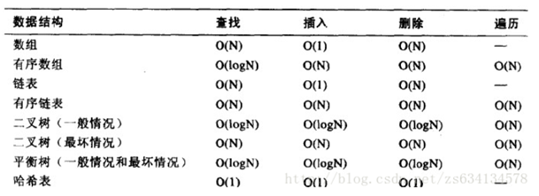
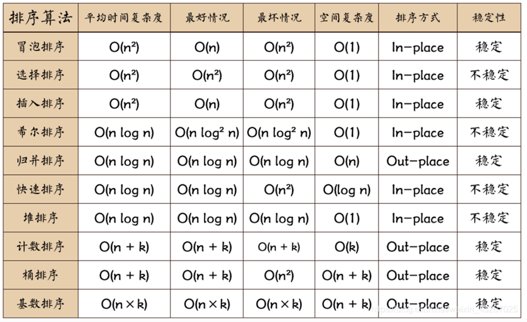

数据结构和算法
============

数据结构
-------

### 1.堆与栈、数组

GC方面：栈是一片连续的内存域，产生的垃圾系统自动释放。堆是是一片不连续的内存域，用户来控制和释放内存，如果不释放内存达到特定值时，通过垃圾回收器(GC)来回收。

存储方面：栈内存方法变量等，空间小。堆内存对象等信息，空间大。

缓存方面：栈使用的是一级缓存；堆是存放在二级缓存，调用速度要相对更慢。

速度方面：

（1）申请速度，栈是程序运行前就已经分配好的空间，而堆是运行时动态申请的。

（2）寻址速度，栈的物理地址空间是连续的，而堆未必是连续的，查找堆的链表也会耗费较多时间。

（3）CPU硬件操作速度，cpu有专门的寄存器（esp，ebp）-栈指针来操作栈，堆是使用间接寻址的，所以栈快。

#### 1.1  vector底层原理

Vector的数据安排及操作方式与array非常相似。两者的唯一差别在于空间运用的灵活性。采用的数据结构是线性的连续空间，他以两个迭代器start和finish分别指向配置得来的连续空间中目前已将被使用的空间。迭代器end_of_storage指向整个连续的尾部。在增加元素时，如果超过自身最大的容量，vector则将自身的容量扩充为原来的两倍。扩充空间需要经过的步骤：重新配置空间，元素移动，释放旧的内存空间。一旦vector空间重新配置，则指向原来vector的所有迭代器都失效了，因为vector的地址改变了。

#### 1.2 vector为什么要用加倍扩容而不是每次增加一个固定的扩容容量

（1）vector在push_back以成倍增长可以在均摊后达到O(1)的时间复杂度，相对于增长指定大小的O(n)时间复杂度更好。（2）为了防止申请内存的浪费。

#### 1.3 vector的扩容方式为什么是1.5倍或2倍 

2倍或更高倍数扩容会导致：（1）空间浪费可能比较大。（2）无法使用前面已释放的空间。

#### 1.4 三种迭代器的区别 

iterator，可遍历，可改变所指元素。const_iterator，可遍历，不可改变所指元素。const iterator，不可遍历，可改变所指元素。const_iterator能转iterator，iterator不能转const iterator。

### 2. 队列

#### 2.1   deque的实现原理

（1）deque是连续空间，但是不同于array和vector的连续地址。它本质是动态开辟的二维数组空间，第二维固定长度的数组空间，扩容的时候第一维的数组进行2倍扩容。它是通过一段一段定量的连续空间构成的，并提供随机存取的接口。

（2）deque维护着一个map（并非STL的map容器）用来记录每个缓冲区的位置，将其作为中控器记录每一段内存空间的入口，从而做到整体连续的假象。

（3）除了map外，deque的数据结构还维护着start和finish两个迭代器，分别指向deque的首尾。此外，他还必须知道map的大小，一旦map提供的节点不足，就需要配置一块更大的map。

（4）为了前后遍历考虑，需要对operator++ 和operator-- 两个运算符进行重载。同时，也需要指针加、减等几个关键行为支持。为了实现随机存取，迭代器可以直接跳跃n个距离，还需要对+=、-=等操作符进行重载。

#### 2.2  C++中deque可以从中间插入元素吗？

deque允许在两端进行插入和删除操作，包括中间位置。

（1）在deque中间插入或者删除将使所有deque元素的迭代器、引用、指针失效。

（2）在deque首部或者尾部插入元素不会使得任何迭代器失效。

（3）在其首部或尾部删除元素则只会使指向被删除元素的迭代器失效。

#### 2.3  优先级队列原理。

底层数据结构一般以vector为底层容器，heap为处理规则来管理底层容器实现。优先队列（priority_queue）容器与队列一样，只能从队尾插入元素，从队首删除元素。但是它有一个特性，队列中最大的元素总是位于队首。元素的比较规则默认按元素值由大到小排序，可以重载“<”操作符来重新定义比较规则。在优先队列中，队首元素一定是优先级最高的。

#### 2.4 stack和queue，栈和队列。 

它们都是由deque作为底层容器实现的，他们是一种容器配接器，修改了deque的接口，具有自己独特的性质（此二者也可以用list作为底层实现）；stack是deque封住了头端的开口，先进后出，queue是deque封住了尾端的开口，先进先出。

### 3. 链表
#### 3.1 list的底层原理

list的底层是一个双向链表，以结点为单位存放数据，结点的地址在内存中不一定连续，每次插入或删除一个元素，就配置或释放一个元素空间，元素存放在堆中。和vector容器迭代器的实现方式不同，由于 list 容器的元素并不是连续存储的，所以该容器迭代器中，必须包含一个可以指向 list 容器的指针，并且该指针还可以借助重载的 *、++、--、==、!= 等运算符，实现迭代器正确的递增、递减、取值等操作。

### 4. 二叉树
#### 4.1 什么是红黑树

红黑树是一种自平衡的二叉搜索树，通过对节点颜色的限制和对树的约束条件，红黑树可以保证在最坏情况下，查找、插入和删除操作的时间复杂度均为 O(log n)。

#### 4.2 红黑树的性质

（1） 每个节点要么是红色，要么是黑色。

（2） 根节点是黑色的。

（3）每个叶子节点（NIL节点，即空节点）是黑色的。

（4）如果一个节点是红色的，则它的子节点必须是黑色的。

（5）对于每个节点，从该节点到其所有后代叶子节点的路径包含相同数目的黑色节点。

#### 4.3 红黑树的插入操作可以分为以下几个步骤：

（1）在二叉搜索树中插入新节点，并将其颜色设置为红色。

（2）如果插入节点的父节点是黑色的，那么插入操作完成，否则进行下一步。如果插入节点的父节点是红色的，那么需要进行调整以满足红黑树的约束条件。具体来说，需要判断插入节点的叔叔节点是否是红色的，如果是，那么将插入节点的父节点和叔叔节点都涂黑，将插入节点的祖父节点涂红，然后将插入节点指向其祖父节点，继续进行调整。如果插入节点的叔叔节点是黑色的，那么需要进行旋转操作，将插入节点和其父节点旋转到同一方向上，然后再进行颜色调整。

#### 4.4 红黑树的删除操作是如何实现的？

（1）在二叉搜索树中删除目标节点，并将其颜色保存下来。

（2）如果目标节点是红色的，那么直接删除即可，删除操作完成，否则进行下一步。

（3）如果目标节点是黑色的，那么需要进行调整以满足红黑树的约束条件。具体来说，需要判断目标节点的兄弟节点的颜色和子节点的颜色。如果兄弟节点是红色的，那么需要进行旋转操作，将兄弟节点涂黑，父节点涂红，然后向父节点旋转一次，再重新获取目标节点的兄弟节点。如果兄弟节点是黑色的，那么需要进一步判断其子节点的颜色，如果两个子节点都是黑色的，那么将兄弟节点涂红，然后将目标节点指向其父节点，继续进行调整。如果兄弟节点有一个子节点是红色的，那么需要进行旋转操作，将兄弟节点与其红色子节点旋转到同一方向上，然后重新获取目标节点的兄弟节点，并进行颜色调整。

#### 4.5 红黑树与 AVL 树有何区别？

红黑树与 AVL 树都是自平衡的二叉搜索树，目的都是为了保证查找、插入和删除等操作的时间复杂度不会退化到O(n)级别，但是它们的平衡策略不同。红黑树是通过对节点颜色的限制和对树的约束条件来实现自平衡的，而AVL树则是通过对节点的平衡因子（左右子树的高度差不超过1）进行限制来实现自平衡的红黑树的平衡策略更加宽松，适用于插入和删除操作较多的场景中，而AVL树则适用于对插入和删除操作的次数要求较少的场景。

#### 4.6 B树、B+树、红黑树、avl树的特点和区别，以及应用场景分别是什么

B树（B-Tree）：特点：B树是一种多路搜索树，每个节点可以存储多个关键字和对应的值。B树的特点是每个节点可以有多个子节点，并且节点的关键字按照升序排列。B树的高度相对较低，使得磁盘IO次数较少，适合在磁盘上存储大量数据。应用场景：B树广泛应用于文件系统和数据库中，用于在磁盘上存储和索引大量的数据。

B+树（B+ Tree）：特点：B+树是在B树的基础上进行优化的一种树结构。B+树与B树的区别在于，B+树的非叶子节点只存储关键字，而不存储对应的值，而叶子节点包含了所有关键字的值。B+树的叶子节点使用链表连接起来，使得范围查询更加高效。应用场景：B+树常用于数据库索引和文件系统中，可以提供高效的范围查询和顺序访问。

红黑树（Red-Black Tree）：特点：红黑树是一种二叉搜索树，具有以下特点：节点是红色或黑色，根节点和叶子节点（NIL节点）是黑色，红色节点的子节点都是黑色，从任意节点到其每个叶子的路径上包含相同数量的黑色节点。红黑树的平衡性能较好，插入和删除操作的时间复杂度为O(log n)。应用场景：红黑树常用于实现映射和集合等数据结构，也被广泛用于编程语言的内部实现，例如C++的STL中的map和set。

B树（B-Tree）：特点：B树是一种多路搜索树，每个节点可以存储多个关键字和对应的值。B树的特点是每个节点可以有多个子节点，并且节点的关键字按照升序排列。B树的高度相对较低，使得磁盘IO次数较少，适合在磁盘上存储大量数据。应用场景：B树广泛应用于文件系统和数据库中，用于在磁盘上存储和索引大量的数据。

B+树（B+ Tree）：特点：B+树是在B树的基础上进行优化的一种树结构。B+树与B树的区别在于，B+树的非叶子节点只存储关键字，而不存储对应的值，而叶子节点包含了所有关键字的值。B+树的叶子节点使用链表连接起来，使得范围查询更加高效。应用场景：B+树常用于数据库索引和文件系统中，可以提供高效的范围查询和顺序访问。

红黑树（Red-Black Tree）：特点：红黑树是一种二叉搜索树，具有以下特点：节点是红色或黑色，根节点和叶子节点（NIL节点）是黑色，红色节点的子节点都是黑色，从任意节点到其每个叶子的路径上包含相同数量的黑色节点。红黑树的平衡性能较好，插入和删除操作的时间复杂度为O(log n)。应用场景：红黑树常用于实现映射和集合等数据结构，也被广泛用于编程语言的内部实现，例如C++的STL中的map和set。

AVL树（AVL Tree）：特点：AVL树是一种自平衡二叉搜索树，具有以下特点：任意节点的左右子树的高度差不超过1，即AVL树是高度平衡的。AVL树的插入和删除操作会通过旋转操作来保持平衡。应用场景：由于AVL树的平衡性较好，适用于需要快速插入和删除操作的场景，但相对于红黑树，AVL树的旋转操作较多，因此在频繁插入和删除操作与查询操作并存的场景中，可以考虑使用红黑树。windows对进程地址空间的管理用到了AVL树。

AVL数4种调整类型总结：（1）LL型，向顺时针方向选择；（2）RR型，向逆时针方向旋转；（3）LR型，左子树先向逆时针方向旋转（变成LL型），再整体顺时针旋转；（4）RL型，右子树先顺时针旋转（变成RR型），再整理逆时针方向旋转。

### 5. 哈希表
#### 5.1 哈希表的实现原理是什么？

哈希表的本质是数组加哈希函数。在哈希表中，它的作用就是将哈希表的某个key作为输入，然后经过一系列运算后，得到数组的某个索引。通过索引对数组执行插入或查找的操作。

设计哈希函数将键映射到哈希表的槽位上；通常使用数组来存储数据，每个元素都是一个键值对；将键值对存储到对应的槽位上；装载因子处理，过高会导致哈希冲突概率大，扩容。

（1）哈希函数：哈希函数接收一个键作为输入，计算出固定大小的哈希值。（MD5、SHA）

（2）存储桶数组：哈希表内部维护一个存储桶数组，存储实际的数据项。

（3）哈希值到存储桶的映射：哈希值映射到存储桶数组的索引位置。

（4）解决哈希冲突：链地址法，开放地址法。

#### 5.2 如何解决哈希冲突？

开放定址法：发生哈希冲突时沿着序列依次查找可用槽位。 再哈希法。

拉链法：链表法解决哈希冲突，简单易用，无堆积，需要额外空间。

#### 5.3 说说hash数组的扩容机制？ 

哈希数组的扩容机制是在数组存储元素的同时，通过控制数组的长度来保证哈希表中的数据能够均匀分布，减少冲突，提高查询效率。当哈希数组的负载因子（即数组中存储元素的个数与数组长度的比值）达到一定阈值时（一般为0.75），就需要进行扩容操作。

扩容的基本步骤如下：

（1）创建一个新的更大的数组，一般是原数组长度的2倍或4倍。

（2）遍历旧数组中的每个元素，并将其重新计算哈希值，然后放入新数组的对应位置。旧数组中的空槽位不会被复制到新数组中，只会将非空槽位进行重新散列，减少空间浪费。

（3）使用swap函数，使新数组成为哈希表的底层数组，销毁旧数组。

#### 5.4 map和unordered_map的优缺点

map的优点：（1）有序。（2）基于红黑树实现，查找的时间复杂度是O(logn)

map的缺点：（1）空间占用率比较高，虽然说底层是红黑树实现的，提高了运行效率，但是每个节点都要保存父节点和孩子节点和红黑树的性质，使得每一个节点都占用大量的空间。

适用情况：对于有序的结构

unordered_map的优点：底层是用哈希表实现的，查找效率非常高，时间复杂度为O(1)。

unordered_map的缺点：哈希表的建立比较费时。

适用场景：对于查找问题，使用unordered_map更好。

#### 5.5 HashMap的数组长度一般设置为多少？

设置为2的幂次方：优点：（1）效率高，对于哈希函数的计算，可以使用位运算来代替取模运算，提高计算效率。（2）冲突减少，对于哈希值的分布具有良好的均匀性，从而减少了哈希冲突的发生。缺点：（1）浪费一些内存空间。（2）要求哈希函数的分布良好。

设置为质数：优点：（1）更好的内存利用率。（2）冲突分散：由于质数长度不太可能与常见的哈希值产生整数倍关系，使用质数长度可以帮助更好地分散元素到数组的不同位置，减少哈希冲突的发生。缺点：（1）计算效率较低，通常需要进行取模运算来计算哈希值的索引。

### 6. 堆

堆的底层实现是数组，表现为一个完全二叉树。

完全二叉树结构：堆在逻辑上是一棵完全二叉树，这意味着除了最后一层外，每一层都是满的，且最后一层的节点都尽可能地向左对齐

最大堆（大根堆）：每个节点的值都大于或等于其子节点的值，根节点是最大值

最小堆（小根堆）：每个节点的值都小于或等于其子节点的值，根节点是最小值

基本操作：

1）插入操作：将新元素插入到堆的末尾，然后通过“上浮”操作调整堆的顺序，直到满足堆序性质

2）删除操作：删除堆顶元素后，将堆的最后一个元素移到堆顶，然后通过“下沉”操作调整堆的顺序，直到满足堆序性质

3）建堆操作：将一个无序数组转换为堆，通常通过自底向上的方式进行，依次采用向下调整法，时间复杂度为O(n)。

应用场景：优先级队列，堆排序、图算法、top k

### 7. 机制

#### 7.1 容器上的迭代器的类型 

vector、deque：随机访问

list、set/multiset、map/multimap：双向

stack、queue、priority_queue：不支持迭代器

#### 7.2 STL容器动态链接可能产生的问题？

容器和动态链接库相互支持不够好，动态链接库函数中使用容器时，参数中只能传递容器的引用，并且要保证容器的大小不能超出初始大小，否则导致容器自动重新分配，就会出现内存堆栈破坏问题。

#### 7.3 swap函数原理

除了数组，其他容器在交换后本质上是将内存地址进行了交换，而元素本身在内存中的位置是没有变化。template <class T> void swap (T& a,T& b)}{ T c(std::move(a));a=std::move(b); b=std::move(c);}

--------

算法
-------
### 1. 排序算法

纠正：希尔排序，最好时间复杂度 O(n) 最坏时间复杂度 O(n^2) 平均时间复杂度O(nlogn)

#### 1.1 排序算法介绍
冒泡排序： 从前往后比较相邻元素，如果第一个比第二个大就交换。

选择排序：在未排序序列中找到最小（大）元素，存放到排序序列的起始位置。

插入排序：第二个元素开始，在已排好序的子数组中寻找到该元素合适的位置并插入。

归并排序：采用分治法将待排序数组分成两半，对左右两半排序，然后将再将两者合并。

快速排序：选择第一个元素作为枢轴，记录。将序列中小于枢轴元素的元素放在枢轴元素的左边，大于枢轴元素的元素放在右边。从右边j开始找到第一个比枢轴大的元素，j--，左边i第一个元素等于它j；从左边i开始找到第一个比枢轴小的元素i++，位置j的元素等于它i。循环进行i++和j--，直到i<j不满足，即到中间元素让其等于枢轴。

堆排序：将初始待排序关键字序列构建成大顶堆，依次将堆顶元素与最后一个元素交换。初始化建堆过程时间：O(n)。更改堆元素后重建堆时间：O(nlogn)。堆排序整个过程中要进行n-1次调整堆，每次都是自顶向下，根据二叉树的性质可知每次调整的时间复杂度为$O(logn)$，因此所有调整过程时间复杂度为O(nlogn)。因为堆排序是就地排序，空间复杂度为常数：O(1)。

希尔排序：将待排序的数组按照一定的增量间隔进行分割，通常初始增量为数组长度的一半，组内插入排序，然后增量减半再组内排序，直至增量为1。

桶排序：桶排序的基本思想是将待排序的元素分布到一定数量的桶中，每个桶对应一个值的范围，尽量让桶内的元素均匀分布。然后对每个桶中的元素进行排序，可以使用其他排序算法如插入排序、快速排序等。最后，按照桶的顺序和每个桶内的元素顺序，将所有桶中的元素合并起来得到最终的排序结果。

计数排序：
  
基数排序：（1）确定排序的元素类型和最大位数。对于整数类型的元素，最大位数是元素中最大值的位数；对于字符串类型的元素，最大位数是字符串的最大长度。（2）根据最大位数，建立0到9的十个桶（或称为队列）。（3）从最低位开始，按照位值依次将待排序的元素分配到对应的桶中。具体操作是，按照个位数（或字符的最后一位）将元素放入对应的桶中。（4）按照桶的顺序，将元素依次从桶中取出，组成一个新的序列。（5）重复步骤3和步骤4，对序列中的下一个有效位进行排序。（6）重复上述步骤，直到对所有位排序完成。

#### 1.2 归并排序和快排排序比较
相同点：（1）利用分治思想；（2）具体实现都用递归。

不同点：（1）归并排序先分解再合并：先递归分解到最小粒度，然后从小粒度开始合并排序，自下而上的合并排序；快速排序边分解边排序：每次分解都实现整体上有序，即参照值左侧的数都小于参照值，右侧的大于参照值；是自上而下的排序。（2）归并排序不是原地排序，因为两个有序数组的合并一定需要额外的空间协助才能合并；快速排序是原地排序，原地排序指的是空间复杂度为O(1)。

应用场景：归并排序适用于对稳定性和可预测性有较高要求的场景，特别适用于链表排序；而快速排序适用于大规模数据集和一般情况下的排序需求，尤其在平均情况下有较高的性能。

### 2. Top-k 问题：（100亿数据找出最大的1000个数字？）

 （1）直接排序法。堆排序：时间复杂度O（n log k），n是数组的长度。这种方法适用于当n很大但k相对较小的情况，因为它只需要维护一个大小为k的堆，而不需要对整个数组进行排序。快速排序：算法思想是通过随机选取一个元素作为"基准"，将数组分成两部分，一部分大于基准，另一部分小于基准，然后递归地在较大或较小的部分继续寻找第k大的元素。Sum = |S / 2| + |S / 4| + |S / 8| + ...... + 1，根据等比数列求和方法可得Sum大约等于2N，故快速选择的平均时间复杂度为O（N）。

（2）局部淘汰法。用一个容器保存前1000个数，而后将剩余的全部数字一一与容器内的最小数字相比，若是全部后续的元素都比容器内的1000个数还小，那么容器内这个1000个数就是最大1000个数。容器能够用（小顶堆）最小堆来实现。方法优势是性能尚可，空间复杂度低，IO读取比较频繁，对系统压力大。

（3）分治法，即大数据里最经常使用的MapReduce。将100亿个数据分为1000个大分区，每一个区1000万个数据排序；每一个大分区再细分红100个小分区，总共就有1000 * 100=10万个分区索引；计算每一个小分区上最大的1000个数；合并每一个大分区细分出来的小分区，利用每一个小分区的前1000个数，将这100个分区的1000 * 100个数合并，找出每一个大分区的前1000个数。合并大分区，咱们有1000个大分区，利用每一个大分区的前1000个数，将这1000 * 1000个数合并，找出前1000就是要求的结果。

（4）堆排序，创建一个固定数量的桶，通常桶的数量与数据的范围和分布有关，如正态分布。每个桶负责存储一定范围内的数。
### 3. KMP算法

基于前缀和后缀构建next数组，KMP。

### 4. LRU算法

最近最久未使用算法，使用双向链表（key，val，pre，next），和哈希表（key，node）。

struct Node，class LRUCache包含Node * L, Node * R，capacity。

### 5. Dijkstra迪杰斯特拉算法

邻接矩阵存图；起点s；dis数组存起点s到i距离，默认为inf；check数组存更新过的点。

（1）选取dis最小值索引点i。（2）check[i] = true。（3）遍历与i连接的点，计算点到i的距离是否小于dis中存储的距离，是则更新。
算法步骤

​初始化：将起点的距离设为0，其他所有节点的距离设为无穷大（表示未知路径）。

​贪心策略：每次从未处理的节点中选择距离起点最近的节点，标记为已处理。

​松弛操作：更新该节点的所有邻居节点的距离。如果通过当前节点到达邻居节点的路径比已知路径更短，则更新邻居节点的距离。

​重复：重复上述步骤，直到所有节点的最短路径都被确定。

### 6. DFS深度优先搜索算法

### 7. 最小生成树算法

最小生成树（Minimum Spanning Tree，MST）算法是一种用于在连接图中的所有顶点且权重最小的树形结构的算法。下面介绍两种常见的最小生成树算法：Kruskal算法和Prim算法。

Kruskal算法是一种基于贪心策略的最小生成树算法，它按边的权重从小到大进行选择，并确保选择的边不会构成环路。

Prim算法也是一种贪心算法，它从一个起始顶点开始，逐步扩展最小生成树，每次选择与当前最小生成树相连的边中权重最小的边。

--------

设计模式
-------
### 1. 面向对象设计原则

单一职责原则：不能将太多的职责放在一个类中；

开闭原则：软件实体对扩展是开放的，对修改是关闭的；

里氏替换原则：一个可以接受基类对象的地方，必然可以接受子类对象；

依赖倒转原则：代码要依赖于抽象的类，而不要依赖于具体的类；要针对抽象层编程，而不要针对具体类编程；

接口隔离原则：使用多个专门的接口来代替统一的接口；

合成复用原则：复用功能时尽量多使用组合和聚合关联关系，尽量少用或不用继承关系；

迪米特原则：一个软件实体对其他实体的引用越少越好，或者说如果两个类不必彼此直接通信，那么这两个类就不应当发生直接的相互作用，而是通过引入一个第三者发生间接交互。它强调了一个类应该对其他类具有最少的了解，即一个对象应该尽可能少地了解其他对象的内部结构和实现细节。

### 2. 创建型设计模式
#### 2.1 单例模式

（1）饿汉模式：类加载时就生成了一个对象。

（2）懒汉模式：类加载时没有生成对象，在第一次调用getInstance()方法时才生成对象。

#### 2.2 工厂模式

（1）简单工厂模式：根据传入的参数返回需要创建的对象，创建单一的对象类型。

（2）工厂方法模式：引入抽象工厂类，将具体产品的创建过程封装在其子类中，即具体工厂类中。增加新的具体产品类时，只需增加一个相应的具体工厂类。用于创建不同的对象类型，每种对象类型对应一种工厂方法。

（3）抽象工厂模式：相较于工厂方法模式，抽象工厂模式中的具体工厂可以生产相关的一组具体产品，这样的一组产品称之为产品族，产品族中的每一个产品都分属于某一个产品继承等级结构。

### 3. 行为型设计模式

#### 3.1 模板方法模式

定义一个操作中算法的骨架，而将一些步骤延迟到子类中，模板方法使得子类可以不改变一个算法的结构，即可重定义该算法的某些特定步骤。在模板方法模式中，父类定义了一个模板方法，该方法中包含了算法框架的步骤，其中有些步骤由父类自身实现，有些步骤则由子类实现。子类可以通过覆盖父类的方法来实现自己特有的步骤，从而完成整个算法。

#### 3.2 状态模式

状态模式的核心思想是将对象的状态封装成独立的类，并将状态的转换逻辑委托给状态类来处理。在状态模式中，当对象的状态发生改变时，它会将当前状态的处理委托给对应的状态类，从而使得对象的行为发生改变。

#### 3.3 命令模式

将一个请求封装为一个对象，从而使我们可用不同的请求对客户进行参数化；对请求排队或者记录请求日志，以及支持可撤销的操作。命令模式的本质是对命令进行封装，将发出命令的责任和执行命令的责任分开，使得请求方不必知道接受方的接口，更不必知道请求是怎么被接受、操作是否被执行、何时被执行，以及是怎么被执行的。

#### 3.4 观察者模式

定义对象间的一种一对多依赖关系，使得每当一个对象状态发生改变时，其相关依赖对象都得到通知并被自动更新。

### 4. 结构型设计模式
#### 4.1 代理模式

给某个对象提供一个代理，并由代理对象控制对原对象的引用。当直接访问某些对象存在问题时，可以通过一个代理对象来间接访问，为了保证客户端使用的透明性，代理对象与真实对象需要实现相同的接口。根据代理模式的使用目的不同，代理模式又可分为多种类型，如远程代理、虚拟代理、保护代理、缓冲代理、防火墙代理、同步化代理、智能引用代理等，它们应用于不同的场合，满足用户的不同需求。常见的代理模式案例有：论坛权限控制代理、日志记录代理。

### 5. MVC、MVVC和ECS的区别和优缺点？

MVC：优点：比较好的降低代码的耦合度，可以达到界面、数据、逻辑分离的效果，三个模块分别负责表现、存储、逻辑，各司其职，易于代码的维护和拓展。缺点：如果是应用于比较小的项目或者功能上，就会显得过于复杂，比如点击一个按钮切换图片，这样实质上一个View层就可以了，逻辑和数据都可以写里面，要是分开写还降低开发效率。还有就是也不能做到给数据层和视图层完全的解耦。

ECS：由Entity、Component、System三部分组成，分别是实体、组件、系统。基于组合优于继承的思想，我把实体理解为一个游戏物体，组件理解为数据，把众多组件挂在或者说组合在游戏物体上就是把数据给游戏物体，然后系统就像个CPU去处理各个物体的数据，从而引发一些行为。优点：组合优于继承的思想，能很好的降低代码的耦合度，可以将数据更有效的组织，提高CPU cache利用率，从而节省性能的开支，ECS自己有一套多线程调度系统，易于做多线程并行。缺点：不能很好地用来开发UI交互

MVC比较适用于UI交互的设计，ECS比较适用于处理游戏物体之间的业务逻辑关系。

MVVM：View是视图层；Model是指数据模型，泛指后端进行的各种业务逻辑处理和数据操控，主要围绕数据库系统展开；ViewModel是由前端开发人员组织生成和维护的视图数据层。优点：View层展现的不是Model层的数据，而是ViewModel的数据，由ViewModel负责与Model层交互，这就完全解耦了View层和Model层；MVVM模式强调数据绑定的使用，通过数据绑定可以实现View和ViewModel之间的自动更新

### 6.

### 7.

### 8.
