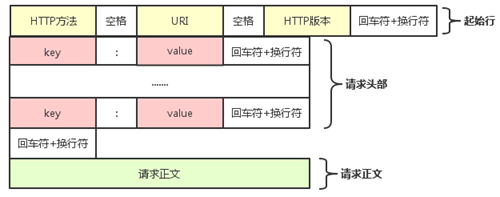

计算机基础知识面试题
============
计算机网络
-------
### 1. 计算机网络的体系结构

OSI的七层协议：物理层、数据链路层、网络层、运输层、会话层、表示层、应用层。

TCP/IP的四层协议：网际接口层、网络层、运输层、应用层。

五层协议：物理层、数据链路层、网络层、运输层、应用层。

### 2. 介绍一下五层协议

物理层：物理层是计算机网络的最底层，它负责将数据转换成比特流并在物理介质上传输。

数据链路层: 数据链路层负责将比特流转换成帧（Frame），并在物理介质上进行数据传输。

网络层: 数据被封装成 IP 数据报从源节点传输到目的节点，主要任务是路由选择和分组传输，为主机提供逻辑通信。主要使用 IP协议，与IP协议配套的还有三个协议：地址解析协议 ARP、网际控制报文协议 ICMP、网际组管理协议 IGMP。

运输层：运输层为应用进程之间提供通用的端到端的数据传输服务，传输的是报文段，要使用 TCP 或 UDP 协议。TCP 提供可靠的、有序的、面向连接的数据传输服务，而 UDP 则提供不可靠的、无序的、面向无连接的数据传输服务。

应用层：应用层用来规定应用进程在通信时所遵循的协议，应用层的许多协议都是基于客户服务器方式。客户服务器方式所描述的是进程之间服务和被服务的关系。客户是服务请求方，服务器是服务提供方，传输的是报文。涉及到的协议是DNS、DHCP，常见协议是HTTP、FTP、SSH。

### 3. 网络协议分层的好处？

简化问题难度和复杂度；易于实现和维护；促进标准化工作。

灵活性好。当其中一层的技术变化时，只要层间接口关系保持不变，其他层不受影响。

### 4. IP协议，及其配套的ARP、ICMP、IGMP协议的作用？

IP协议是一个无连接的协议，它不提供可靠的数据传输服务，也不保证数据包的顺序，主要作用包括分组传输、路由选择和地址分配。

ARP地址解析协议完成了IP地址与物理地址的映射，用于动态解析以太网硬件的地址。

ICMP 协议的作用是为 IP 协议提供一些控制和错误消息，进行网络测试和诊断，如ping。

IGMP 协议的作用是在多播网络中管理多播组成员和维护多播组的状态。

### 5. IPV4和IPV6的区别？

地址长度不同：IPv4地址长度为32位，IPv6地址长度为128位。

地址表示方式不同：前者点分十进制表示法，后者冒号分隔的16进制表示法。

IPv6支持更好的服务质量（QoS）功能，可以对数据包进行更好的分类和处理。

IPv6在设计上考虑了更好的安全性和隐私保护，包括IPsec协议和地址自动配置等机制。

IPv6则是未来的趋势，IOS应用必须支持 IPv6 网络协议。

### 6. TCP和UDP的区别？

UDP：无连接协议提供无连接服务；传输的数据单元是UDP报文或用户数据报；支持单播、广播、多播；不提供可靠交付；适用于多媒体应用；速度快；基于数据包的传输方式。UDP包头中，用两个字节（16bits）来定义数据包的总大小，2^16 =65535字节，即64k。头部开销小，仅8个字节（源端口+目的端口+长度+校验和，16位x4）。UDP 数据包不能大于512字节。如果大于此大小，则会被截断。因此，任何应用程序都需要传输大于512个字节的数据，需要就地使用TCP。

TCP：面向连接协议提供面向连接服务；传输的数据单元是TCP报文；支持点对点单播，不支持多播、广播；提供可靠交付；复杂，适用于电子邮件、文件传输；速度慢，需要建立连接和维护连接状态；基于字节流的传输方式。TCP包头中没有对数据包总大小的定义，数理论上没有大小限制。

滑动窗口是接受数据端使用的窗口大小，用来告知发送端接收端的缓存大小，以此可以控制发送端发送数据的大小，从而达到流量控制的目的。

拥塞窗口是数据的发送端，拥塞窗口不代表缓存，拥塞窗口指某一源端数据流在一个RTT内可以最多发送数据包

### 7. TCP的三次握手？

第一次握手：主机A的TCP向主机B发出连接请求报文段，其首部中的同步位SYN = 1，并选择序号seq = x，表明传送数据时的第一个数据字节的序号是x。

第二次握手：主机B的TCP收到连接请求报文段后，如同意，则发回确认。主机B在确认报文段中应使SYN = 1，使ACK = 1，其确认号ack = x + 1，自己选择的序号seq = y。

第三次握手：主机A收到此报文段后向主机B给出确认，其ACK = 1，确认号ack = y + 1。主机A的TCP通知上层应用进程，连接已经建立。主机B的TCP收到主机A的确认后，也通知其上层应用进程：TCP连接已经建立。

### 8. 为什么需要进行三次握手，三次握手的目的是什么？

三次握手的目的是建立可靠的通信信道，主要的目的就是双方确认自己与对方的发送与接收机能正常。

为了防止已经失效的连接请求报文段突然又传到服务端，因而产生错误。客户端向服务器端发送的请求报文由于网络等原因滞留，未能发送到服务器端，此时连接请求报文失效，客户端会再次向服务器端发送请求报文，之后与服务器端建立连接，当连接释放后，由于网络通畅了，第一次客户端发送的请求报文又突然到达了服务器端，这条请求报文本该失效了，但此时服务器端误认为客户端又发送了一次连接请求，两次握手建立好连接，此时客户端忽略服务器端发来的确认，也不发送数据，造成不必要的错误和网络资源的浪费。如果采用三次握手的话，就算那条失效的报文发送到服务器端，服务器端确认并向客户端发送报文，但此时客户端不会发出确认，由于客户端没有确认，由于服务器端没有接收到确认，就会知道客户端没有请求连接。

### 9. 如果已经建立了连接，但客户端出现了故障怎么办？

客户端出现故障，可能会导致连接无法正常关闭，从而导致服务器资源的浪费和连接占用。保活计时器：用来防止在TCP连接出现长时期的空闲。服务器每收到一次客户端的请求后都会重新复位一个计时器，时间通常是设置为2小时，若服务器过了2小时还没有收到客户的信息，它就发送探测报文段。若发送了10个探测报文段还没有响应，就终止该连接。

### 10.  TCP的四次挥手？

第一次挥手：主机A向B发送连接释放报文段，并停止再发送数据，主动关闭TCP连接。把连接释放报文段首部的FIN = 1，其序号seq = u，等待B的确认（FIN_WAIT_1状态）。

第二次挥手：主机B发出确认，发送一个ACK=1，确认号 ack = u+1，序号seq = v。A到主机B这个方向的连接释放，处于CLOSE_WAIT状态。B可以继续发送数据，但不能接收。

第三次挥手：主机B确认已经没有要向主机A发送的数据，将FIN置1，确认号ack = u + 1，序号 seq = w，请求关闭连接，同时进入LAST_ACK状态。

第四次挥手：主机A收到连接释放报文段后，进入TIME_WAIT状态，向B发送ACK报文。确认报文段中ACK = 1，确认号ack = w + 1，序号 seq = u + 1。主机B收到ACK后变为CLOSED状态。客户端等待2*MSL（报文段最长寿命），关闭连接并进入CLOSED状态。

### 11. 为什么不能把服务器发送的ACK和FIN合并起来（CLOSE_WAIT状态意义是什么）？

等待服务器向客户端发送数据完成。

### 12. 如果第二次挥手时服务器的ACK没有送达客户端，会怎样？

客户端没有收到ACK确认，会重新发送FIN请求。

### 13. 客户端TIME_WAIT状态的意义是什么？

确保服务器收到ACK确认报文：如果服务端没有收到ACK，就会重发FIN，TIME_WAIT状态用来重发可能丢失的ACK报文。2MSL就是一个发送和一个回复所需的最大时间。

避免冲突连接的出现：网络中的所有数据包在TIME_WAIT状态时都已被接收方处理完毕。

### 14. TCP 协议如何保证可靠传输？

序列号和确认应答机制。超时重传机制。数据包校验。停止等待。对失序数据包重排序。

流量控制机制：点对点的通信量控制，只能发送接收端缓冲区所能接纳的数据。

拥塞控制机制：全局的网络流量整体性的控制；拥塞控制是防止过多的数据注入网络，使得网络中的路由器或者链路过载。具体方式是慢开始、拥塞避免（算法）、快重传和快恢复。

### 15. DNS、DHCP协议的原理和作用是什么？

DNS是一个分布式的域名解析系统，将域名映射到IP地址实现网络中的域名解析，使用UDP协议通信，端口号为53。

DHCP是一个动态IP地址分配协议，自动为网络中的设备分配IP地址、子网掩码、网关等网络配置信息，使用UDP协议进行通信，端口号为67和68。

### 16. 介绍一下HTTP、HTTPs、FTP和SSH

HTTP超文本传输协议，在Web浏览器和服务器传输超文本数据，明文传输，端口号80。

HTTPS安全超文本传输协议，是在HTTP基础上加入了SSL/TLS协议的安全协议，保护网络通信的安全性和完整性，使用TCP协议进行通信，端口号为443。

FTP文件传输协议，用于在客户端和服务器之间传输文件，TCP通信，端口号为21和20。

SSH安全外壳协议，用于在客户端和服务器之间建立安全的连接，TCP通信，端口号为22。

### 17. GET和POST的区别

参数位置：GET请求的参数会附在URL的末尾，POST请求将请求参数放在请求体中。

参数长度限制：GET请求参数长度有限制，通常2000个字节左右，POST没有限制。

安全性：GET会显示请求参数，POST更安全不显示请求参数。

幂等性：GET请求是幂等的，多次请求相同的URL和参数，只是获取数据不会对服务器状态产生影响。POST请求不是幂等的，会修改和创建新资源，对服务器状态产生修改。

缓存机制：GET请求可以被缓存，浏览器从缓存获取结果能提高性能。POST不会缓存。

### 18. HTTP的状态码有哪些？

信息性状态码（1xx）：表示已收到请求，需要客户端继续发送请求才能完成处理。

成功状态码（2xx）：表示已成功处理请求，并返回了响应结果。

重定向状态码（3xx）：服务器需要客户端进一步的操作才能完成请求。

客户端错误状态码（4xx）：表示客户端发送的请求有错误或无法完成处理。

服务器错误状态码（5xx）：表示Web服务器在处理请求时发生了错误。

如100（Continue继续）、200（OK请求正常处理完毕）、204（No Content请求成功处理，没有实体返回）、302（Found跳转，重定向）、400（Bad Request客户端语法错误）、403（Forbidden服务器拒绝提供服务）、404（Not Found请求资源不存在）、500（Internal Server Error服务器内部错误）、503（Service Unavailable服务器超载或停机维护）。

### 19. HTTPS工作原理是什么？

客户端发送请求：请求中包含使用的SSL/TLS版本号和加密套件等信息。

服务器返回数字证书：服务器返回数字证书，包含公钥（RSA加密）、数字签名等信息。

客户端验证数字证书：客户端对证书的有效期、合法性、证书公钥等进行校验。

客户端生成随机密钥：根据证书的公钥的有效，则生成一个随机的对称加密密钥(AES)，使用服务器的公钥将该密钥加密(RSA)；消息体产生后，对它的摘要进行MD5（或者SHA1）算法加密，然后发送给服务器。

服务器使用私钥解密密钥：得到客户端生成的随机密钥，用私钥解密获得对称密钥。

客户端和服务器加密通信：密钥只有客户端和服务端知道，保障数据的安全性和完整性。

### 20. 加密算法有哪些？

加密算法：对信息进行编码和解码的技术，编码是把原来可读信息（又称明文）译成代码形式（又称密文），其逆过程就是解码（解密）。可以分为三类：

对称加密，如AES。基本原理：将明文分成N个组，然后使用密钥对各个组进行加密，形成各自的密文，最后把所有的分组密文进行合并，形成最终的密文。优点：算法公开、计算量小、加密速度快、加密效率高。缺点：双方都使用同样密钥，安全性得不到保证。

非对称加密，如RSA。基本原理：同时生成两把密钥：私钥和公钥，私钥隐秘保存，公钥可以下发给信任客户端。私钥加密，持有私钥或公钥才可以解密；公钥加密，持有私钥才可解密。优点：安全，难以破解。缺点：算法比较耗时。

不可逆加密，如 MD5，SHA。基本原理：加密过程中不需要使用密钥，输入明文后由系统直接经过加密算法处理成密文，这种加密后的数据是无法无法根据密文推算出明文。优点：
安全性高，不可逆性，易于计算。缺点：易于碰撞，无法还原。应用场景：数字签名。

### 21. HTTP协议定义了多种请求方式，也称为HTTP方法，常见的有以下几种：

GET：用于获取资源。 POST：用于提交数据。

PUT：用于更新资源，请求的参数会包含在请求体中，更新整个资源，不适用于部分更新。

DELETE：用于删除资源，参数会附加在URL后面，会删除整个资源。

HEAD：类似于GET请求，但只返回响应头部信息，不返回响应体。

OPTIONS：获取服务器支持的HTTP方法、请求头信息等，用于API开发和跨域请求场景。

PATCH：用于部分更新资源，请求的参数会包含在请求体中。

### 22. Session和Cookie有什么区别？

Session和Cookie都是用于在客户端和服务器之间传递信息、维持用户状态的机制。

存储位置：Cookie保存在客户端，Session保存在服务器端。

安全性：Cookie的数据可以被客户端修改和篡改，安全性较低。而Session的数据保存在服务器端，客户端无法修改，安全性较高。

存储容量：Cookie的存储容量受限于浏览器的限制，一般为4KB左右。而Session的存储容量受限于服务器的硬件和软件条件，一般较大。

作用范围：Cookie的作用范围为域名和路径，可以在多个页面和域名之间共享。而Session的作用范围为当前会话，只在当前会话内有效。

生命周期：Cookie可以设置过期时间，可以长期保存在客户端，而Session的生命周期受限于服务器的设置，一般为会话结束后自动销毁。

### 23. 在浏览器中输入网址之后执行会发生什么？

DNS域名解析：浏览器DNS->操作系统DNS->读host文件->向域名服务器发生请求。

建立TCP连接：三次握手。

发送HTTP请求：请求报文。

接收响应结果：响应报文。

浏览器解析html并布局渲染。

断开TCP连接：四次挥手。

### 24. MAC地址和IP地址分别有什么作用？

MAC地址，物理地址用于局域网中标识网络设备，IP地址用于Internet中标识网络设备。

### 25. 简述静态路由和动态路由的区别？

静态路由是系统管理员手动构建的路由表规定的路由。

动态路由是由路由选择协议动态构建和维护的。

### 26. TCP的粘包和拆包问题，解决方法是什么？

数据传输是以字节流的形式进行的，缓存区满后才会传递数据，数据包可能被拆分或合并。由于UDP是以数据包的形式进行传输，包中就有了消息头，不会发生粘包。粘包时，发送方每次写入数据 < 接收方套接字(Socket)缓冲区大小。拆包时，发送方每次写入数据 > 接收方套接字(Socket)缓冲区大小。

解决方法：固定长度。末尾固定分隔符。将消息分为头部和消息体。

请求头格式：<HTTP方法> <URI路径> <HTTP协议版本> <头部字段1>: <值1> <头部字段2>: <值2>。消息头部是由一些key：value的值对组成的，以一个空行结束。Accept : 申明自己的接受的数据类型，通常使用MIME类型；Accept-Encoding：申明自己接收的编码方法；Accept-Language：申明自己接收的语言语言跟字符集的区别；Host：客户端指定自己想访问的WEB服务器的域名/IP 地址和端口号；Cache-control: 指定缓存机制；Connection: 两种值，keepalive和close。

### 27.  集线器、交换机、路由器的区别？

集线器是一个广播设备，将数据包广播到所有连接的设备；

交换机是一个智能设备，根据MAC地址将数据包转发到目标设备；

路由器是连接不同网络的设备，根据路由表将数据包从源网络转发到目标网络。交换机提供了更高的性能和灵活性，而路由器在连接不同网络时起到关键作用。

### 28. TCP三次握手，如果一、二、三次握手丢失各会发生什么

第一次握手丢失：客户端重传SYN请求连接报文，默认重传5次，看tcp_syn_retries参数。

第二次握手丢失：客户端重传SYN请求连接报文，服务器重传SYN-ACK报文。

第三次握手丢失：前两次握手已经验证了客户端的发送和接收能力，当ACK丢失了，由服务器重传对应的报文。

### 29. 

### 30.

------
操作系统
-------
### 1. 操作系统的地址空间包括哪些部分

代码段：存储程序的指令集，只能执行，大小固定。

数据段：包括全部初始化的全局和静态变量。

BSS：未初始化的全局和静态变量。

只读数据段：只读的全局变量、常量。

堆：存储动态分配的内存。处于低地址，地址向上增长。需要通过指针访问，内存空间大。

栈：存储函数返回地址、寄存器内容、局部变量。处于高地址，地址向下增长。空间小。

### 2. 说一说进程、线程、协程是什么，区别是什么

进程是操作系统中最基本的执行单元，资源分配的基小单元。上下文进程间切换开销大，需要保存先调用栈的信息、cpu各寄存器的信息等。

线程是操作系统中最小的可调度执行单位，进程中包含多个线程并发执行任务。同一进程的线程共享本进程的地址空间，而进程之间则是独立的地址空间。同一进程内的线程共享本进程的资源如内存、I/O、cpu等，但是进程之间的资源是独立的。线程的独立资源：栈、寄存器状态、线程优先级、线程局部存储、线程ID；线程的共享资源：代码段、数据段、堆、文件描述符、进程标识信息。

协程是一种用户级线程，调度由程序员控制，通过yield机制实现协程间的切换，开销小。在任一指定时刻只有一个协同程序在运行，且这个正在运行的协程只在必要时才会被挂起。协程是通过迭代器来实现功能的，通过关键字IEnumerator来定义一个迭代方法。

Unity中协程就是一种特殊的函数，它可以主动的请求暂停自身并提交一个唤醒条件，Unity会在唤醒条件满足的时候去重新唤醒协程。MonoBehaviour生命周期的Update和LateUpdate之间，会检查这个MonoBehaviour下挂载的所有协程，并唤醒其中满足唤醒条件的协程。要想使用协程，只需要以IEnumerator为返回值，并且在函数体里面用yield return语句来暂停协程并提交一个唤醒条件。然后使用StartCoroutine来开启协程。

I/O密集型任务使用多线程，因为CPU的占用率较低；CPU密集型的任务使用多进程。

### 3. 说一说线程与协程的区别？

协程的执行效率极高，没有内核切换开销。不需要多线程的锁机制，用户控制逻辑。

### 4. 什么是孤儿进程，什么是僵尸进程，如何解决僵尸进程？

孤儿进程指的是父进程退出后，子进程还在运行的情况

僵尸进程指的是子进程结束后父进程没有对其处理，进程描述符存在但无法执行任何操作。在fork子进程后及时执行wait系统调用，将子进程的状态传递给父进程，防止僵尸进程。

### 5. 什么是大端序，什么是小端序，怎么判断？

大端序是指高位字节存储低地址内存单元，低位字节存储高地址内存单元的数据表示方式。

小端序是指低位字节存储低地址内存单元，高位字节存储高地址内存单元的数据表示方式。

x86架处理器和Windows都采用小端序，PowerPC处理器和Mac OS X则采用大端序。

利用联合体union test{ int a; char b;} u; u.a = 1; 访问u.b，如果为1则小端序，否则大端序。

### 6.  什么是死锁，产生死锁的四个条件

死锁：多个进程（线程）在执行过程中，由于竞争资源或者由于彼此通信而造成的一种阻塞的现象（互相挂起等待），若无外力作用，它们都将无法推进下去。

互斥条件、不可剥削条件、请求和保持条件、循环等待条件

### 7. 多线程编程要注意什么，加锁的目的是什么？

多线程编程要考虑数据同步问题。方式包括互斥锁、信号量、条件变量、读写锁。

加锁是为了保证共享数据的准确性。

### 8. 如何避免死锁？

银行家算法：当一个进程申请资源时，假设从可利用资源中分配给它申请的资源，看剩余的资源是否能满足某个进程执行完毕，若不能，则是不安全的，拒绝分配，若能，则假设可执行完毕的进程所占用的资源返还到可利用资源中，将其标记为可完成进程，继续判断其它进程，资源分配顺序则为安全序列。

### 9. 内存/地址对齐

各类型数据按照一定的规则在空间上排列，CPU访问内存时，不是逐字节访问，而是以字长为单位访问，所以数据结构应该尽可能在边界上对齐，减少访问次数提高性能。

### 10. 进程调度算法了解多少

先来先服务、短作业优先、最短剩余时间优先、时间片轮转、优先级调度、多级反馈队列。

### 11. 页面置换算法了解哪些

最佳置换算法：选择淘汰最长时间内不再被访问的页面。理想状态，无法实现。

先进先出置换算法：选择淘汰的页面是最早进入内存的页面。

最近最久未使用置换算法：淘汰的页面是最近最久未使用的页面。

时钟置换算法：通过模拟时钟的方式来选择合适页面进行置换，设置访问位，为0则置换。

改进型的时钟置换算法：其他条件相同时，优先淘汰没有被修改的页面，避免 I/O 操作。

### 12. 什么是虚拟内存？

虚拟内存是一个内存管理技术，有两个优点，有连续的虚拟内存地址空间，不会产生内存碎片；把内存扩展到了磁盘空间。进程创建时分配可寻址大小的虚拟空间，数据保存在磁盘，进程要访问数据时通过页表发现数据的地址不在物理内存，会发生缺页异常，磁盘的这部分数据会通过页面置换算法复制到内存，更新页表地址，下次访问就能命中了。此外，操作系统屏蔽了物理内存空间的细节，进程无法访问到操作系统禁止访问的物理地址，程序更安全。

虚拟内存的基本思想：每个进程有用独立的逻辑地址空间，内存被分为大小相等的多个页块，每个页都是一段连续的地址。逻辑上貌似有很多内存空间，一部分对应物理内存上的一块，还有一些没加载在内存中的对应在硬盘上，虚拟内存和物理内存的匹配是通过页表实现。

### 13. 页面置换算法都有哪些？

最优算法：置换最后要访问的页面。理想状态，无法实现。

FIFO先进先出算法：跟踪页面加载进入内存中的顺序，先进先出。

时钟算法：基于时钟的方式，维护每个页面的访问位，选择访问位为0的页面进行置换。

NRU最近最少算法：根据R位和M位状态分页面为四类。从最小类别随机选择一个页面。

LRU最近最少使用算法：选择最近最少被使用的页面进行置换。

### 14. 常见的几种磁盘调度算法

先来先服务：按照磁盘请求的顺序进行调度。

最短寻道时间优先：优先调度与当前磁头所在磁道距离最近的磁道。

电梯扫描算法：总是保持一个方向运行，直到该方向没有请求为止，然后改变运行方向。

### 15. 什么是用户态和内核态？用户态切换到内核态的3种方式

用户模式和内核模式最根本区别就是是否拥有对硬件的控制权。

系统调用、外围设备的中断、异常。

### 16. select、poll、epoll的区别

 select、poll、epoll都是IO多路复用的机制，让一个进程/线程可以监视多个文件描述符，一旦某个描述符就绪，能够通知应用程序进行相应的读写操作。

select基于轮询机制，需要遍历整个监听集合，直到找到就绪的文件描述符。数组结构，监听集合大小有限。处理大量文件描述符连接时性能急剧下降。在多线程环境下select需要将监听集合传递给每一个线程。处理少文件描述符和跨平台知识时是更好选择。

poll 是对 select 的改进，连接数的维护上使用链表，没有最大文件描述符数量的限制。

epoll基于事件通知机制，只需要遍历当前就绪文件描述符集合，大大减少了遍历次数和开销。链表结构，无限制可以监听大量文件描述符。只与当前活跃的连接数有关，性能稳定。epoll可以在一个线程中处理多个文件描述符，避免线程切换和数据复制开销。

### 17. 进程间的通信方式有哪些？

（1）管道：管道是一种半双工的通信方式，用于具有父子关系的进程间通信。

（2）消息队列：消息队列是一种通过消息传递进行进程间通信的机制。

（3）共享内存：高效的进程间通信方式，允许多个进程共享同一块内存区域。

（4）信号量：信号量是一种用于进程间同步和互斥的机制P操作：当一信号量的值大于0，表示资源可用；V操作：当一个线程或进程使用完一个共享资源后，信号量的值加1，唤醒其中一个在等待的线程或进程。

（5）套接字：套接字是一种用于网络通信的进程间通信方式。

（6）信号：信号是一种异步通信方式，用于向进程发送通知和中断处理。

### 18. 多线程的通信方式有哪些？

（1）共享内存：线程可以直接共享数据，实现数据的共享和传递。

（2）互斥锁：互斥锁是一种用于线程间互斥访问共享资源的机制。

（3）条件变量：条件变量用于线程间的通知和等待。

（4）信号量：信号量也可用于线程间的同步和互斥访问。

（5）屏障：屏障用于多个线程在某个点上同步等待。

（6）队列：一个线程将数据放入队列，而另一个线程从队列中取出数据进行处理。

### 19. 什么是TLB（快表）？有什么用？原理？

 TLB快表：具有并行查找能力的高速缓存存储器，又称联想寄存器。若页表全部放在内存中，则存取一个数据或一条指令至少要访问两次内存，一次是访问页表，确定物理地址，一次是取数据和指令。这显然比通常执行指令慢一倍，所以增加。TLB用来存放当前访问的若干表项，比较的时候是将页与快表中的所有页号同时比较，如果没有则访问主存中页表，读出后同时放入快表中，以便下次访问；若快表已满，则按着一定算法对旧页表进行替换。

### 20. 多核CPU缓存可见性问题，每个核是否有独立内存？

产生并发问题的一个核心的原因就是多个CPU都有各自的缓存区域（高速缓存），而且它们各自之间无法感知的，当一个CPU对共享数据进行修改了之后，其它CPU并不知道内容已经被修改了，还是从自己缓存里读取到旧的数据，那么其实解决这个问题的根本其实就是需要一种机制来保证一个人修改了内存数据后另外几个缓存了该共享变量的人可以感知到，那么就可以保证各个缓存之间的数据一致性了

### 21. 锁有几种

互斥锁：最基本的锁类型，确保同一时间只有一个线程可以访问共享资源。如果一个线程已经持有锁，其他线程必须等待锁释放后才能获取。

读写锁：允许多个读线程同时访问共享资源，但写线程必须独占访问。提高并发性，适合读多写少的场景。

自旋锁：线程在获取锁时，如果锁已被占用，会不断循环检查锁的状态（忙等待）。适合锁持有时间非常短的场景，避免线程切换的开销。

条件变量：与互斥锁配合使用，用于线程间的条件等待和通知。允许线程在某个条件不满足时主动释放锁并进入等待状态，直到条件满足后被唤醒。

信号量：用于控制对共享资源的访问数量。信号量有一个计数器，表示可用资源的数量，线程在访问资源时需要获取信号量。

------
3D数学
-------
### 1. 点乘和叉乘是什么，有什么区别？

点乘是两个向量的数量积，标量，|a||b|cos<a,b>。应用于方向，光照计算。

叉乘是两个向量的向量积，得到的向量垂直于原来的两个向量，|a||b|sin<a,b>。应用于计算平面的法向量。

### 2. 三维空间中点A到线BC的距离怎么计算？

面积法：d = |(B - A) × (C - A)| / |C - B|，叉乘得到三角形面积S，再除以向量BC的长度。

向量投影法：先计算出AB到BC的投影，再计算投影点到A的距离。

### 3. 空间中点A到面BCD的距离怎么计算？

计算平面BCD的法向量n，n = (C - B) × (D - B)；

计算向量AB和平面法向量n的点乘，即为投影长度p，即：p = (A - B) · n。

计算点A到平面BCD的距离d，即为p除以|n|，即：d = p / |n|。

### 4. 判断一个点在三角形内外，点P，三角形ABC

面积法：如果一个点在三角形内部，该点为顶点的三角形面积之和等于原三角形的面积。

同侧法：沿着ABCA的方向在三条边上行走时，点P始终位于边AB，BC和CA的右侧。判断两个向
量同侧用叉乘（sinθ），判断两个向量同向用点乘（cosθ）。

### 5. 判断一个点在矩形内外

同侧法：只要判断(AB x AP ) * (CD x CP) >= 0 就说明P在AD和BC中间夹着，同理(DA x DP ) * (BC x BP) >= 0计算另两边AB,CD就可以了

### 6. 判断一个对象B在对象A的前后左右（点乘叉乘应用）

点乘前后，叉乘左右。

### 7. 什么是欧拉角？什么是四元数？两者的优缺点有哪些？

欧拉角是描述物体在三维空间中旋转的一种方式。它由三个角度组成，通常是俯仰角（Pitch）：X轴、偏航角（Yaw）：Y轴和滚转角（Roll）：Z轴。优点：直观性、简单性、可逆性。缺点：万向锁问题、顺序依赖性、非线性插值困难、不适用连续旋转。

四元数是一种数学对象，用于表示3D旋转。由一个实数部分和三个虚数部分组成，通常表示为 q = w + xi + yj + zk。满足w²+x²+y²+z²=1，自由度为3。w与x控制X轴旋转，取值在-1到1，其他同理。优点：避免万向节死锁、插值简单、旋转组合、给定方位有两种互为负的表达式。缺点：难以理解、计算复杂、不可逆。

### 8. 什么是万向节死锁？

某个旋转轴与其他轴重合，失去自由度。依次绕物体坐标系的X轴、Y轴、Z轴旋转,当Y轴旋转了90度之后，Z就会指向原来的X轴，第三根轴的自由度就丢失了。

### 9. 基础变化矩阵有哪些？

平移变化矩阵：[ [1, 0, 0, Tx], [0, 0, 0, Ty], [1, 0, 0, Tz], [1, 0, 0, 1] ]
缩放变换矩阵：[ [Sx, 0, 0, 0], [0, Sy, 0, 0], [0, 0, Sz, 0], [0, 0, 0, 1] ]

旋转变化矩阵：

X轴：[ [1, 0, 0, 0], [0, cosθ, -sinθ, 0], [0, sinθ, cosθ, 0], [0, 0, 0, 1] ]

Y轴：[ [cosθ, 0, sinθ, 0], [0, 1, 0, 0], [-sinθ, 0, cosθ, 0], [0, 0, 0, 1] ]

Z轴：[ [cosθ, -sinθ, 0, 0], [sinθ, cosθ, 0, 0], [0, 0, 1, 0], [0, 0, 0, 1] ]

### 10. 贝塞尔曲线的作用和应用举例

作用是生成平滑曲线，如赛车游戏中选择几个拐点利用贝塞尔曲线生成赛道路径。

### 11. 作用是生成平滑曲线，如赛车游戏中选择几个拐点利用贝塞尔曲线生成赛道路径。

Shuffle Bag算法：保证每个元素被随机打乱的概率相等，并且可以在原地进行，不需要额外的空间。如果需要进行多次随机抽样，可以使用Shuffle Bag算法将数组打乱后，再按顺序依次取出前N个元素，可以避免重复抽样的问题，并且保证每个元素的概率相等。

### 12. 介绍一下Noise算法？

Noise算法是一种用于生成自然风景、纹理、动画等视觉效果的算法，它可以生成具有随机性和连续性的数据。以下是一些常见的Noise算法：

Perlin Noise：将坐标空间分成一个个网格，每个网格顶点计算一个随机梯度向量（伪随机），利用点乘计算插值权重，再利用平滑函数对网格内各点进行插值。噪声具有连续渐变特点。

Gradient Noise： 坐标空间中随机生成梯度向量，根据点到最近梯度向量距离进行插值。噪声具有自然形状，但是不连续不光滑。

Value Noise：划分网格，顶点随机，插值。噪声具有锐利边缘和颗粒状质感。

### 13. 傅里叶变换在图像处理的作用

游戏图像通常是由像素组成，傅里叶变换将像素转换成频率信息，提取图像特征，比如轮廓、纹理、边缘等。这些特征可以用来检测和识别图像中的物体，如检测游戏中玩家的行为。

帮助解决3D渲染中的抗锯齿和模糊问题。傅里叶变换将3D模型的曲面转换成频率信息，使更多细节更准确显示出来，这是抗锯齿的原理。可快速渲染模型，减少模糊现象。

图片压缩，消除噪声增加图片质量。

### 14. 傅里叶变换在声音处理的作用

可以将声音信号转换成频率信息，从而提取出声音的特征，比如声音的频率、响度、音色等。可以根据声音特征来控制游戏中声音的大小、音色等。

### 15. 判断一个点是否在扇形区域呢？

方法1：首先,判断该目标点与技能释放者的距离是否小于扇形的半径;其次目标点与技能释放者面对的方向向量夹角是否小于扇形角度的二分之一。主要利用点乘求出夹角。

方法2：类似同侧法，先获取扇形区域左右边界的两个向量OA和OB，然后计算它们与OP的叉乘；如果(OA*OP)>0 且 (OB*OP)<0，则在区域内，否则，则在区域外。

### 16. 圆内随机取一点，该点到圆心的距离的期望是多少？

假设圆的半径为R，期望为2R/3，概率密度函数P（X=r）=2 * PI * r * dr / (PI * R^2)

### 17.

### 18.

### 19.

### 20.

### 1. 

### 2.

### 3.

### 4.

### 5.

### 6.

### 7.

### 8.

### 9.

### 10.

### 11. 

### 12.

### 13.

### 14.

### 15.

### 16.

### 17.

### 18.

### 19.

### 20.