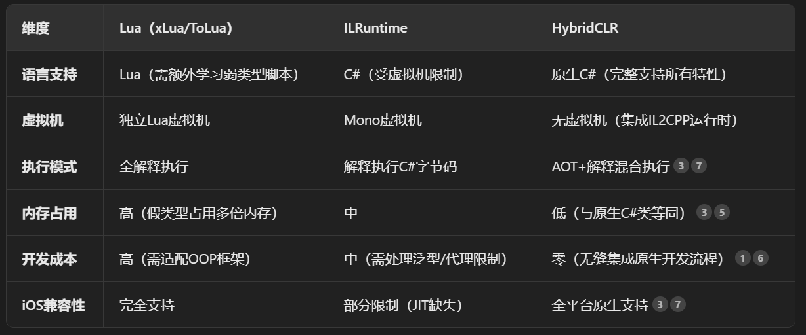

# 项目框架
--------------

## UGUI
### 一 UI Panel

### 二 图集
#### 2.1 图集拆分策略

图集拆分策略​​的核心目标是平衡性能（减少Draw Calls）与内存效率（降低内存峰值）。

(1) 划分私有图集、公共图集。公共图集存放多个模块高频复用的资源，而同一功能/界面​​的临时使用纹理合并到同一私有图集。

(2) 公共图集的添加要慎重,控制公共图集的个数,不是所有的小图都要使用图集，比如物品图标（常伴随游戏逻辑动态变化，打在静态图集中，未使用的图标占比大造成内存浪费。优化方案：动态图集，仅对当前屏幕显示的图标实时打包，避免全量加载）。

(3) 背景图单独一个图集，或者不打图集。

(4) 小图采用九宫格、纯色图片、减少半透明图片；大的的背景图片尽量采用高复用性。

#### 2.2 图集的原理是什么
图集（Texture Atlas）是一种将多个小纹理合并为一张大纹理的技术
图集装箱算法：

（1）断头台算法，Guillotine算法会维护一个剩余矩形list(其中的空白矩形称为F)。主要方法是从uv矩形(称为R)中选出一个放置在F左下角，再将右上方的“L”型空间分割为两个F并组织进list（所以不会有任何一个空白块被忽略）。再递归执行，直到R不能装入list中的任何一个F，则再开一个bin。

（2）最大矩形算法(MaxRects)，保证装箱速度的同时，尽量减少大图的尺寸，从而获得较高的空间利用率。
Guillotine的缺点在于不能跨过分割线，为了解决这个问题，Maximal方法提出了新的分割方式，即同时执行水平分割和竖直分割，并保留两次分割中的包含右上矩形的矩形(或叫maximal矩形)，作为F存入剩余空间list。
https://zhuanlan.zhihu.com/p/375451946

#### 2.3 图集为什么能减低内存
图集最终形成的纹理尺寸变大了，但占用内存减少。原因：

（1）减少了小图的冗余开销，如每张纹理需存储的头部信息（压缩格式元数据），合并图集后只需存一份。

（2）压缩格式的效率提升​，大图集包含更多像素相关性，压缩算法（如ETC2、ASTC）可达到更高压缩。GPU对纹理内存有对齐要求(如4KB/64KB对齐)，并后的大纹理可以更高效地利用对齐空间。

（3） 空白区域的优化处理。

### 

## UIParticle
UIParticle 是 Unity 中用于在 UI 系统上显示粒子特效的解决方案，它解决了原生 ParticleSystem 无法与 UGUI 系统完美整合的问题。

参考：https://zhuanlan.zhihu.com/p/633932778

### UIParticle的作用

1. 让原本为 3D 场景设计的 ParticleSystem 能够被 UI 的 Mask/RectMask2D 裁剪。
2. 支持在 Canvas 下显示，并与UI元素正确叠加排序。
​
### UIParticle的原理
1. 将 ParticleSystem 的渲染输出转化为UI的Mesh(顶点、三角形、UV等)。通过UGUI的渲染管线输出到Canvas。
2. 继承自MaskableGraphic，因此支持所有UGUI的遮罩和裁剪功能。

UIParticle就解决了UGUI与Particle System不兼容的问题，通过在其节点上挂载CanvasRender,然后通过ParticleSystemRenderer的BakeMesh接口将网格传给CanvasRender,做到节点数据跟UGUI的处理方式一致。

### UIParticle的特性和优点
​​无缝UI整合、​​渲染转换机制​​、​​跨平台支持​​、​​高级特效功能​​

## HybridCLR

### HybridCLR的优势：

HybridCLR是一个特性完整、零成本、高性能、低内存的近乎完美的Unity全平台原生c#热更新解决方案。

（1）特性完整。支持反射、多线程、异步等完整C#特性，与常规Unity开发流程完全一致。

（2）零成本。无需学习其他脚本语言，通过扩充IL2CPP运行时，使其支持"AOT+解释执行"混合模式，热更新代码与原生AOT代码​​类型系统完全统一​​，无需适配器或生成代码。（IL2CPP：C#到中间语言（IL）的转换​，​​IL到C++代码的转换，C++代码由目标平台的本地编译器编译为二进制文件​）

（3）高性能。实现了一个极其高效的寄存器解释器，通过​​差分混合DLL技术​​，未修改代码以AOT模式运行，修改部分解释执行，整体性能比Lua快3-10倍，比ILRuntime快2-5倍。

（4）低内存。热更新脚本中定义的类跟普通c#类占用一样的内存空间，远优于其他热更新方案。

### 不同热更方式的原理

（1）C#热更具体做法：将需要频繁更改的逻辑部分独立出来做成DLL，在主模块调用这些DLL，主模块代码是不修改的，只有作为业务（逻辑）模块的DLL部分需要修改。游戏运行时通过反射机制加载这些DLL就实现了热更新。ILRuntime 就是使用C#进行的热更新。

（2）lua热更原理：逻辑代码转化为脚本，脚本转化为文本资源，以更新资源的形式更新程序。

## 设备性能

### 最低配置：
iOS：A9处理器、内存2G及以上配置设备（iPhone 6s及以上）

安卓：高通骁龙460/麒麟710及以上、内存4g及以上设备

### 品质分级

UnityEngine.SystemInfo 获取设备信息

 * 先判断芯片，再判断内存：
 * 内存lv5：12G+, lv4：12G+, lv3:8G+, lv2:6G+, lv1:4G+, lv0:4G-
 * 有cpu取 cpu评级 有gpu取gpu,都有取最低

 ## 性能分析
 https://blog.csdn.net/qq_33060405/article/details/147377246

 ### profiler的功能和适用场景
（1） Profiler（性能分析器）
功能：采集和展示CPU、GPU、内存、渲染、物理、音频等各模块的实时性能数据。常用模块：CPU Usage、GPU Usage、Memory、Rendering、Physics、Audio、Network等。

（2）Memory Profiler
功能：抓取和对比内存快照，分析资源、对象、GC堆、原生内存等分布。
适用场景：内存泄漏排查、资源占用分析、内存增长趋势监控。

（3） Frame Debugger
功能：逐步回放一帧的渲染过程，查看每个Drawcall的资源、状态、Shader等。
适用场景：渲染流程分析、Drawcall优化、资源冗余排查。

（4） Profiler API
功能：通过代码自定义埋点，记录特定逻辑的性能数据。
适用场景：业务逻辑性能监控、关键路径分析。

### profiler的原理
（1）Profiler原理

数据采集：Unity在引擎各模块、C#脚本、渲染管线等关键节点插入采样点（ProfilerMarker），记录时间戳、调用关系、分配信息等。

数据传输：采集到的数据通过本地或网络传输到编辑器（或写入文件）。

数据展示：编辑器端将数据解析为树状结构（Hierarchy）、时间线（Timeline）等多种可视化方式，便于开发者分析。

（2）Memory Profiler原理

快照抓取：在特定时刻冻结内存状态，遍历所有托管对象、原生对象、资源等，记录其类型、引用关系、大小等。

快照对比：对比两次快照，分析对象增减、引用链变化，定位泄漏或未释放资源。

（3）Frame Debugger原理

渲染命令捕获：在一帧内，记录所有渲染命令（Drawcall、SetPass、Clear等）。

逐步回放：开发者可以逐步执行每个渲染命令，观察场景变化和资源绑定情况。

（4）Profiler API原理

代码插桩：开发者用ProfilerMarker.Begin()/End()包裹代码段，手动采集耗时数据。

与主Profiler数据合并：自定义埋点数据会和引擎采集的数据一起展示在Profiler中。

# 负责模块
--------------

## 城建系统
涉及内城建筑数据的管理，Lod切换时模型的加载和卸载，以及建筑上能指令执行，包括升级、征兵、科技、闭城等等。

### 1. 数据层：
City 里面存放所有的建筑Building Dictionary<int, Building>；

建筑的动态属性如等级，通过接收服务器数据获得；

建筑的静态属性通过策划表配置获取；

利用工厂模式创建建筑实例；

具体的建筑类方法通过继承基类Building实现；

基类Building主要包含初始化Initialize、加载Load、卸载UnLoad、升级
Upgrade、更新状态方法。

### 2. 外观层：
Homeland 控制内城的加载和卸载，是一个单例且序列化的asset文件，添加了定位器、建筑外观HomelandPawns配置、内城装饰等配置的引用，核心方法是Enter入城和Exit出城两个方法，通过监听Lod的变化进行调用，入城时将这些建筑、场地、卫兵、树木进行组装。

HomelandPawns存放了所有建筑的外观配置，Dictionary<Collider, HomelandPawn> clicks = new();建筑外观类被定义为HomelandPawn，包含了模型的碰撞体、资源加载路径、坐标旋转、UI锚点、UI插槽HomelandSlot等等。

### 3. UI层：
根据Building创建操作命令HomelandConsoleCommand集合，绑定对应的Action事件；
HomelandConsolePanel操作面板，建筑被选择时，将HomelandPawn引用传入面板中，创建功能按钮组。
HomelandSlot加载插槽基类，绑定到HomelandPawn上，显示建筑的名称、等级、状态等。

### 4. 亮点:
（1）内存中的各个模块是在加载时组装而成的，可以构建了对应的asset配置文件，可以设置它们的位置，旋转角度、资源路径、UI锚点位置等等。

（2）Lod切换时入城分帧加载各模块，更加平滑，降低了性能峰值。

（3）征兵优化，原逻辑，征兵过程中兵力发生变化，服务器则发送通知告知客户端，前后端通信频繁。优化后由客户端计算兵力数量，服务器只在征兵开始、征兵取消、征兵速度变化时通知。

（4 征兵优化，前后端存在时差Clock.nowms，导致征兵数量不一致，优化方案分别为客户端固定延迟x ms；服务端定义一个错误码，当前后端数量不一致时，返回错误和延迟时间，延到到xxms后再发送分兵请求。

## 背包系统
背包内包含四种类型的道具，普通道具、武将信物、装备、材料道具。每种道具的用途和获取路径各有不同，需要背包系统内管理道具的数据、使用方法和显示规则。

### 1. 数据层：
Bag 管理所有道具、监听背包变化通知、提供外部调用接口

Item 道具属性的管理，包括道具id、道具格子uid、名称、类型、子类型等等，同事也将通用复杂且独立的逻辑拆分出来，如排序规则、使用请求、红点逻辑等。

ItemOperation 道具的操作方法

ItemAccess 道具的获取路径

### 2. UI控制层：

UIBagPanel、UIBagDetail、UIBagItem

### 亮点：
（1） 解决道具同时大批量更新时，频繁触发界面刷新造成卡顿的问题（如武将后台招募，道具批量使用），使用脏标记模式，界面需要刷新时在更改布尔值_isDirty，在LateUpdate中每10帧判断一下脏标志位，true则刷新并设置为false。缺点：状态更新滞后，多了标记和每帧检查的开销。

（2） 由于不同的道具的用途类型和用途数量不同，原逻辑是根据道具的子类型和附加参数，switch-case横向扩展了大量的方法和判断逻辑，导致代码的可读性和扩展性较差。为此，提取了道具操作的概念，封装了ItemOpearation，里面包含了道具的操作类型、操作名称、操作权限和操作方法，在创建道具时为其附加所需的道具操作类型，以此链接其具有的操作方法或可执行方法；通过将道具操作分离，背包模块在后续开发时更易进行扩展和维护。

（3）背包界面的屏幕适配和道具特效的显示层级问题。

## 选服/选角系统
在进入游戏前，玩家可在登录界面选择角色和选择服务器，且开发环境、提审环境、以及正式环境下所展示的区服信息和进入游戏的权限限制都不一样。

### 1. 选服 HostAddressesRequest：
负责从目录服请求区服数据，并在本地加载和显示。

需在本地预定义数据格式，利用LitJson库将拉取到的json格式的字符串反序列化为C#对象，每个区服信息都需再转换为客户端存储和使用HostAddreses对象，共同存放在asset文件HostAddresseses中，作为数据层控制玩家的选服操作。

HostAddreses中存储了区服的zoneId、Ip、端口号、在线人数、注册人数、鉴权权限（用于判断进入游戏是否需要登录SDK，相当于实名）等。

### 2. 选服流程

（1）游戏加载时，判断当前是否是编辑器环境，是则直接发起区服数据请求，否则等待SDK弹出的窗口关闭（即玩家实名信息确认完毕）再发起区服数据请求。

（2）调用延时加载转圈界面，如果0.5s后请求数据失败则调起该界面

（3）根据当前环境向对应的Ip地址发起区服数据请求，try-catch捕获这一过程中发生的异常，如果请求数据成功，则正常注入到HostAddresses配置中，作为后续选服界面的数据源，如果请求数据失败或者触发异常，则根据设置再次重新发起请求直到成功或达到请求次数上限为止。

（4） 进入登录界面，如果区服数据已获取，则根据玩家的上次本地缓存或者推荐规则展示默认选中的区服信息，否则为空白，玩家点击进入游戏时弹出提示窗，再次尝试重新请求区服数据。

### 3. 请求区服数据的通信准备

（1） 准备客户端的用户数据（平台id、sdk账号id、版本信息），转换成base64传给服务器。

（2） 将当前时间戳、账号id和token用私钥加密，（RSA加密+SHA1签名）进行数字签名，将参数和签名添加到header中传给服务器，验证通过则返回数据。

（3） 在Debug模式和编辑器模式下跳过证书验证，因为Http的证书可能过期，重写request.certificateHandler。

### 4. 选角 AccountRolesRequest 

负责从目录服请求角色数据，并在本地加载显示。

与区服数据不同，它是打开选服界面的时候开始请求角色数据，请求成功后再在界面上刷新展示出来，保证打开界面时看到的信息是最新的。

## 选服/选角系统

